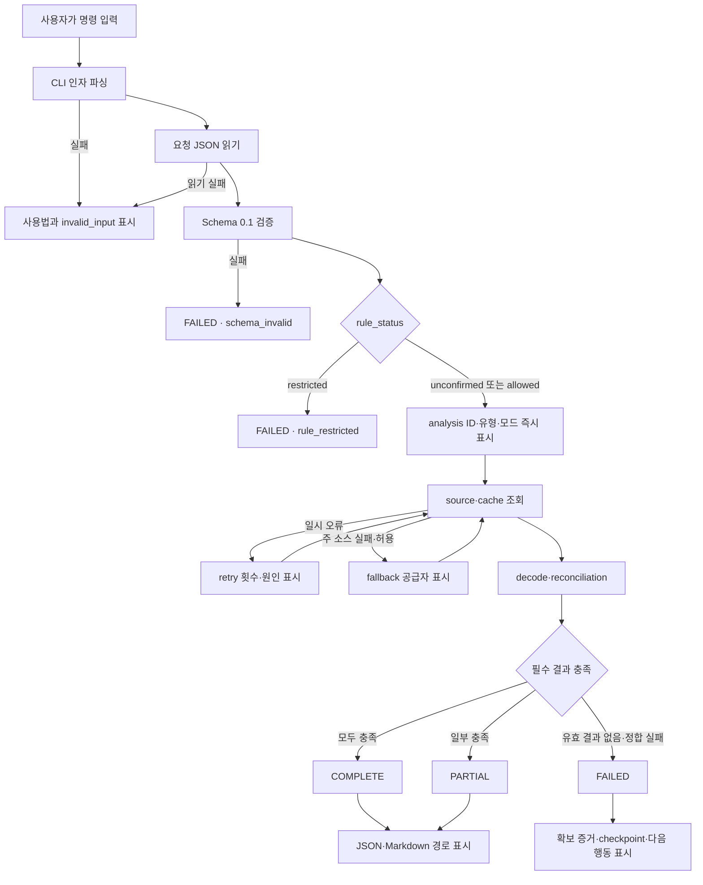
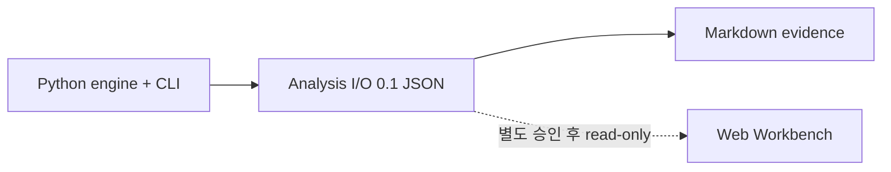
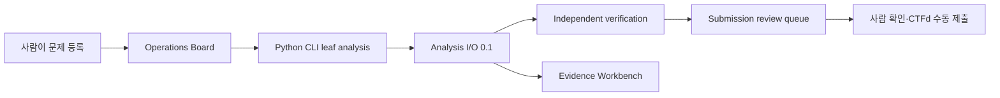

# SCAN 2026 CLI 화면 흐름
> Created: 2026-07-26 15:31
> Last Updated: 2026-07-28 01:59
> Status: Approved 1.4 · UI-First Gate Passed · TASK-008 FREEZE Applied

## 1. 문서 목적

이 문서는 SCAN 분석 도구를 터미널에서 실행할 때 사용자가 거치는 명령 흐름과
상태 전환을 정의한다. Python 구현 전에 입력, 진행, 결과, 오류, 재개 동선을
확정하는 UI-First Gate 문서다.

V1은 DEX·AUTH·FREEZE를 서로 다른 명령 체계로 만들지 않는다. 승인된 Analysis
I/O Schema `0.1` 요청 파일을 공통 진입점으로 사용하고 `analysis_type`에 따라
해당 vertical slice를 실행한다.

## 2. 사용자와 사용 환경

### 2.1 주요 사용자

- 해커톤 중 온체인 사례를 빠르게 확인하는 분석자
- 결과 수치와 원본 증거를 함께 검토하는 팀원
- confirmed fixture로 변경 사항을 회귀 검증하는 개발자

### 2.2 사용 환경

- 데스크톱 터미널을 기본으로 한다.
- 최소 너비 80 columns에서 핵심 상태와 경로를 읽을 수 있어야 한다.
- 색상을 지원하지 않는 터미널과 `NO_COLOR` 환경에서도 의미가 유지되어야 한다.
- V1은 대화형 질문 없이 명령 인자와 JSON 요청 파일로 재현 가능해야 한다.

## 3. 명령 인벤토리

| 명령 | 목적 | 주요 입력 | 종료 결과 |
|:---|:---|:---|:---|
| `scan analyze --request PATH --evidence PATH` | 공통 분석 실행 | Schema `0.1` 요청 JSON + 유형별 검토 증거 | complete·partial·failed |
| `scan validate PATH` | 요청·결과 계약 사전 검증 | JSON 파일 | valid·invalid |
| `scan resume ANALYSIS_ID` | checkpoint에서 중단 작업 재개 | 기존 analysis ID | complete·partial·failed |
| `scan show ANALYSIS_ID` | 저장 결과와 증거 경로 재표시 | 기존 analysis ID | summary·not found |
| `scan --help` | 명령과 다음 행동 확인 | 없음 | 도움말 |

V1의 canonical 실행은 `scan analyze --request PATH`이며, TASK-006/007 DEX·AUTH
offline replay는 `--evidence`로 검토한 raw replay JSON을 함께 받는다. 이
옵션은 source adapter 입력이지 Analysis Request Schema 필드가 아니다.
`analysis_type`별
`scan dex`, `scan auth`, `scan freeze` 별칭은 같은 정보를 두 경로에서
관리하게 하므로 현재 범위에서 제외한다.

## 4. 공통 진입 흐름



## 5. 기본 실행 흐름

### 5.1 명령

```bash
scan analyze --request requests/dex.json \
  --evidence docs/05_QA_Validation/fixtures/FX-SVC-DEX-001/raw-replay.json
```

### 5.2 단계

| 순서 | 상태 | 사용자에게 표시할 최소 정보 | 출력 스트림 |
|:---:|:---|:---|:---:|
| 1 | `STARTING` | analysis ID, type, chain, offline 여부 | stderr |
| 2 | `VALIDATED` | Schema version, source policy, 규정 상태 | stderr |
| 3 | `RUNNING` | 현재 stage, source ID, cache hit·miss | stderr |
| 4 | `RETRY` | 원인, 현재/최대 시도, 다음 대기 | stderr |
| 5 | `FALLBACK` | 실패한 source와 대체 source | stderr |
| 6 | terminal status | `COMPLETE`, `PARTIAL`, `FAILED` | stdout 요약 |
| 7 | `EXPORTED` | JSON·Markdown artifact 경로 | stdout |

명령 입력 후 400ms 안에 최소 `STARTING` 한 줄을 표시한다. 이는 외부 조회
완료 목표가 아니라 명령이 접수되었음을 알리는 UX 목표다.

## 6. 상태별 화면 흐름

### 6.1 Complete

1. 헤더에서 `COMPLETE`, analysis ID, 분석 유형을 확인한다.
2. `Confirmed results`에서 핵심 raw 값과 사람이 읽는 표시값을 함께 확인한다.
3. `Scope`에서 `not_assessed` 항목을 확인한다.
4. `Run`에서 cache·retry·fallback·resume 여부를 확인한다.
5. JSON과 Markdown 경로 중 필요한 파일을 연다.

DEX는 `pool_output` WETH와 `user_net_output` native ETH를 반드시 다른 행으로
표시한다. AUTH는 `권한 소비`와 `피싱·탈취 미평가`를 분리한다. FREEZE는
온체인 상태 전이와 공식 맥락을 분리한다.

### 6.2 Partial

1. 헤더에서 `PARTIAL`과 확보 결과 수를 확인한다.
2. 확정된 결과는 complete와 같은 형식으로 먼저 표시한다.
3. `Missing`에서 충족되지 않은 요구사항과 영향을 확인한다.
4. `Error`에서 오류 코드, stage, source, attempt를 확인한다.
5. `Next action`에서 재개 또는 다른 소스 정책 사용 방법을 확인한다.
6. 확보된 증거와 partial JSON·Markdown을 그대로 보존한다.

partial을 성공처럼 초록색으로 표시하거나 빈 결과로 숨기지 않는다.

### 6.3 Failed

1. 헤더에서 `FAILED`와 첫 번째 구조화 오류를 확인한다.
2. 네트워크 호출 전 실패인지 실행 중 실패인지 stage로 구분한다.
3. 이미 확보한 증거가 있으면 evidence 수와 저장 경로를 표시한다.
4. 재시도 가능 여부와 사용자가 실행할 정확한 다음 명령을 표시한다.
5. secret, 인증 header, 전체 endpoint query는 표시하지 않는다.

`rule_restricted`, `schema_invalid`, `invalid_input`은 외부 조회 전에 종료한다.

### 6.4 Retry와 fallback

- 같은 줄을 애니메이션으로 덮어쓰는 것만으로 기록을 없애지 않는다.
- retry마다 source ID, 오류 분류, 현재/최대 시도를 남긴다.
- fallback 시 최초 실패 source와 대체 source를 둘 다 표시한다.
- verbose log가 아니어도 fallback 발생 사실과 최종 횟수는 결과에 남긴다.

### 6.5 Resume

```bash
scan resume AN-20260726-DEX-001
```

1. checkpoint와 기존 analysis type을 확인한다.
2. 완료된 stage와 다시 시작할 stage를 표시한다.
3. 완료된 immutable 조회는 다시 호출하지 않는다.
4. 기존 evidence ID를 유지하고 새 source attempt만 추가한다.
5. 최종 결과에는 `resumed: true`를 표시한다.

## 7. 입력 데이터

### 7.1 공통 요청

화면은 다음 공통 필드를 요약한다.

| 필드 | 표시 규칙 |
|:---|:---|
| `analysis_id` | 전체 표시 |
| `analysis_type` | DEX swap·AUTH consumption·Address freeze로 보조 설명 |
| `chain_id` | `1 · Ethereum mainnet`처럼 표시 |
| `source_policy.rule_status` | unconfirmed·allowed·restricted를 문자로 표시 |
| `offline_mode` | `offline` 또는 `live` |
| `fixture_id` | 존재할 때만 표시 |

### 7.2 분석 유형별 입력

| 유형 | 입력 요약 | 숨기거나 축약할 항목 |
|:---|:---|:---|
| DEX | TX hash | 중간 표시는 앞 10자·뒤 8자, export는 전체 |
| AUTH | 대상·token·spender, 승인·소비 TX, 상태 블록 | 실패 TX 목록은 개수 우선 |
| FREEZE | token·target, 이벤트 TX 2개, 상태 블록, 공식 URL | URL query와 secret 제거 |

API key, private key, seed phrase는 입력 항목으로 표시하거나 받지 않는다.

## 8. 결과 데이터와 정보 계층

출력 순서는 고정한다.

1. 최종 상태와 analysis ID
2. confirmed result
3. `external_context`, `not_assessed`, warning
4. error와 missing requirement
5. run 요약
6. export 경로
7. next action

표시용 소수값은 보조 정보다. `amount_raw`, 자산, 주소, block, log·trace 위치를
채점과 증거의 기준으로 유지한다.

## 9. stdout·stderr·파일 계약

| 채널 | 내용 |
|:---|:---|
| stdout | 최종 상태, 핵심 결과 요약, export 경로 |
| stderr | 시작·진행·cache·retry·fallback·warning·error 진행 정보 |
| JSON export | 결과의 단일 source of truth |
| Markdown export | 같은 result model에서 렌더링한 사람용 evidence |

`--quiet`와 `--json` 같은 추가 모드는 실제 자동화 필요가 확인될 때 검토한다.
V1에서 stdout에 JSON 전체를 출력하는 별도 계약은 만들지 않는다.

## 10. 종료 코드

| 코드 | 의미 | 결과 상태 |
|:---:|:---|:---|
| `0` | 모든 필수 결과와 export 완료 | complete |
| `2` | CLI 사용법·입력 파일·Schema 오류 | failed |
| `3` | 일부 결과와 증거만 확보 | partial |
| `4` | 실행 실패·정합 실패·필수 소스 실패 | failed |
| `5` | 공식 규정에 따른 실행 차단 | failed |
| `130` | 사용자 중단, checkpoint 보존 시도 | interrupted |

오류 코드의 세부 의미는 Analysis Error Schema의 11개 코드를 사용한다. 프로세스
종료 코드는 자동화에서 큰 상태를 구분하기 위한 별도 계층이다.

TASK-005는 위 여섯 종료 코드를 renderer와 CLI fault-injection test로
검증했다. vertical analyzer 미구현 상태의 유효 요청은 결과를 꾸미지 않고
`source_unavailable`, 종료 코드 `4`로 명시적으로 종료한다.

TASK-006은 DEX offline replay에서 complete `0`, internal call 누락 partial
`3`, 로그 정합 실패 `4`, 규정 차단 `5`를 실제 분석 결과로 검증했다.
TASK-007 AUTH는 complete `0`, state·trace 누락 partial `3`, 정합 실패 `4`,
규정 차단 `5`와 checkpoint resume을 검증했다. TASK-008 FREEZE도 두 전이
complete `0`, state·전이 누락 partial `3`, 정합 실패 `4`, 규정 차단 `5`와
checkpoint resume을 검증했다.

## 11. 도움말과 빈 상태

### 11.1 인자 없이 실행

`scan`만 실행하면 분석을 시작하지 않고 다음을 보여준다.

- 한 줄 목적
- canonical 명령
- 지원 분석 유형 3개
- `scan --help`, `scan validate PATH` 예

### 11.2 결과 없음

`scan show UNKNOWN_ID`는 빈 표를 출력하지 않는다.

```text
[FAILED] analysis not found: UNKNOWN_ID
Next: check the ID or list the .scan/runs directory.
```

`.scan/` 실제 절대 경로는 export에 넣지 않으며 terminal에서 사용자에게 필요한
로컬 경로만 표시한다.

## 12. 사용자 진입·전환·이탈

| 구간 | 진입 | 다음 행동 | 이탈·복구 |
|:---|:---|:---|:---|
| 준비 | 요청 JSON 작성·fixture 복사 | `scan validate` | 파일 수정 |
| 실행 | `scan analyze` | 결과 확인 | Ctrl-C 후 checkpoint |
| 검토 | terminal summary | JSON·Markdown 열기 | `scan show`로 재확인 |
| 부분 성공 | partial summary | source 정책 수정·resume | 확보 증거 유지 |
| 규정 차단 | restricted 요청 | 공식 규정 확인 | 정책 변경 승인 전 실행 없음 |

## 13. UI-First Gate 수용 기준

- [x] 주요 명령과 각 목적이 정의됨
- [x] 사용자 진입·전환·이탈 흐름이 정의됨
- [x] 화면별 입력·출력 데이터가 정의됨
- [x] 시작·진행·complete·partial·failed 상태가 정의됨
- [x] retry·fallback·resume 상태가 정의됨
- [x] stdout·stderr·artifact 경계가 정의됨
- [x] HTML terminal preview가 문서에 연결됨
- [x] 사용자가 HTML preview를 확인함
- [x] 사용자 피드백과 보완 결과가 기록됨

UI-First Gate는 통과했다. Python package 초기화는 backlog 승인 후 시작한다.
구현 시 AUTH partial 최종 stdout의 retry 이력 압축은
[Prototype Review FB-001](./02_CLI_PROTOTYPE_REVIEW.md)을 따른다.

## 14. 비차단 Web Workbench 문서 트랙

[Web Investigation Workbench](./03_WEB_INVESTIGATION_WORKBENCH.md)는
Analysis I/O `0.1` 결과를 그래프·타임라인·증거 Inspector로 읽는 선택적
시연 UX다. 현재 CLI V1의 진입·실행·저장 계약을 대체하거나 확장하지 않는다.



문서 트랙의 범위 잠금:

- HTML Preview는 정적 검토 산출물이며 실제 RPC·API·DB에 연결하지 않는다.
- DEX·AUTH·FREEZE와 `CHAL-FLOW-SCALE-001` 시연만 다룬다.
- 웹은 Analysis I/O JSON의 read-only viewer이며 별도 계산 결과를 만들지 않는다.
- Preview에서 발견된 데이터 공백은 피드백으로만 기록하고 Schema를 즉시 바꾸지 않는다.
- 웹 구현 작업은 현재 Backlog에 추가하지 않는다.
- 이 문서 트랙은 `DOC-M5`, `TASK-001`, Python 엔진·CLI 구현의 선행 조건이 아니다.
- 실제 웹 구현은 Python 엔진 결과 안정화와 별도 사용자 승인 뒤에만 검토한다.

사용자 흐름은 `사건 선택 → 그래프 탐색 → 타임라인 확인 → 증거 Inspector →
기존 export 위치 확인`으로 제한한다. 웹에서 사건 생성·수정·재분석·라벨
저장·외부 전송은 하지 않는다.

## 15. Rules-gated Competition Operations Board

[Competition Operations Board](./04_COMPETITION_OPERATIONS_BOARD.md)는 여러
문제·worker·검증·제출 후보를 지휘하는 별도 운영 화면이다.



- CLI는 leaf 분석의 규범적 실행·오류·export 계약으로 유지한다.
- Board는 문제 간·문제 내부 병렬 실행 상태를 지휘한다.
- Workbench는 선택한 analysis의 증거를 read-only로 검토한다.
- AI·자동화가 제한되면 agent worker를 human·CLI worker로 교체한다.
- 자동 제출·CTFd credential 저장·brute force는 포함하지 않는다.
- `TASK-010`과 Operations Preview 사용자 승인을 별도 Gate로 둔다.

이 트랙은 기존 CLI UI-First Gate와 `TASK-001` 착수를 되돌리지 않는다.
실제 구현은 공식 Rules와 별도 사용자 승인 후에만 시작한다.

## 16. 365 글로벌 평가 기준

| 기준 | CLI 흐름의 대응 |
|:---|:---|
| Functionality | Schema 검증부터 export까지 상태별 종료가 명확함 |
| Potential Impact | 하나의 요청 계약으로 분석 유형과 공급자를 확장 가능 |
| Novelty | 결과·증거·맥락·미평가와 partial을 터미널에서 분리 |
| UX | 400ms 시작 피드백, 다음 행동, retry·fallback 가시화 |
| Open-source | 재현 가능한 명령·종료 코드·공개 Schema 연결 |
| Business Plan | 대회 준비용 CLI 흐름이므로 현재 범위 N/A |

## 16.1 TASK-006 화면 대조

- confirmed DEX fixture의 USDC input, WETH pool output, native ETH user output이
  Preview의 세 행과 동일하게 출력된다.
- internal native call을 제거하면 확보한 두 결과를 먼저 보존하고
  `PARTIAL`·`trace_unavailable`·resume 명령을 표시한다.
- checkpoint 재개는 저장한 raw replay artifact를 읽고 `resumed yes`를
  표시하며 네트워크를 호출하지 않는다.
- progress에는 evidence 파일 basename만 표시하고 전체 로컬 경로·provider
  URL·secret을 출력하지 않는다.

## 16.2 TASK-007 화면 대조

- confirmed AUTH fixture에서 `uint256.max` 승인, allowance 네 지점,
  `4500000` raw 소비와 실패 거래 nonce 327~329를 exact 정합한다.
- `CONFIRMED RESULTS`에는 입증된 결과만 두고, 피싱·탈취는 `SCOPE`의
  `NOT ASSESSED theft_or_phishing_attribution`과 claim `false`로 표시한다.
- state 또는 trace가 없으면 확보한 증거·결론만 보존한 `PARTIAL`과 resume
  명령을 출력하며 소비를 완전 결과로 승격하지 않는다.

## 16.3 TASK-008 화면 대조

- blacklist `false→true`와 unblacklist `true→false`를 `CONFIRMED RESULTS`에
  별도 표시하고 대상 주소·before·after를 보존한다.
- Circle·OFAC 주소 명시 여부, current sanctions·criminal intent 미평가와
  global pause 비적용은 `SCOPE / EXTERNAL CONTEXT`에 둔다.
- unblacklist 또는 historical state가 없으면 blacklist 전이와 공식 맥락을
  보존한 `PARTIAL`을 출력하며 누락 전이를 확정하지 않는다.

## 17. Related Documents

- **Concept_Design**: [분석 도구 기능 우선순위](../01_Concept_Design/04_SCAN_2026_TOOL_PRIORITY.md) - P0·V1 범위
- **UI_Screens**: [CLI Terminal UI Design](./01_UI_DESIGN.md) - 정보 계층과 상태 표현
- **UI_Screens**: [CLI Prototype Review](./02_CLI_PROTOTYPE_REVIEW.md) - 사용자 확인과 피드백 기록
- **UI_Screens**: [Web Investigation Workbench](./03_WEB_INVESTIGATION_WORKBENCH.md) - 비차단 read-only 시연 UX 범위
- **UI_Screens**: [Competition Operations Board](./04_COMPETITION_OPERATIONS_BOARD.md) - 여러 문제·worker·검증·제출 상태 흐름
- **UI_Screens**: [HTML Terminal Preview](./previews/01_cli_terminal_preview.html) - 브라우저 확인용 화면
- **UI_Screens**: [HTML Workbench Preview](./previews/02_investigation_workbench_preview.html) - 그래프·타임라인·증거 화면 초안
- **UI_Screens**: [Operations Board Preview](./previews/03_competition_operations_board_preview.html) - 병렬 운영 화면 Draft
- **Technical_Specs**: [Agentic Parallel Solve Flow](../03_Technical_Specs/07_AGENTIC_PARALLEL_SOLVE_FLOW.md) - 역할·Queue·독립 검증·수동 제출 계약
- **Technical_Specs**: [Python 개발 원칙](../03_Technical_Specs/00_DEVELOPMENT_PRINCIPLES.md) - CLI·log·보안 경계
- **Technical_Specs**: [P0·V1 도구 요구사항](../03_Technical_Specs/03_SCAN_2026_TOOL_REQUIREMENTS.md) - 상태·오류·완료 기준
- **Technical_Specs**: [공통 분석 I/O Schema](../03_Technical_Specs/05_ANALYSIS_IO_SCHEMA.md) - 요청·결과·오류 계약
- **Logic_Progress**: [P0·V1 구현 Backlog](../04_Logic_Progress/00_BACKLOG.md) - CLI·vertical slice 구현 순서
- **QA_Validation**: [P0·V1 QA 시나리오](../05_QA_Validation/01_TEST_SCENARIOS.md) - 명령·상태·종료 코드 검증
- **QA_Validation**: [분석 I/O 예제](../05_QA_Validation/examples/analysis/README.md) - preview 기준값
- **QA_Validation**: [TASK-006 DEX 보고서](../05_QA_Validation/10_TASK_006_DEX_REPORT.md) - 실제 complete·partial·resume 화면 대조
- **QA_Validation**: [TASK-007 AUTH 보고서](../05_QA_Validation/11_TASK_007_AUTH_REPORT.md) - AUTH complete·partial·scope·resume 화면 대조
- **QA_Validation**: [TASK-008 FREEZE 보고서](../05_QA_Validation/12_TASK_008_FREEZE_REPORT.md) - FREEZE transition·context·partial·resume 화면 대조
