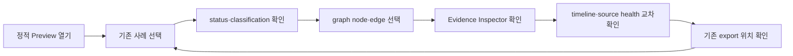

# SCAN 2026 Web Investigation Workbench
> Created: 2026-07-26 23:51
> Last Updated: 2026-07-26 23:51
> Status: Draft 1 · Non-Blocking UX Track · Implementation Not Approved

## 1. 문서 목적

이 문서는 Python 분석 엔진이 생성한 Analysis I/O `0.1` JSON을 사람이
빠르게 탐색·설명할 수 있는 read-only Web Investigation Workbench의 시연
UX를 정의한다.

목표는 범용 상용 포렌식 플랫폼을 복제하는 것이 아니다.

> Analysis I/O 0.1을 읽는 조사 워크벤치로 DEX·AUTH·FREEZE와 Challenge
> 1개만 상용급을 지향하는 UX로 시연한다.

“상용급”은 현재 달성 사실이 아니라 UX 목표다. 실제 사용성·정확성·성능을
측정하기 전에는 상용 제품과 동등하거나 우월하다고 주장하지 않는다.

## 2. 상태와 비차단 계약

이 문서와 HTML Preview는 화면 방향을 검토하기 위한 산출물이다.

- 현재 P0·V1 요구사항과 CLI UI-First Gate를 변경하지 않는다.
- `DOC-M5` Document Completion Gate와 `TASK-001`의 선행 조건이 아니다.
- 현재 구현 Backlog에 Web·React·TypeScript 작업을 추가하지 않는다.
- Analysis I/O Schema, fixture Schema와 SQLite DB Schema를 변경하지 않는다.
- 기술 선택 기록의 “웹은 병목 확인 후” 결정을 유지한다.
- 실제 웹 구현은 Python 엔진·CLI 출력 안정화와 별도 사용자 승인 후 검토한다.

## 3. 사용자와 핵심 작업

### 3.1 주요 사용자

- 대회 중 핵심 자금 경로와 증거를 검토하는 분석자
- 분석 결과를 함께 확인하고 제출 문장을 작성하는 팀원
- DEX·AUTH·FREEZE 결과와 Challenge 상태를 시연하는 발표자

### 3.2 핵심 작업

1. 기존 analysis result를 선택한다.
2. 최종 상태·분류·source health를 확인한다.
3. 그래프에서 핵심 노드와 edge를 선택한다.
4. 타임라인에서 사건 순서와 실패·누락 구간을 확인한다.
5. Evidence Inspector에서 원본 locator와 source를 확인한다.
6. 기존 JSON·Markdown export 위치를 확인한다.

워크벤치에서 사건 생성·수정·재분석·라벨 저장·외부 전송은 하지 않는다.

## 4. 화면 인벤토리

### 4.1 단일 조사 Workspace

| 영역 | 목적 | 표시 데이터 |
|:---|:---|:---|
| Top bar | 사건과 실행 상태 식별 | analysis ID·type·chain·schema·status |
| Case rail | 시연 사례 전환 | DEX·AUTH·FREEZE·Challenge |
| Filter bar | 기존 결과의 보기 범위 축소 | asset·classification·path·time |
| Graph canvas | 자금·호출·상태 관계 탐색 | result·evidence 기반 node·edge |
| Findings | 확정·맥락·휴리스틱·미평가 분리 | classification·result·warning |
| Evidence Inspector | 선택 근거의 원본 위치 확인 | evidence ID·source·method·locator |
| Timeline | block·TX·event·state 순서 확인 | timestamp·block·status·stage |
| Source health | partial·retry·fallback 판단 | source·attempt·cache·missing |
| Export strip | 기존 산출물 위치 확인 | JSON·Markdown artifact URI |

별도 dashboard·로그인·설정·관리 화면은 현재 범위에 없다.

## 5. 사용자 흐름

Preview는 데이터를 변경하지 않는다. 선택·필터·확장도 화면 표현만 바꾸며
Analysis I/O JSON이나 fixture를 수정하지 않는다.

## 6. Analysis I/O 표시 계약

Analysis result JSON이 화면의 단일 source of truth다.

| UI 표현 | Analysis I/O 필드 | 규칙 |
|:---|:---|:---|
| 사건 헤더 | `analysis_id`, `analysis_type`, `chain_id` | 별도 UI ID 생성 금지 |
| 상태 | `status` | complete·partial·failed 의미 변경 금지 |
| Findings | `results[]` | `classification`별 분리 |
| 증거 | `evidence[]` | `evidence_id`와 locator 유지 |
| 출처 | `sources[]` | source·provider·role·required 표시 |
| 경고·오류 | `warnings[]`, `errors[]` | 빈 값으로 숨기지 않음 |
| 실행 상태 | `run` | cache·retry·fallback·resume 표시 |
| Export | `exports` | 기존 artifact URI만 표시 |

그래프 layout·화면용 축약 주소·선택 상태는 UI 임시 상태일 수 있다. 그러나
새로운 귀속·점수·금액·경로를 계산해 Analysis I/O 결과처럼 표시하지 않는다.

## 7. 분류와 시각 언어

| 분류 | label | 의미 | edge |
|:---|:---|:---|:---|
| `confirmed_fact` | `CONFIRMED` | 온체인·결정적 근거로 입증 | 실선 |
| `external_context` | `CONTEXT` | 공식·외부 출처의 맥락 | 보라 실선 |
| `heuristic` | `HEURISTIC` | 후보·점수·반례가 필요한 판단 | 점선 |
| `not_assessed` | `NOT ASSESSED` | 현재 분석 범위 밖 | 중립 점선 |

색상만으로 상태를 전달하지 않는다. 모든 node·edge·finding에는 문자 label과
증거 수 또는 범위 설명을 함께 둔다.

## 8. 시연 사례

### 8.1 DEX complete

- `AN-FX-SVC-DEX-001`
- USDC input, pool WETH output, user native ETH output을 분리한다.
- Transfer·Swap·Withdrawal·internal call evidence를 edge별로 확인한다.

### 8.2 AUTH read-only

- `AN-FX-EVM-AUTH-001`
- approve, allowance lifecycle, `transferFrom` 소비를 순서대로 표시한다.
- theft·phishing은 `NOT ASSESSED`로 유지한다.

### 8.3 FREEZE complete

- `AN-FX-EVM-FREEZE-001`
- false→true와 true→false 상태 전이를 분리한다.
- OFAC·Circle 맥락을 온체인 상태와 다른 classification으로 표시한다.

### 8.4 Challenge scale + source failure

- 기반 ID: `CHAL-FLOW-SCALE-001`
- 실제 confirmed fixture가 아닌 축약 UI demo data다.
- 다중 분기·재병합·dust·무관 자금 중 핵심 피해 경로만 선택하는 UX를 검토한다.
- archive timeout·explorer 429·cache hit·partial missing을 Source health에 표시한다.
- 노드 수·처리 시간은 실제 성능 측정값으로 주장하지 않는다.

## 9. 상태 범위

### 9.1 Complete

- 모든 필수 result를 먼저 표시한다.
- evidence와 source로 이동할 수 있다.
- export 위치가 존재한다.

### 9.2 Partial

- 화면 최상단에서 `PARTIAL`을 유지한다.
- 확보한 confirmed result와 missing requirement를 동시에 표시한다.
- 첫 오류·영향·재개 가능 여부와 source attempt를 숨기지 않는다.

### 9.3 Failed

- 실패 stage와 구조화 error code를 표시한다.
- 네트워크 호출 전 규정 차단과 실행 중 공급자 실패를 구분한다.
- 확보 evidence가 있으면 삭제하거나 성공 결과로 오표시하지 않는다.

### 9.4 Loading·empty

- Loading은 기존 JSON을 읽고 layout을 계산하는 상태에 한정한다.
- 거짓 진행률을 표시하지 않는다.
- Empty는 “analysis result가 선택되지 않음”과 “유효 result 0건”을 구분한다.

## 10. Preview 포함·제외 범위

### 10.1 포함

- 단일 workspace
- DEX·AUTH·FREEZE·Challenge 탭
- read-only graph·timeline·Evidence Inspector
- complete·partial·failed·source unavailable 표현
- classification legend
- 기존 JSON·Markdown export 위치
- 키보드 focus와 반응형 축소

### 10.2 제외

- live RPC·explorer·상용 API 호출
- 서버·사용자 계정·인증·협업
- 사건·라벨·finding mutation
- 새로운 분석·그래프 탐색 알고리즘
- Web 전용 DB·API·Schema
- 범용 drag-and-drop graph editor
- Web 구현 Backlog와 프레임워크 확정

## 11. UX 평가 기준

실제 구현 승격 전 아래 목표와 측정 방법을 별도로 승인한다.

| 지표 | 목표 가안 | 현재 상태 |
|:---|:---|:---|
| 핵심 경로 발견 시간 | 기준 CLI 대비 단축 | 미측정 |
| result→원본 evidence 이동 | 2회 이하 선택 | Preview 검토 필요 |
| classification 오독 | 0건 | 사용자 검토 필요 |
| CLI·Web 의미상 일치 | 동일 Analysis I/O 입력에서 불일치 0건 | 구현 전 |
| 첫 화면 피드백 | 로컬 JSON 선택 후 400ms 내 상태 표시 | 구현 전 |
| 키보드 탐색 | 주요 case·finding·evidence 접근 가능 | Preview 검토 필요 |

## 12. 구현 승격 Gate

아래 조건을 모두 충족하고 사용자가 별도 승인하기 전에는 Web 구현을 시작하지
않는다.

- [ ] Python 엔진이 DEX·AUTH·FREEZE Analysis I/O 결과를 안정적으로 생성
- [ ] CLI fixture 회귀와 Schema 검증 통과
- [ ] 공식 규정에서 Web·외부 API·AI 사용 범위 확인
- [ ] HTML Preview 사용자 검토와 피드백 기록
- [ ] UI가 새로운 계산·판단을 만들지 않는다는 계약 확인
- [ ] Challenge 1개 fixture 또는 명시적 demo data 경계 확정
- [ ] 프레임워크·API·배포·보안 범위 별도 승인
- [ ] Web 구현 Backlog 생성 별도 승인

이 Gate는 현재 Document Completion Gate와 Python `TASK-001`을 차단하지 않는다.

## 13. 365 글로벌 평가 기준

| 기준 | Workbench 기여 |
|:---|:---|
| Functionality | Analysis I/O 결과만 읽어 원본 증거까지 이동 |
| Potential Impact | 비전문가도 사건 흐름과 증거 경계를 빠르게 이해 |
| Novelty | 상용 범용 라벨보다 evidence-first 재현에 집중 |
| UX | graph·timeline·Inspector를 한 workspace에 결합 |
| Open-source | 공개 Schema·fixture 기반의 교체 가능한 viewer 방향 |
| Business Plan | 현재 대회 시연 UX 트랙이므로 수익 모델 N/A |

## 14. Related Documents

- **Concept_Design**: [예상문제 은행](../01_Concept_Design/02_SCAN_2026_EXPECTED_PROBLEM_BANK.md) - `CHAL-FLOW-SCALE-001`과 문제 범위
- **Concept_Design**: [기능 우선순위](../01_Concept_Design/04_SCAN_2026_TOOL_PRIORITY.md) - CLI-first와 기능 단계 제한
- **UI_Screens**: [CLI Screen Flow](./00_SCREEN_FLOW.md) - 현재 V1의 규범적 실행 흐름
- **UI_Screens**: [CLI Terminal UI Design](./01_UI_DESIGN.md) - 공유 classification·상태 시각 언어
- **UI_Screens**: [CLI Prototype Review](./02_CLI_PROTOTYPE_REVIEW.md) - 현재 통과한 UI-First Gate와 FB-001
- **UI_Screens**: [HTML Workbench Preview](./previews/02_investigation_workbench_preview.html) - 정적 read-only 화면 Draft
- **Technical_Specs**: [Analysis I/O Schema](../03_Technical_Specs/05_ANALYSIS_IO_SCHEMA.md) - 화면 데이터의 단일 source of truth
- **Technical_Specs**: [기술 선택 기록](../03_Technical_Specs/04_SCAN_2026_TECHNOLOGY_DECISION.md) - Web 구현 보류 결정
- **Logic_Progress**: [문서 완료 Roadmap](../04_Logic_Progress/00_ROADMAP.md) - 비차단 시연 UX 트랙 상태
- **Logic_Progress**: [P0·V1 구현 Backlog](../04_Logic_Progress/00_BACKLOG.md) - 현재 Web 작업이 없는 구현 범위
- **QA_Validation**: [Analysis I/O 예제](../05_QA_Validation/examples/analysis/README.md) - DEX·AUTH·FREEZE Preview 값
