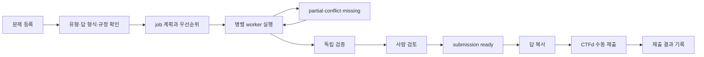

# SCAN 2026 Competition Operations Board
> Created: 2026-07-27 00:54
> Last Updated: 2026-07-27 01:29
> Status: Draft 1 · Rules-Gated UI Track · Implementation Not Approved

## 1. 문서 목적

이 문서는 여러 CTF 문항과 분석 worker를 동시에 운영하고, 검증된 정답
후보를 사람의 제출 대기열로 전달하는 Competition Operations Board의 화면
흐름을 정의한다.

기존 Web Investigation Workbench가 단일 analysis의 graph·timeline·evidence를
검토하는 화면이라면, Operations Board는 전체 경기의 우선순위·병렬 실행·
검증·제출 상태를 통제하는 화면이다.

## 2. 제품 경계

### 2.1 포함

- 문제 등록·분류·우선순위와 상태 확인
- 문제 간·문제 내부 job의 진행 상태
- Coordinator·EVM·Tracer·OSINT·Verifier·Reporter 역할 표시
- worker·provider health와 Queue depth
- 결과 충돌·누락·검증 상태
- 제출 후보의 답 형식·신뢰도·증거·불확실성
- 사람이 제출 완료를 기록하는 흐름
- AI·자동화·source 규정 상태와 비활성화 표시

### 2.2 제외

- CTFd 자동 로그인·credential·session 저장
- 정답 자동 제출과 brute force
- UI에서 직접 온체인 계산
- 범용 팀 채팅·프로젝트 관리
- 외부 서비스로 문제 원문 자동 전송
- 공식 규정 확인 전 AI worker 기본 활성화

## 3. 사용자와 역할

### 3.1 주요 사용자

- 여러 문제를 분류하고 우선순위를 정하는 Operator
- 에이전트 또는 Python worker의 진행을 관찰하는 Coordinator
- 정답 후보와 결정적 증거를 최종 확인하는 제출자

한 사람이 세 역할을 모두 수행할 수 있다. 다른 사람 또는 agent가 분석에
참여해도 최종 CTFd 제출 책임은 Operator에게 있다.

### 3.2 화면의 역할 표현

| 역할 | UI 표시 | 주요 행동 |
|:---|:---|:---|
| Coordinator | 문제 유형·추천 파이프라인·배정 | triage 승인·우선순위 변경 |
| EVM | TX·log·call·state stage | 분석 상세 열기 |
| Tracer | hop·branch·destination stage | 경로 상세 열기 |
| OSINT | label·source·retrieved time | 출처 검토 |
| Verifier | checks passed·conflict·missing | 재검증·보류 |
| Reporter | candidate·format·summary | 제출 Queue로 전달 |
| Operator | 최종 human approval | 복사·수동 제출·결과 기록 |

## 4. 화면 인벤토리

### 4.1 Competition Operations Board

| 영역 | 목적 | 표시 데이터 |
|:---|:---|:---|
| Competition bar | 경기·규정·시간 확인 | event, elapsed, Rules Gate, auto-submit off |
| Problem board | 전체 문항 상태와 우선순위 | problem ID, type, score, state, owner, confidence |
| Worker pool | 역할별 현재 작업과 부하 | role, job, stage, runtime, queue, health |
| Verification rail | 검증 대기·충돌·누락 | candidate, required checks, evidence refs |
| Submission queue | 사람이 제출할 후보 | answer, format, confidence, human approval |
| Source health | provider 자원 상태 | capability, provider, rate limit, retry, cache |
| Activity log | 운영 변경과 오류 | assignment, pause, fallback, verification |

### 4.2 Single Problem Workspace 전환

Problem row 또는 candidate의 `Open evidence`를 선택하면
[Web Investigation Workbench](./03_WEB_INVESTIGATION_WORKBENCH.md)의 해당
`analysis_id` 화면으로 이동한다.

Operations Board는 graph·timeline을 축약 복제하지 않는다. Workbench에서
돌아오면 Queue·worker·submission 상태가 유지되어야 한다.

## 5. 핵심 사용자 흐름

### 5.1 문제 등록

1. Operator가 CTFd 문제 원문·ID·배점·요구 답 형식을 입력한다.
2. 외부 AI 전송 전 Rules Gate 상태를 확인한다.
3. Coordinator가 유형·난이도·필요 도구를 가설로 제안한다.
4. Operator가 실행할 job과 우선순위를 승인한다.

### 5.2 병렬 실행

1. 문제별 row에서 active job 수와 dependency를 확인한다.
2. worker pool에서 사용 가능한 role과 provider quota를 확인한다.
3. 같은 source 요청은 deduplicated·cache 상태로 표시한다.
4. 오류가 발생하면 해당 job만 partial·retry·fallback으로 표시한다.
5. 다른 문제의 실행과 제출 후보는 유지한다.

### 5.3 검증과 제출

1. Verifier가 answer field별 evidence를 독립 재확인한다.
2. 충돌·휴리스틱·누락이 있으면 `REVIEW REQUIRED`로 보낸다.
3. 필수 검증 통과 후 `SUBMISSION READY`로 승격한다.
4. Operator가 답과 형식을 복사해 CTFd에 직접 제출한다.
5. 정답·오답 응답과 시각만 수동 기록한다.

## 6. 상태 모델과 시각 언어

### 6.1 문제 상태

| 상태 | 화면 label | 의미 |
|:---|:---|:---|
| `captured` | `CAPTURED` | 원문 접수, 미분류 |
| `triaged` | `TRIAGED` | 유형·답 형식 가설 생성 |
| `queued` | `QUEUED` | 실행 대기 |
| `running` | `RUNNING` | 하나 이상의 job 실행 |
| `partial` | `PARTIAL` | 일부 확정·필수 누락 |
| `verifying` | `VERIFYING` | 독립 검증 |
| `review_required` | `REVIEW REQUIRED` | 충돌·휴리스틱·낮은 신뢰도 |
| `submission_ready` | `SUBMISSION READY` | 사람 제출 가능 |
| `submitted` | `SUBMITTED` | 사람의 제출 완료 기록 |
| `failed` | `FAILED` | 유효 후보 없음 |

색상만으로 상태를 구분하지 않는다. 모든 상태는 label, 설명, 다음 행동을
함께 표시한다.

### 6.2 worker 상태

| 상태 | 의미 | UI 행동 |
|:---|:---|:---|
| `idle` | 배정 가능 | assign 가능 |
| `queued` | dependency·slot 대기 | 대기 이유 표시 |
| `running` | tool·source 호출 중 | stage·elapsed 표시 |
| `waiting` | rate limit·사람 입력 대기 | retry 시각·필요 입력 표시 |
| `stopped` | 사람 중단 | checkpoint 여부 표시 |
| `failed` | job 실패 | 오류와 재배정 CTA |

## 7. 정보 계층

### 7.1 첫 번째 시선

- 남은 시간
- Rules Gate와 자동 제출 비활성화
- 문제별 `SUBMISSION READY`, `VERIFYING`, `RUNNING`, `FAILED`
- provider rate limit 또는 전체 worker 고갈

### 7.2 두 번째 시선

- 문제 배점·우선순위·예상 난이도
- 담당 role과 active job 수
- 후보 신뢰도와 필수 check 통과 수
- conflict·missing evidence

### 7.3 세 번째 시선

- leaf `analysis_id`
- evidence·source locator
- retry·fallback·cache provenance
- assignment·상태 변경 audit

## 8. Submission Queue 계약

제출 카드에는 최소 다음 항목이 필요하다.

| 필드 | 표시 규칙 |
|:---|:---|
| `problem_id` | CTFd 문항과 일치 |
| `candidate_id` | 후보 버전 식별 |
| answer | 전체 값 표시, 임의 축약 복사 금지 |
| answer format | address·TX·amount·text·tuple 등 |
| confidence | 근거가 있는 보조값, 증거 대체 금지 |
| verification | 필수 check 통과·누락·충돌 |
| evidence | 최소 결정적 evidence 링크 |
| uncertainty | 휴리스틱·미확인·반례 |
| recommendation | submit·hold·investigate |
| human state | review pending·approved·submitted |

`Copy answer`는 clipboard만 사용한다. `Submit` 버튼처럼 보이는 CTFd 호출
CTA를 만들지 않는다. 제출 완료는 `Mark submitted`로 명확히 구분한다.

## 9. 화면 상태

### 9.1 Default

- 문제·worker·verification·submission Queue를 동시에 표시한다.
- row 선택 시 우측 detail panel이 바뀐다.
- 상태 filter는 화면 표현만 변경하고 job을 중단하지 않는다.

### 9.2 Loading

- 기존 운영 상태를 유지하고 갱신 중인 panel만 skeleton 또는 `Refreshing`을
  표시한다.
- 거짓 percentage를 만들지 않는다.
- 첫 상태 피드백 목표는 화면 진입 후 400ms다.

### 9.3 Empty

- 문제 0건: `CTFd 문제를 등록하십시오`와 Rules 확인 CTA
- worker 0건: AI 제한·CLI only·설정 누락을 구분
- submission 0건: `검증 완료 후보 없음`, 실패로 표시하지 않음

### 9.4 Partial·error

- provider 장애는 영향받는 job·problem만 표시한다.
- 전역 Rules 차단과 개별 source 실패를 구분한다.
- 이미 확보한 evidence·candidate를 숨기지 않는다.
- stale 상태에는 마지막 갱신 시각을 표시한다.

### 9.5 Permission·Rules unavailable

- AI·자동화가 `unclear`이면 관련 worker는 disabled다.
- 이유, 규정 ID, 재확인 시각과 CLI·human fallback을 표시한다.
- UI toggle만으로 제한을 우회할 수 없어야 한다.

## 10. 반응형·접근성

- desktop 1440px 이상에서는 Problem Board, Worker Pool, Verification Rail을
  3열로 표시한다.
- 1024px에서는 Verification·Submission을 아래로 이동한다.
- mobile은 대회 운영의 주 화면이 아니지만 read-only 상태 확인과 답 전체
  복사는 가능해야 한다.
- 모든 상태·role·health는 텍스트 label을 가진다.
- table row와 action은 키보드로 이동할 수 있어야 한다.
- focus가 panel 전환 후 사라지지 않아야 한다.
- 긴 주소·TX는 시각적으로 축약해도 복사값과 접근 가능한 전체 값은 유지한다.

## 11. HTML Preview 범위

[Operations Board HTML Preview](./previews/03_competition_operations_board_preview.html)는
다음을 정적으로 시연한다.

- 6개 문제의 서로 다른 상태
- 6개 역할 worker의 병렬 실행
- provider health·rate limit·cache
- 검증 중·충돌·제출 준비 후보
- assignment·fallback·verification 축약 Activity Log
- answer 복사와 `Mark submitted`의 분리
- AI `unclear`, auto-submit `OFF`
- 전체 12개 중 현재 6개 표시 범위
- problem row 선택에 따른 Detail 본문 전환

실제 RPC·AI·CTFd·DB 호출은 없다. 표시 숫자는 UX 검토용 demo data이며
성능·정확도 측정값이 아니다.

## 12. 사용자 확인 Gate

- [ ] Operations Board Preview를 브라우저에서 확인했다.
- [ ] 여러 문제의 우선순위와 상태를 한 화면에서 판독할 수 있다.
- [ ] worker 역할·현재 job·대기 이유를 구분할 수 있다.
- [ ] `review_required`와 `submission_ready`가 혼동되지 않는다.
- [ ] 답 복사와 CTFd 제출 완료 기록이 분리되어 있다.
- [ ] AI·자동화 Rules 차단과 fallback이 보인다.
- [ ] loading·empty·partial·failed 상태가 확인된다.
- [ ] Workbench로 증거를 열고 돌아오는 흐름이 이해된다.

사용자 확인 전에는 UI-First Gate를 통과하지 않으며 `TASK-010` 구현을
시작하지 않는다.

## 13. 365 글로벌 평가 기준

| 기준 | Operations Board 기여 |
|:---|:---|
| Functionality | 문제·worker·검증·제출 Queue를 일관된 상태로 운영 |
| Potential Impact | 제한 시간 동안 병렬 분석과 사람 검토의 병목 감소 |
| Novelty | agent orchestration을 evidence-first human submission과 결합 |
| UX | 전체 경기 상태와 다음 행동을 한 화면에서 제공 |
| Open-source | role·worker·Analysis I/O가 교체 가능한 UI 계약 |
| Business Plan | 대회 운영 UI Draft이므로 수익 모델 N/A |

## 14. Related Documents

- **Concept_Design**: [참가·분석 도구 준비 전략](../01_Concept_Design/01_SCAN_2026_PREPARATION_STRATEGY.md) - 문제 분배·자동화·사람 판단
- **Concept_Design**: [공식 규정 Register](../01_Concept_Design/03_SCAN_2026_RULES_REGISTER.md) - AI·자동화·협업·제출 상태
- **UI_Screens**: [CLI Screen Flow](./00_SCREEN_FLOW.md) - leaf 실행·partial·resume 흐름
- **UI_Screens**: [CLI UI Design](./01_UI_DESIGN.md) - 공유 상태·접근성 시각 언어
- **UI_Screens**: [Web Investigation Workbench](./03_WEB_INVESTIGATION_WORKBENCH.md) - 단일 분석 증거 화면
- **UI_Screens**: [Operations Board Preview](./previews/03_competition_operations_board_preview.html) - 브라우저 확인용 정적 Preview
- **Technical_Specs**: [Agentic Parallel Solve Flow](../03_Technical_Specs/07_AGENTIC_PARALLEL_SOLVE_FLOW.md) - 역할·Queue·검증·제출 기술 계약
- **Technical_Specs**: [Analysis I/O Schema](../03_Technical_Specs/05_ANALYSIS_IO_SCHEMA.md) - leaf result source of truth
- **Logic_Progress**: [Backlog](../04_Logic_Progress/00_BACKLOG.md) - `TASK-010` Preconditions·Acceptance Criteria
- **Logic_Progress**: [Roadmap](../04_Logic_Progress/00_ROADMAP.md) - Rules-gated 비차단 운영 UI 트랙
- **QA_Validation**: [QA 시나리오](../05_QA_Validation/01_TEST_SCENARIOS.md) - 병렬 상태·독립 검증·수동 제출 검증
