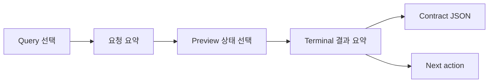

# TASK-012 EVM Core CLI UI
> Created: 2026-07-29 05:08
> Last Updated: 2026-07-29 05:18
> Status: Draft 0.1 · Browser Check Passed · User Review Pending · Runtime Not Implemented

## 1. 목적

이 문서는 `TASK-012`의 격리된 `evm_core` `0.2-draft` 계약을 CLI에서
입력·검토하는 화면을 정의한다. 기존 DEX·AUTH·FREEZE Analysis I/O `0.1`
Preview는 변경하지 않는다.

이 UI는 다음을 검토하기 위한 정적 Preview다.

- 네 `query_kind`별 최소 입력이 구분되는가
- complete·partial·failed가 같은 결과를 다르게 포장한 것처럼 보이지 않는가
- raw 값, source, evidence completeness와 다음 행동이 충분히 보이는가
- `0.2-draft`가 현재 실행 가능한 기능으로 오해되지 않는가

## 2. 화면 구조

한 화면의 정보 순서는 고정한다.

1. Draft·runtime 미구현 경계
2. query 선택
3. request 입력 요약
4. complete·partial·failed 상태 선택
5. 결과·오류·evidence/source
6. 다음 행동
7. contract JSON

## 3. Query별 입력

| query_kind | 화면 label | 필수 입력 | 금지·주의 |
|:---|:---|:---|:---|
| `object_summary` | Object summary | values, block, fee 포함 여부 | fee 요청 때만 `fee_paid_wei` |
| `historical_balance` | Historical balance | subject, block, timestamp, assets | ERC-20은 token address 필수 |
| `first_token_transfer` | First token transfer | subject, token, start block, 정렬 | complete만 range complete |
| `native_inflow` | Native inflow | interest address, TX, trace 필수 | top-level과 internal 합산 금지 |

화면은 credential·endpoint·private key를 입력받거나 표시하지 않는다.
주소·TX는 요약 영역에서 축약할 수 있지만 contract JSON에는 전체 값을 둔다.

## 4. 상태 표현

### 4.1 Complete

- `COMPLETE` label을 결과 최상단에 둔다.
- query별 결정적 raw 값을 표시한다.
- `errors`는 0개다.
- evidence와 source ref를 각각 1개 이상 표시한다.
- transfer는 `range_complete: true`, inflow는 `trace_complete: true`다.

### 4.2 Partial

- 확보된 결과를 유지하되 `PARTIAL` label을 최상단에 둔다.
- 오류 code·stage·retryable을 표시한다.
- transfer는 `range_complete: false`, inflow는 `trace_complete: false`다.
- 다음 행동은 archive·pagination·trace처럼 부족한 capability를 지목한다.

### 4.3 Failed

- `FAILED`와 첫 오류 code를 최상단에 둔다.
- `data: null`을 명시한다.
- 결과값·confirmed 표현을 표시하지 않는다.
- evidence/source ref가 0개일 수 있음을 숨기지 않는다.
- 정확한 재시도·정책·입력 수정 행동을 제시한다.

## 5. 사용자 동선

| 단계 | 사용자 행동 | 화면 변화 | 이탈·복구 |
|:---:|:---|:---|:---|
| 1 | query tab 선택 | 입력·설명·결과 계약 전환 | 다른 query 선택 |
| 2 | request 요약 확인 | 필수 필드와 고정 조건 확인 | JSON 수정은 Preview 밖 |
| 3 | 상태 선택 | complete·partial·failed 전환 | 상태 간 raw/오류 차이 비교 |
| 4 | 결과·오류 확인 | Next action과 contract JSON 확인 | 구현 승인 전 실행 없음 |

Query tab은 Tab으로 진입하고 좌우 방향키로 이동한다. 상태 버튼도 같은 키보드
규칙을 사용한다. 색상과 함께 문자 label을 항상 표시한다.

## 6. Loading·Empty·Stale·Rules 경계

이 Preview는 계약 결과 12개를 검토하는 화면이므로 loading·empty·stale·Rules
상태를 실행하지 않는다.

- loading: 기존 CLI Screen Flow의 `STARTING`을 재사용한다.
- empty: 입력 JSON이 없으면 `scan validate` 이전 단계에서 멈춘다.
- stale: 고정 block·artifact hash가 바뀌면 result를 표시하지 않는다.
- Rules: restricted면 기존 `rule_restricted` 정책 Gate가 외부 호출 전에 막는다.

TASK-012 구현 Brief에서 위 공통 상태 재사용을 다시 확인한다.

## 7. Preview 범위

[EVM Core Preview](./previews/04_task_012_evm_core_cli_preview.html)는 다음을
대화형으로 전환한다.

- query 4개
- query별 complete·partial·failed 3개
- 총 12개 계약 사례
- request 필드·raw 결과·오류·evidence/source·next action

Preview는 외부 요청, 파일 읽기, SQLite mutation, clipboard 외 데이터 전송을
하지 않는다. 표시값은 제안 예제에서 가져오며 제품 analyzer의 실행 결과가
아니다.

## 8. UI-First Gate

- [x] query 4개의 목적과 필수 입력 정의
- [x] complete·partial·failed 정보 계층 정의
- [x] raw 값·오류·evidence·source 표시 정의
- [x] 사용자 진입·전환·이탈 정의
- [x] 키보드·색상 비의존 규칙 정의
- [x] loading·empty·stale·Rules 재사용 경계 정의
- [x] HTML Preview 작성
- [x] 브라우저 정적·상호작용 검증
- [ ] 사용자 Preview 확인
- [ ] 사용자 피드백 반영

위 마지막 세 항목이 닫히기 전에는 TASK-012 runtime 구현을 승인하지 않는다.

## 9. 365 글로벌 평가 기준

| 기준 | 현재 판정 | UI 근거 |
|:---|:---:|:---|
| Functionality | Draft | 4 query × 3 상태 전환 Preview |
| Potential Impact | Planned | 범용 EVM 네 문제를 같은 UX로 처리 |
| Novelty | Draft | raw proof·completeness·failed null 분리 |
| UX | Review Pending | 한 화면 입력·결과·오류·다음 행동 |
| Open-source | Pass | 단일 HTML·외부 dependency 없음 |
| Business Plan | N/A | 대회 준비용 CLI 계약 검토 |

## 10. Related Documents

- **UI_Screens**: [CLI Screen Flow](./00_SCREEN_FLOW.md) - 공통 명령·진입·종료 흐름
- **UI_Screens**: [CLI Terminal UI Design](./01_UI_DESIGN.md) - 상태·정보 계층·접근성 기준
- **UI_Screens**: [EVM Core HTML Preview](./previews/04_task_012_evm_core_cli_preview.html) - 사용자 검토 화면
- **Technical_Specs**: [Analysis I/O 0.1](../03_Technical_Specs/05_ANALYSIS_IO_SCHEMA.md) - 현재 승인 계약
- **Technical_Specs**: [TASK-012 Analysis Contract Proposal](../03_Technical_Specs/11_TASK_012_ANALYSIS_CONTRACT_PROPOSAL.md) - `evm_core` 0.2 Draft
- **Logic_Progress**: [Backlog](../04_Logic_Progress/00_BACKLOG.md) - TASK-012 구현 전 Gate
- **QA_Validation**: [TASK-012 UI Preview 보고서](../05_QA_Validation/28_TASK_012_UI_PREVIEW_REPORT.md) - 검증·사용자 확인 기록
- **QA_Validation**: [TASK-012 Contract Examples](../05_QA_Validation/examples/task-012/README.md) - 12개 표시 기준
