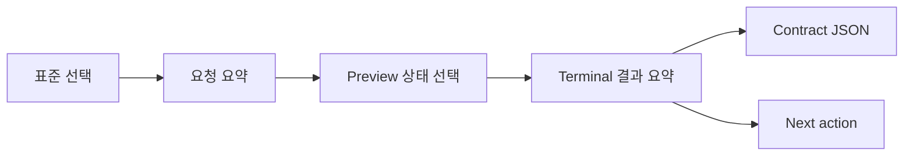

# TASK-013 NFT·Proxy CLI UI
> Created: 2026-07-29 19:53
> Last Updated: 2026-07-29 20:59
> Status: Approved 0.1 · UI-First Gate Passed · Runtime Applied

## 1. 목적

이 문서는 `TASK-013`이 제안한 `evm_special` 대안 B(`nft_activity`,
`proxy_history`)를 CLI에서 입력·검토하는 화면을 정의한다. 기존
DEX·AUTH·FREEZE Analysis I/O `0.1`과 TASK-012 `evm_core` `0.2` Preview는
변경하지 않는다.

이 UI는 다음을 검토하기 위한 정적 Preview다.

- ERC-721·ERC-1155·EIP-1967 세 표준이 서로 다른 화면 계약으로 혼동 없이
  구분되는가
- NFT의 `tokenId`(정규화되지 않은 raw 정수)와 `amount_raw`(ERC-721은
  `normalized_unit`으로 표시된 `1`)가 서로 다른 출처임을 알 수 있는가
- ERC-1155 Batch의 `ids[]`/`values[]` 순서·길이가 펼쳐서 보이는가
- Proxy의 event(`Upgraded`)와 historical state(slot)가 별도 증거로 분리돼
  충돌 시 조용히 하나를 선택하지 않는가
- complete·partial·failed가 같은 결과를 다르게 포장한 것처럼 보이지 않는가
- 소유권·악성 upgrade 여부가 `not_assessed`로 명시되는가

## 2. 화면 구조

한 화면의 정보 순서는 고정한다.

1. 계약 version·reviewed replay 경계
2. 표준 선택(ERC-721 / ERC-1155 / EIP-1967 Proxy)
3. request 입력 요약
4. complete·partial·failed 상태 선택
5. 결과·오류·evidence/source
6. `not_assessed` 고지
7. 다음 행동
8. contract JSON

## 3. 표준별 입력과 결과

| 표준 | 화면 label | 필수 입력 | 결과 핵심 필드 |
|:---|:---|:---|:---|
| ERC-721 | NFT · ERC-721 | `token_contract`, `subject_address`, `include_approvals` | `movements[]`(tokenId·from·to), `approvals[]`(operator·token-specific 분리) |
| ERC-1155 | NFT · ERC-1155 | `token_contract`, `subject_address`, `include_approvals` | `single_case`, `batch_case`(`ids_raw[]`·`amounts_raw[]`), approval transitions |
| EIP-1967 Proxy | Proxy · EIP-1967 | `proxy_address`, `include_admin`, `include_beacon` | `pattern`, `change`(before/after/event), `admin`, `beacon` |

화면은 credential·endpoint·private key를 입력받거나 표시하지 않는다.
주소·TX는 요약 영역에서 축약할 수 있지만 contract JSON에는 전체 값을 둔다.
ERC-1155 `token_id_raw`는 uint256 원본 그대로 표시하고 자릿수를 줄이거나
반올림하지 않는다.

## 4. 상태 표현

### 4.1 Complete

- `COMPLETE` label을 결과 최상단에 둔다.
- ERC-721: token 이동 1건 + approval 2건(operator·token-specific)을 별도
  행으로 표시한다.
- ERC-1155: Single 1건 + Batch 1건(`ids_raw`/`amounts_raw` 배열 펼침) +
  approval transition 2건을 표시한다.
- Proxy: `before_implementation` → `after_implementation`과 `event`가
  일치함을 한 줄에서 확인하고, admin/beacon은 `not_applicable`을 명시한다.
- `errors`는 0개다. evidence와 source ref를 각각 1개 이상 표시한다.

### 4.2 Partial

- 확보된 결과를 유지하되 `PARTIAL` label을 최상단에 둔다.
- ERC-721/1155: 선택 범위의 log page 또는 승인 완전성이 불명확하면
  이동/전송 사실은 유지하고 부족한 부분만 지목한다.
- Proxy: `Upgraded` event는 있으나 한쪽 historical slot이 없으면 확보한
  방향만 표시하고 나머지는 `state_unavailable`로 남긴다.
- 오류 code·stage·retryable을 표시한다.
- 다음 행동은 archive·pagination처럼 부족한 capability를 지목한다.

### 4.3 Failed

- `FAILED`와 첫 오류 code를 최상단에 둔다.
- `data: null`을 명시한다.
- ERC-1155 Batch `ids[]`/`values[]` 길이 불일치, ERC-721 topic을 ERC-20
  amount로 오독, proxy event/state 충돌처럼 표준별 실패 원인을 문자로
  표시한다.
- evidence/source ref가 0개일 수 있음을 숨기지 않는다.
- 정확한 재시도·정책·입력 수정 행동을 제시한다.

## 5. `not_assessed` 표시

세 표준 모두 다음을 결과와 분리된 고정 영역에 표시한다.

- NFT 자산의 가치·소유권 분쟁·거래 의도는 판정하지 않는다.
- Proxy upgrade의 악성 여부·공격 여부는 판정하지 않는다.
- 표시 문구는 TASK-012·기존 FREEZE Preview와 동일하게 `not_assessed`
  claim `false`로 고정한다.

## 6. 사용자 동선

| 단계 | 사용자 행동 | 화면 변화 | 이탈·복구 |
|:---:|:---|:---|:---|
| 1 | 표준 tab 선택 | 입력·설명·결과 계약 전환 | 다른 표준 선택 |
| 2 | request 요약 확인 | 필수 필드와 고정 조건 확인 | JSON 수정은 Preview 밖 |
| 3 | 상태 선택 | complete·partial·failed 전환 | 상태 간 raw/오류 차이 비교 |
| 4 | 결과·오류 확인 | Next action과 contract JSON 확인 | reviewed replay CLI로 재현 |

표준 tab은 Tab으로 진입하고 좌우 방향키로 이동한다. 상태 버튼도 같은
키보드 규칙을 사용한다. 색상과 함께 문자 label을 항상 표시한다.

## 7. Loading·Empty·Stale·Rules 경계

이 Preview는 계약 결과 9개(표준 3 × 상태 3)를 검토하는 화면이므로
loading·empty·stale·Rules 상태를 실행하지 않는다.

- loading: 기존 CLI Screen Flow의 `STARTING`을 재사용한다.
- empty: 입력 JSON이 없으면 `scan validate` 이전 단계에서 멈춘다.
- stale: 고정 block·artifact hash가 바뀌면 result를 표시하지 않는다.
- Rules: restricted면 기존 `rule_restricted` 정책 Gate가 외부 호출 전에
  막는다.

## 8. Preview 범위

[NFT·Proxy Preview](./previews/06_task_013_nft_proxy_preview.html)는
다음을 대화형으로 전환한다.

- 표준 3개(ERC-721, ERC-1155, EIP-1967 Proxy)
- 표준별 complete·partial·failed 3개
- 총 9개 계약 사례
- 세 `검증 중` fixture(`FX-EVM-NFT-721-001`, `FX-EVM-NFT-1155-001`,
  `FX-EVM-PROXY-001`)의 실제 재계산 값을 표시 데이터로 사용

Preview는 외부 요청, 파일 읽기, SQLite mutation, clipboard 외 데이터
전송을 하지 않는다. 표시값은 fixture의 확정된 raw 값에서 가져오며 실제
제품 analyzer 검증은 이후 CLI 통합 테스트가 별도로 담당한다.

## 9. UI-First Gate

- [x] 표준 3개의 목적과 필수 입력 정의
- [x] complete·partial·failed 정보 계층 정의
- [x] raw 값·오류·evidence·source 표시 정의
- [x] `not_assessed` 고지 위치 정의
- [x] 사용자 진입·전환·이탈 정의
- [x] 키보드·색상 비의존 규칙 정의
- [x] loading·empty·stale·Rules 재사용 경계 정의
- [x] HTML Preview 작성
- [x] 브라우저 정적·상호작용 검증 — 3 표준 × 3 상태 전환, 콘솔 에러 0건 확인
- [x] 사용자 Preview 확인 — 2026-07-29 20:19 승인
- [x] 사용자 피드백 반영 — 별도 수정 요청 없이 승인됨

사용자는 2026-07-29 20:19 "TASK-013 UI Preview를 승인합니다. Context
Receipt PASS 전환과 analyzer 구현을 승인합니다." 요청에 "승인합니다"로
명시 승인했다. UI Gate 통과 뒤 NFT·Proxy analyzer 구현이 별도로
시작된다. Preview 자체는 계속 정적이며 live provider 호출을 수행하지
않는다.

## 9.1 브라우저 검증 기록

2026-07-29, 로컬 정적 서버로 3 표준(ERC-721·ERC-1155·EIP-1967) × 3 상태
(complete·partial·failed) 전환을 확인했다. ERC-721 complete의 tokenId
`9110`·두 approval, ERC-1155 complete의 Batch `ids_raw`/`amounts_raw`
배열 2건, Proxy failed의 `proxy_event_state_conflict`·`data: null`
표시를 스크린샷으로 확인했다. 콘솔 에러 0건이며 외부 요청은 발생하지
않았다.

표준 tab·상태 버튼 모두 roving tabindex(선택된 항목만 `tabindex="0"`)와
`ArrowLeft`/`ArrowRight`/`Home`/`End` 이동을 구현했다. 포커스를 준 뒤
`ArrowRight`로 ERC-721 → ERC-1155 → Proxy → ERC-721(wrap)로 이동하고
선택·렌더링이 함께 전환됨을 `document.activeElement`·`aria-pressed`·
`tabindex` 값으로 확인했다. 상태 버튼도 `ArrowLeft`로 `complete` →
`failed`(wrap) 이동을 확인했다.

## 10. 365 글로벌 평가 기준

| 기준 | 현재 판정 | UI 근거 |
|:---|:---:|:---|
| Functionality | Draft | 3 표준 × 3 상태와 공통 terminal runtime 설계 |
| Potential Impact | Planned | NFT·Proxy 두 예상문제를 같은 UX로 처리 |
| Novelty | Draft | raw event/state 분리, Batch 펼침, 충돌 표시 |
| UX | Draft | 사용자 확인 대기, 한 화면 입력·결과·오류·다음 행동 |
| Open-source | Pass | 단일 HTML·외부 dependency 없음 |
| Business Plan | N/A | 대회 준비용 CLI 계약 검토 |

## 11. Related Documents

- **UI_Screens**: [CLI Screen Flow](./00_SCREEN_FLOW.md) - 공통 명령·진입·종료 흐름
- **UI_Screens**: [CLI Terminal UI Design](./01_UI_DESIGN.md) - 상태·정보 계층·접근성 기준
- **UI_Screens**: [TASK-012 EVM Core UI](./05_TASK_012_EVM_CORE_UI.md) - 동일 패턴의 선행 Preview
- **UI_Screens**: [NFT·Proxy HTML Preview](./previews/06_task_013_nft_proxy_preview.html) - 사용자 검토 화면
- **Technical_Specs**: [TASK-013 분석 계약 제안](../03_Technical_Specs/14_TASK_013_NFT_PROXY_CONTRACT_PROPOSAL.md) - `evm_special` 대안 B·결과 후보
- **Technical_Specs**: [Analysis I/O 0.2](../03_Technical_Specs/05_ANALYSIS_IO_SCHEMA.md) - 현재 승인 계약과 0.1 호환
- **Logic_Progress**: [Backlog](../04_Logic_Progress/00_BACKLOG.md) - TASK-013 Context Receipt·승인 Gate
- **QA_Validation**: [TASK-013 Fixture 승격 검토 보고서](../05_QA_Validation/35_TASK_013_FIXTURE_PROMOTION_REVIEW.md) - `검증 중` 승격 근거
- **QA_Validation**: [TASK-013 독립 Verifier 보고서](../05_QA_Validation/34_TASK_013_INDEPENDENT_VERIFIER_REPORT.md) - raw-first 재계산 증거
