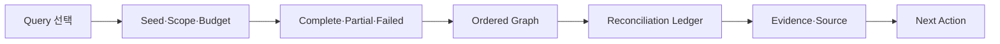

# TASK-014 PATH Graph·금액 정합 UI
> Created: 2026-07-29 22:52
> Last Updated: 2026-07-29 22:52
> Status: Draft 0.1 · Interactive Preview Added · User Review Pending · Runtime Not Implemented

## 1. 목적

이 문서는 TASK-014의 `trace_path`, `trace_remerge`, `aggregate_origins`
결과를 CLI/Workbench에서 검토하는 화면 계약을 정의한다. Preview 값은
계약 확인용 synthetic data이며 공개 fixture·제품 analyzer 결과가 아니다.

핵심 확인 질문:

- included·excluded·unresolved edge가 혼동되지 않는가
- single path와 branch/remerge, multi-origin contribution 차이가 보이는가
- residual과 budget termination이 graph 모양보다 우선적으로 드러나는가
- partial이 complete로 오해되지 않는가
- label·범죄 귀속·AI 가설이 온체인 edge 사실과 분리되는가

## 2. 화면 구조



정보 순서는 다음으로 고정한다.

1. docs-only·synthetic·미구현 고지
2. query 선택
3. seed·range·asset·budget
4. 상태 badge와 termination
5. included path/branch
6. excluded·unresolved edge
7. asset별 reconciliation ledger
8. evidence/source와 다음 행동
9. `not_assessed`

## 3. Query별 화면

| Query | 목적 | 핵심 결과 |
|:---|:---|:---|
| `trace_path` | seed에서 terminal까지 bounded N홉 탐색 | ordered edges, terminal, excluded candidates |
| `trace_remerge` | seed 분기 뒤 공통 merge 검증 | branch contribution, selected merge, unrelated inflow, residual |
| `aggregate_origins` | 여러 origin의 공통 exit 유입 집계 | origin별 contribution, deduplicated total, unresolved amount |

`aggregate_origins`의 가격 환산은 PATH 사실과 별도 context panel에 둔다.
가격이 없다고 온체인 contribution을 실패로 바꾸지 않는다.

## 4. 상태 표현

### 4.1 Complete

- `COMPLETE`를 최상단에 표시한다.
- termination은 `terminal_reached` 또는 `merge_confirmed`다.
- included edge와 excluded edge 수를 함께 표시한다.
- ledger residual은 자산별 raw 단위로 표시한다.
- evidence/source 참조가 모든 included edge에 연결된다.

### 4.2 Partial

- `PARTIAL`과 중단 이유를 최상단에 표시한다.
- 확인된 graph는 유지한다.
- `budget_exhausted`, `frontier_unresolved`, `source_unavailable` 중
  무엇이 중단 원인인지 표시한다.
- unresolved node/edge와 재개 cursor를 표시한다.
- residual을 0으로 꾸미지 않고 `unresolved`로 표시한다.

### 4.3 Failed

- `FAILED`, 오류 code·stage를 최상단에 표시한다.
- `data: null`을 명시한다.
- scope/replay 결합, asset mismatch, source conflict처럼 재시도로
  해결되지 않는 원인을 구분한다.
- graph·ledger를 성공 결과처럼 표시하지 않는다.

## 5. Edge·Ledger 표현

edge는 다음 텍스트 형태를 기본으로 한다.

```text
[INCLUDED] A --(12.5 ETH · tx 0x… · block 100)--> B
[EXCLUDED] X --(12.5 ETH · unrelated_origin)-----> B
[UNRESOLVED] B --(frontier · max_hops=3)---------> ?
```

색상 외 `[INCLUDED]`, `[EXCLUDED]`, `[UNRESOLVED]` 문자열을 항상 사용한다.
금액은 `amount_raw`를 원본으로 보존하고 display 단위는 보조로 표시한다.

ledger:

| 필드 | 의미 |
|:---|:---|
| input | seed/origin에서 확인된 raw 금액 |
| included | 선택 경로에 포함된 raw 금액 |
| excluded | seed/origin 범위 안에서 근거와 함께 제외된 raw 금액; external inflow는 별도 context |
| fee/context | 명시적으로 입증된 수수료·맥락 |
| residual | unresolved 또는 정합 차이 |

## 6. 사용자 동선

| 단계 | 사용자 행동 | 화면 변화 | 복구 |
|:---:|:---|:---|:---|
| 1 | query tab 선택 | request·graph·ledger 계약 전환 | 다른 query 선택 |
| 2 | request scope 확인 | seed·asset·range·budget 표시 | 입력 수정은 Preview 밖 |
| 3 | 상태 선택 | complete·partial·failed 전환 | 상태 간 차이 비교 |
| 4 | edge·ledger 검토 | evidence·next action 확인 | reviewed replay로 재현 |

query와 상태 버튼은 Tab으로 진입하고
`ArrowLeft`/`ArrowRight`/`Home`/`End`로 이동한다. 선택된 버튼만
`tabindex="0"`이다.

## 7. Loading·Empty·Stale·Rules

- loading: graph shell과 `COLLECTING / NORMALIZING / TRAVERSING` stage를 표시
- empty: seed와 연결된 edge가 0건임을 성공 경로 없음으로 명확히 표시
- stale: artifact hash 또는 range가 바뀌면 기존 result를 숨김
- Rules: restricted면 외부 수집 전에 차단하며 artifact-only 대안을 제시

이번 Preview는 query×결과 상태 9개만 전환한다. 위 네 운영 상태는 기존
CLI/Operations 화면 계약을 재사용하며 구현 QA에서 별도 실행한다.

## 8. Preview 범위

[PATH Preview](./previews/07_task_014_path_preview.html)는 다음을 제공한다.

- query 3개 × 상태 3개
- synthetic graph·ledger·evidence
- included/excluded/unresolved edge
- keyboard roving tabs
- 외부 fetch/XHR, 파일 읽기, DB mutation 0건

Preview는 fixture 확정이나 analyzer 구현을 뜻하지 않는다.

## 9. UI-First Gate

- [x] query 3개와 필수 입력 정의
- [x] complete·partial·failed 정보 계층 정의
- [x] edge·exclusion·residual 표현 정의
- [x] loading·empty·stale·Rules 재사용 경계 정의
- [x] 키보드·색상 비의존 규칙 정의
- [x] HTML Preview 작성
- [ ] 브라우저 상호작용 검증
- [ ] 사용자 Preview 확인
- [ ] 사용자 피드백 반영

사용자 확인 전에는 Context Receipt를 `PASS`로 전환하거나 PATH analyzer를
구현하지 않는다.

## 10. 365 글로벌 평가 기준

| 기준 | 현재 판정 | UI 근거 |
|:---|:---:|:---|
| Functionality | Draft | query 3개·상태 3개 화면 계약 |
| Potential Impact | Planned | PATH 의존 예상문제의 공통 검토 UI |
| Novelty | Proposed | graph보다 exclusion·residual을 우선 |
| UX | Review Pending | 한 화면 scope·graph·ledger·next action |
| Open-source | Pass | 단일 HTML·외부 dependency 없음 |
| Business Plan | N/A | 대회 준비 범위 |

## 11. Related Documents

- **UI_Screens**: [CLI Screen Flow](./00_SCREEN_FLOW.md) - 공통 상태·오류·출력 흐름
- **UI_Screens**: [Investigation Workbench](./03_WEB_INVESTIGATION_WORKBENCH.md) - read-only graph 상위 화면
- **UI_Screens**: [PATH HTML Preview](./previews/07_task_014_path_preview.html) - 사용자 검토 화면
- **Technical_Specs**: [TASK-014 PATH 계약](../03_Technical_Specs/15_TASK_014_PATH_CONTRACT_PROPOSAL.md) - graph·ledger·상태 계약
- **Logic_Progress**: [Backlog TASK-014](../04_Logic_Progress/00_BACKLOG.md) - Context Lock·구현 승인
- **QA_Validation**: [TASK-014 Fixture·Contract Gate](../05_QA_Validation/39_TASK_014_FIXTURE_CONTRACT_GATE.md) - UI·fixture·Verifier Gate
