# TASK-015 Label·OSINT·Actor Intelligence UI
> Created: 2026-07-30 02:37
> Last Updated: 2026-07-30 02:37
> Status: Draft 0.1 · User Review Pending · Runtime Not Implemented

## 1. 목적

이 문서는 TASK-015의 label claim, sanctions direct/indirect match, ENS·SNS
단서, common funder, actor relation 후보를 사람이 증거와 함께 검토하는
화면 계약을 정의한다.

가장 중요한 UI 원칙은 “주소에 붙은 라벨”보다 다음 정보를 먼저 보이는 것이다.

- 어떤 source가 무엇을 주장했는가
- 원문에 주소가 직접 명시됐는가
- 그 주장은 어느 시점에 유효했는가
- 다른 source와 충돌·정정·철회됐는가
- 온체인 관찰과 휴리스틱 후보가 분리됐는가

Preview는 synthetic docs-only 화면이며 공개 사례·live 검색·제품 analyzer
결과가 아니다.

## 2. 화면 구조

```mermaid
flowchart LR
    QUERY["Query 선택"] --> SUBJECT["주소·기간·Source Policy"]
    SUBJECT --> STATUS["Complete·Partial·Failed"]
    STATUS --> CLAIMS["Claim Timeline"]
    CLAIMS --> CONFLICT["Conflict·Disposition"]
    CONFLICT --> RELATION["On-chain Relation·Heuristic"]
    RELATION --> SOURCE["Source Inspector"]
    SOURCE --> NEXT["Human Review·Next Action"]
```



정보 우선순위:

1. docs-only·Rules/Terms·개인정보 고지
2. query와 subject scope
3. complete·partial·failed
4. direct address mention·source role·retrieved_at
5. conflict·stale·withdrawn
6. onchain observation
7. heuristic candidate와 반례
8. source hash·locator·next action
9. `not_assessed`

## 3. Query별 화면

| Query | 목적 | 핵심 결과 |
|:---|:---|:---|
| `collect_label_claims` | 공개 source claim 수집 | claim별 source role·주소 명시·충돌 |
| `check_sanctions_exposure` | 목록 직접·1홉 대조 | direct/indirect·목록 버전·해제 기록 |
| `resolve_identity_clues` | ENS·도메인·SNS 단서 | forward/reverse·설정 TX·사칭 conflict |
| `find_common_funder` | 여러 주소의 초기 funding 집계 | 공통 source·근거 TX·service exclusion |
| `score_actor_relations` | 동일 주체 후보의 근거 구성 | component score·공용 hub 반례·disposition |

## 4. 상태 표현

### 4.1 Complete

- 승인된 source·주소·기간 범위를 모두 처리했다.
- claim count와 conflict count를 함께 표시한다.
- accepted claim도 “source가 그렇게 주장함”으로 표현한다.
- direct/indirect와 onchain/heuristic을 텍스트 badge로 구분한다.

### 4.2 Partial

- 확인한 claim을 유지하고 `coverage_gaps`를 표시한다.
- Terms restricted, source budget, rate limit, artifact missing을 구분한다.
- source 일부 미조회 상태를 “라벨 없음”으로 표현하지 않는다.
- 재개에 필요한 artifact·승인·cursor를 next action에 표시한다.

### 4.3 Failed

- subject/source/replay 결합 또는 content hash 불일치를 구조화 오류로 표시한다.
- `results: []`를 명시하고 label·관계 card를 숨긴다.
- 실패를 “주소에 연관 없음”으로 오해할 문구를 사용하지 않는다.

## 5. Claim·Conflict 표현

claim card 최소 표시:

```text
[SOURCE ASSERTION] Example Explorer labels 0x1111… as "Example Service"
ROLE provider_label · ADDRESS EXPLICIT yes · RETRIEVED 2026-07-30
DISPOSITION accepted_as_source_claim · TRUTH OF OWNERSHIP not_assessed
```

충돌:

```text
CONFLICT CG-001
- [FIRST PARTY] "Treasury" · address explicit · current
- [PUBLIC REPORT] "Exchange deposit" · address explicit · stale
- [HEURISTIC] "same operator" · no independent evidence · unresolved
```

색상만으로 상태를 구분하지 않고 `[OFFICIAL]`, `[SOURCE ASSERTION]`,
`[ONCHAIN]`, `[HEURISTIC]`, `[REJECTED]`, `[STALE]`, `[WITHDRAWN]` 문자열을
항상 표시한다.

## 6. Direct·Indirect·Actor 관계

- sanctions direct match와 1홉 indirect match는 별도 panel이다.
- common funder는 onchain relation으로 표시하되 owner equality는
  `not_assessed`다.
- relation score는 total보다 component와 반례를 먼저 표시한다.
- CEX hot wallet·paymaster·faucet·router·공용 contract 후보는 exclusion
  reason과 source를 함께 보인다.
- AI가 만든 검색·관계 가설은 `[HEURISTIC / AI PLANNER]`로 표시한다.

## 7. 사용자 동선

| 단계 | 사용자 행동 | 화면 변화 | 복구 |
|:---:|:---|:---|:---|
| 1 | query 선택 | request·result projection 전환 | 다른 query 선택 |
| 2 | subject·source policy 확인 | 주소·기간·Rules mode 표시 | 입력 수정은 Preview 밖 |
| 3 | 상태 선택 | complete·partial·failed 전환 | 상태 비교 |
| 4 | claim/conflict 선택 | source inspector·hash·시점 표시 | claim 목록 복귀 |
| 5 | disposition 검토 | human review decision 후보 표시 | 자동 제출 없음 |

query와 상태 버튼은 Tab으로 진입하고
`ArrowLeft`/`ArrowRight`/`Home`/`End`로 이동한다. 선택된 버튼만
`tabindex="0"`이다.

## 8. Loading·Empty·Stale·Rules

- loading: `COLLECTING SOURCES / NORMALIZING CLAIMS / RECONCILING` stage
- empty: 승인 범위에서 claim 0건; 전체 인터넷에 정보 없음으로 해석 금지
- stale: 목록·페이지·ENS validity가 observation window 밖임을 표시
- Rules: `unclear/restricted`면 live 조회 전에 대기하고 artifact-only 경로 제시
- conflict: claim을 하나로 자동 병합하지 않고 unresolved group 표시

Preview는 query×결과 상태 15개를 전환한다. loading·empty·stale·Rules는
별도 상태 안내 panel로 축약하며 runtime QA에서 실행한다.

## 9. Preview 범위

[Intelligence Preview](./previews/08_task_015_intelligence_preview.html)는 다음을
제공한다.

- query 5개 × complete·partial·failed
- source role·address explicit·timeline·conflict
- direct/indirect·onchain/heuristic·service exclusion
- keyboard roving tabs
- 외부 fetch/XHR·파일 읽기·DB mutation 0건

## 10. UI-First Gate

- [x] query 5개와 subject/source 입력 정의
- [x] complete·partial·failed 정보 계층 정의
- [x] claim·conflict·direct/indirect·heuristic 표현 정의
- [x] loading·empty·stale·Rules 상태 정의
- [x] 개인정보·Terms·주소 비명시 경계 정의
- [x] HTML Preview 작성
- [ ] 브라우저 상호작용 검증
- [ ] 사용자 Preview 확인
- [ ] 사용자 피드백 반영

사용자 승인 전에는 Context Receipt를 `PASS`로 전환하거나 analyzer 구현을
시작하지 않는다.

## 11. 365 글로벌 평가 기준

| 기준 | 현재 판정 | UI 근거 |
|:---|:---:|:---|
| Functionality | Draft | query 5개·상태 3개 화면 계약 |
| Potential Impact | Planned | Label·OSINT·Actor 문제와 후속 CASE 재사용 |
| Novelty | Proposed | source assertion과 ownership truth 분리 |
| UX | Draft | conflict·address explicit·timeline 우선 |
| Open-source | Pass | 단일 HTML·외부 dependency 없음 |
| Business Plan | N/A | 대회 준비 범위 |

## 12. Related Documents

- **Concept_Design**: [예상문제 은행](../01_Concept_Design/02_SCAN_2026_EXPECTED_PROBLEM_BANK.md) - 대상 5문항의 사용자 검토 기준
- **UI_Screens**: [Investigation Workbench](./03_WEB_INVESTIGATION_WORKBENCH.md) - 상위 evidence/source 화면
- **UI_Screens**: [Intelligence HTML Preview](./previews/08_task_015_intelligence_preview.html) - 사용자 검토 화면
- **Technical_Specs**: [TASK-015 Intelligence 계약](../03_Technical_Specs/17_TASK_015_INTELLIGENCE_CONTRACT_PROPOSAL.md) - claim·source·relation 계약
- **Logic_Progress**: [Backlog TASK-015](../04_Logic_Progress/00_BACKLOG.md) - Context Lock·구현 승인
- **QA_Validation**: [TASK-015 Fixture·Contract Gate](../05_QA_Validation/45_TASK_015_FIXTURE_CONTRACT_GATE.md) - UI·fixture·Verifier Gate
