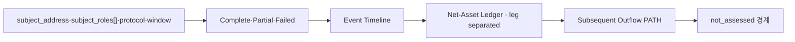

# TASK-016 Lending(SVC-LEND-001) Reconstruction UI
> Created: 2026-07-30 20:45
> Last Updated: 2026-07-30 20:45
> Status: Proposed 0.1 · 사용자 검토 대기 · Browser Check Not Executed · Runtime Not Implemented

## 1. 목적

이 문서는 `SVC-LEND-001`(대출·플래시론·청산 자금 경로 복원)의 결과를 사람이
증거와 함께 검토하는 화면 계약을 정의한다. [Lending 계약 제안](../03_Technical_Specs/19_TASK_016_LENDING_CONTRACT_PROPOSAL.md)의
정답 3필드와 판정 경계를 시각화한다.

가장 중요한 UI 원칙은 아래를 먼저 보이는 것이다.

- 어떤 lending 이벤트가 어떤 순서(block·txIndex·logIndex)로 발생했는가
- subject가 실제 sender/receiver인 value leg가 어떤 자산·방향으로 정합됐는가
- 원금·flashloan premium·debt·collateral leg가 분리됐는가
- 순자산 계산에 필요한 leg가 모두 확보됐는가(아니면 partial)
- 후속 유출 PATH의 시작 주소가 어느 계산 결과에서 유도됐는가
- **공격 vs 정상 청산은 판정하지 않는다(not_assessed)**

Preview는 synthetic docs-only 화면이며 공개 사례·live 조회·제품 analyzer
결과가 아니다.

## 2. 화면 구조

3열 워크스페이스: 좌측 Request(주소·역할 집합·프로토콜·창·상태), 중앙
Lending Result(상태→이벤트→순자산 ledger→유출 PATH→경계), 우측 Evidence
Inspector(event/transfer/call evidence).

## 3. 단일 Query와 역할 표현

`reconstruct_lending_flow` 단일 query다. `subject_roles[]`는 중복 없는 집합
칩으로 표시하며, **역할은 표시·binding·검증용이고 ledger leg 필터가 아니다**.
ledger는 subject_address가 실제 sender/receiver인 정합 통과 leg를 전부 담는다.

## 4. 상태 표현

### 4.1 Complete
모든 lending 이벤트가 디코딩되고 event↔transfer 정합을 통과해 필요한 모든
value leg가 확보된다. 순자산 ledger가 자산별로 닫히고 유출 PATH가 bounded
scope로 이어진다. 공격성·귀속은 not_assessed를 유지한다.

### 4.2 Partial
이벤트는 디코딩됐으나 native/internal leg가 trace 없이는 확정되지 않는 등
일부 leg가 미정합. 미확보 leg를 UNRESOLVED로 표시하고 순자산은 partial,
유출 경로도 확보된 범위까지만 보여준다.

### 4.3 Failed
구조적 오류를 결과 대신 노출한다. 예: 관찰된 역할 집합 ≠ request
`subject_roles[]` → `reconciliation_failed`(stage=role_set_binding). 실패를
"관계 없음"으로 해석하지 않도록 다음 행동을 안내한다.

## 5. Net-Asset Ledger 표현

- leg별로 방향(IN/OUT)·자산·raw amount와 매칭된 Transfer를 표시한다.
- 원금·premium·debt·collateral을 색/라벨로 구분한다(premium은 warn 계열).
- 정합 실패 leg는 bad 계열 UNRESOLVED로 표시하고 total에 partial 사유를 남긴다.
- 총합은 자산별 유입−유출로만 계산하고 가격·법정통화 환산을 하지 않는다.

## 6. 후속 PATH 경계

PATH 시작 주소는 순자산 ledger에서 subject가 자산을 실제 수령한 leg의 수령
주소에서 유도한다(임의 주소 금지). hop은 주소·자산·raw amount만 표시하고
라벨·서비스 귀속을 붙이지 않는다.

## 7. Loading·Empty·Stale·Rules

- loading/empty/stale은 결과 상태(complete/partial/failed)와 분리해 표시한다.
- Rules 미확정 시 live 조회를 막고 artifact_only로 표시한다.
- 외부 fetch·RPC·탐색기 호출을 하지 않는다(정적 Preview).

## 8. Preview 범위

- synthetic 데이터로 complete/partial/failed 3상태를 재현한다.
- 실제 주소·TX·topic0·프로토콜 주소를 사실로 고정하지 않는다(캡처 Gate 유예).
- 외부 fetch/XHR/WebSocket/EventSource 0건, 인라인 script 1개, 중복 ID 0.

## 9. UI-First Gate

- [ ] 사용자가 Preview를 브라우저에서 확인한다.
- [ ] 이벤트 타임라인·leg 분리 ledger·PATH·not_assessed 경계 표현을 승인한다.
- [ ] 승인 시 캡처 Gate(프로토콜·ABI·주소 pin, `FX-SVC-LEND-001` 사례)로
  이동한다. Context Receipt PASS·구현 승인은 그 이후 별도 Gate다.

이 Gate는 설계 확인이며, 코드·fixture 캡처·구현 승인을 포함하지 않는다.

**loading·empty·stale 범위.** 이번 Preview는 결과 3상태(complete/partial/
failed)에 집중하며, loading·empty·stale 전체 상태는 상위 Investigation
Workbench Gate로 분리한다. 이 분리는 bounded 허용이며, **TASK-016 전체 UI
Gate 승인 전에 loading·empty·stale을 별도로 확인**한다.

## 10. 365 글로벌 평가 기준

| 기준 | 판정 | 증거·경계 |
|:---|:---:|:---|
| Functionality | Proposed | 이벤트·leg·순자산·PATH 시각화 계약, runtime 미구현 |
| Potential Impact | Partial | 서비스·크로스체인 확장의 첫 adapter, 실대회 효과 미측정 |
| Novelty | Pass / Offline | 이벤트 amount가 아니라 event↔transfer 정합 leg로 순자산 계산 |
| UX | Proposed / Preview | 단일 화면에서 상태·leg·경계·PATH를 함께 검토 |
| Open-source | Pass | 정적 HTML Preview·계약 문서 공개 |
| Business Plan | N/A | 대회 준비용 설계이며 수익 모델 범위가 아님 |

## 11. Related Documents

- **Technical_Specs**: [Lending 계약 제안](../03_Technical_Specs/19_TASK_016_LENDING_CONTRACT_PROPOSAL.md) - 정답·evidence·oracle 계약
- **UI_Screens**: [Lending Preview](./previews/09_task_016_lending_preview.html) - complete/partial/failed 정적 화면
- **Technical_Specs**: [flow_path IO Contract](../03_Technical_Specs/16_TASK_014_FLOW_PATH_IO_CONTRACT.md) - 후속 유출 PATH 재사용
- **Concept_Design**: [예상문제 은행 SVC-LEND-001](../01_Concept_Design/02_SCAN_2026_EXPECTED_PROBLEM_BANK.md) - 문제·정답 정의
- **Logic_Progress**: [Backlog TASK-016](../04_Logic_Progress/00_BACKLOG.md) - adapter 범위·Context Receipt
- **Logic_Progress**: [Execution Plan Wave 5](../04_Logic_Progress/01_EXECUTION_PLAN.md) - 서비스·Cross-chain 순서
