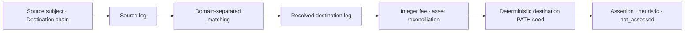

# TASK-016 Bridge/XChain(SVC-BRG-001) Linkage UI
> Created: 2026-07-30 21:56
> Last Updated: 2026-07-30 22:35
> Status: UI-First Approved 0.2 · Browser Check Passed · Runtime Not Implemented

## 1. 목적

이 문서는 `SVC-BRG-001`의 출발 체인 전송과 도착 체인 수령을 증거로 연결하는
화면 계약을 정의한다. [Bridge/XChain 계약](../03_Technical_Specs/21_TASK_016_BRIDGE_XCHAIN_CONTRACT_PROPOSAL.md)의
request/result 분리, domain-separated matching, 정수 fee·asset 정합과
complete/partial/failed 경계를 시각화한다.

Preview는 synthetic docs-only 화면이다. 실제 브리지·체인·주소·TX·topic0을
고정하지 않으며 외부 RPC·탐색기·DB를 호출하지 않는다.

## 2. 화면 구조와 흐름



3열 워크스페이스를 사용한다.

- 좌측 Request: source subject, destination chain, source TX/window,
  discovery/verify mode와 결과 상태 전환.
- 중앙 Result: 상태, source/destination leg, matching key, raw 정수식,
  arrival window, PATH seed와 판단 경계.
- 우측 Evidence Inspector: source/destination event, transfer, message,
  asset mapping evidence.

## 3. Request와 Result 분리

- discovery mode의 request에는 source subject와 destination chain만 둔다.
  recipient는 `UNKNOWN · discover from evidence`로 표시한다.
- verify mode에서만 `expected_recipient`를 선택 입력으로 표시한다.
- result의 `resolved_scoped_subjects[]`가 발견한 destination recipient를
  보유한다. request recipient를 결과처럼 보이지 않는다.
- recipient를 못 찾으면 placeholder를 합성하지 않고 `partial`로 남긴다.

## 4. 상태 표현

### 4.1 Complete

양단 leg가 domain-separated composite key 또는 공식 derivation으로 연결되고,
event↔transfer, 공식 asset mapping, 정수 fee 식과 arrival window를 모두
통과한다. 공식 브리지 식별은 evidence-backed assertion이며 recipient 소유·
본인성·불법성은 `not_assessed`다.

### 4.2 Partial

source leg는 확인됐지만 destination evidence나 결정적 key가 부족한 상태다.
금액·시간 상관 후보는 `heuristic candidate`로 표시하고 resolved recipient와
PATH seed를 만들지 않는다. 결정적 key가 같아도 arrival window 밖이면
`partial`로 두고 late-arrival conflict를 보존한다.

### 4.3 Failed

확보된 근거끼리 모순된 상태다. 예: 동일 composite key에서 공식 fee·asset
mapping을 적용한 expected raw와 observed raw가 다르면
`reconciliation_failed(stage=amount_reconciliation)`와 `results: []`를
표시한다. 실패를 “도착 없음”으로 해석하지 않는다.

## 5. Matching 표현

- composite domain을 `protocol/source contract · source chain · destination
  chain · key type/value · emitter` 순서로 표시한다.
- 결정적 matching은 초록색 `DETERMINISTIC`, 금액·시간 상관은 노란색
  `CANDIDATE`로 분리한다.
- 단독 nonce/message 값은 확정 근거로 표시하지 않는다.
- 공식 derivation route는 source key, destination key, rule reference를
  함께 표시한다.

## 6. Fee·Asset·Arrival 정합

- 모든 원금·수수료·도착 금액은 unsigned decimal raw 값으로 먼저 표시한다.
- `source_asset_ref`, `destination_asset_ref`, decimals, 공식
  `asset_mapping_ref`를 함께 보여준다.
- 1:1 route는 아래 정수식을 그대로 노출한다.

```text
(source_raw - protocol_fee_raw) × 10^destination_decimals
== expected_destination_raw × 10^source_decimals
```

- `max_abs_delta_raw` 기본값은 `0`이며, 임의 tolerance 입력은 제공하지 않는다.
- arrival window 시작·끝·관찰 block을 함께 표시한다. 창 밖 결과는 complete로
  승격하지 않는다.

## 7. PATH와 판단 경계

PATH seed는 결정적으로 정합된 destination recipient leg에서만 만든다.
candidate/partial에서는 PATH 버튼과 seed를 비활성화한다.

- confirmed fact: 양단 event·raw amount·정합 leg·결정적 matching.
- evidence-backed assertion: 공식·검증된 브리지 컨트랙트 식별.
- heuristic candidate: 금액·시간 상관 후보.
- not_assessed: recipient 소유·본인성, 의도·불법성.

## 8. Loading·Empty·Stale·Rules

- loading/empty/stale은 분석 결과 상태와 분리한다.
- 이번 Preview는 complete/partial/failed 계약에 집중한다.
- Rules 미확정 시 `LIVE OFF · ARTIFACT ONLY`로 표시한다.
- TASK-016 전체 UI Gate 전 Workbench에서 loading·empty·stale을 별도 확인한다.

## 9. Preview 범위와 조작

- synthetic complete/partial/failed 3상태를 버튼으로 전환한다.
- Tab/Shift+Tab, Enter/Space와 ArrowLeft/ArrowRight/Home/End를 지원한다.
- 외부 fetch/XHR/WebSocket/EventSource 0건, mutation 0건, 인라인 script 1개,
  중복 ID 0개를 목표로 한다.

2026-07-30 브라우저 재검증에서 세 상태, roving tabindex·ArrowRight·Home 전환,
request의 recipient 미입력, complete의 resolved recipient·정수식·arrival·PATH,
partial의 destination-missing과 late-arrival 변형·PATH 비활성화, failed의
`results: []`·금액 모순을 확인했다. runtime 실행은 별도다.

## 10. UI-First Gate

- [x] 사용자가 Preview를 브라우저에서 확인했다(2026-07-30 22:35).
- [x] request의 미지 recipient와 result의 resolved recipient 분리를 승인했다.
- [x] deterministic/candidate, raw 정수식, arrival window와 conflict 표현을
  승인했다.
- [x] partial에서 recipient·PATH 미승격, late-arrival conflict 보존,
  failed에서 구조화 오류 보존을 승인했다.
- [x] 다음 단계가 브리지/체인/메시지 스키마 pin과 `FX-SVC-BRG-001` 캡처
  Gate임을 확인했다(캡처 착수 승인은 아님).

이 Gate는 UI 계약 확인이며 fixture 캡처, Schema 변경, analyzer 구현 또는
Benchmark 승격을 승인하지 않는다. 사용자의 “권장 순서대로 진행 승인”은
Preview 보완·브라우저 재검증과 이 UI-First Gate에만 적용한다.

## 11. 365 글로벌 평가 기준

| 기준 | 판정 | 증거·경계 |
|:---|:---:|:---|
| Functionality | Proposed | 양단 leg·matching·금액 정합·PATH seed 화면, runtime 미구현 |
| Potential Impact | Partial | cross-chain 문제 지원 기반, 실제 fixture·대회 효과 미측정 |
| Novelty | Pass / Offline | recipient를 입력에 누출하지 않고 domain·raw 산술로 연결 |
| UX | Proposed / Preview | 양단 연결 근거와 실패 경계를 한 화면에서 검토 |
| Open-source | Pass | 정적 HTML Preview·UI 계약 공개 |
| Business Plan | N/A | 대회 준비용 설계이며 수익 모델 범위가 아님 |

## 12. Related Documents

- **Technical_Specs**: [Bridge/XChain 계약](../03_Technical_Specs/21_TASK_016_BRIDGE_XCHAIN_CONTRACT_PROPOSAL.md) - request/result·matching·fee 계약
- **UI_Screens**: [Bridge Preview](./previews/10_task_016_bridge_xchain_preview.html) - complete/partial/failed 정적 화면
- **Technical_Specs**: [WP-SERVICE 공통 계약](../03_Technical_Specs/20_TASK_016_SERVICE_COMMON_CONTRACT.md) - service adapter 공통 불변식
- **UI_Screens**: [Investigation Workbench](./03_WEB_INVESTIGATION_WORKBENCH.md) - graph·evidence 상위 화면
- **Concept_Design**: [예상문제 은행 SVC-BRG-001](../01_Concept_Design/02_SCAN_2026_EXPECTED_PROBLEM_BANK.md) - 문제·정답 정의
- **Logic_Progress**: [Backlog TASK-016](../04_Logic_Progress/00_BACKLOG.md) - Context Receipt·구현 잠금
- **Logic_Progress**: [Execution Plan Wave 5](../04_Logic_Progress/01_EXECUTION_PLAN.md) - adapter 진행 순서
