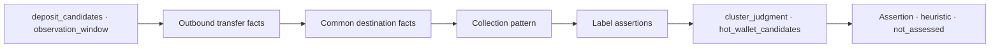

# TASK-016 CEX Cluster(SVC-CEX-001) Evaluation UI
> Created: 2026-07-31 05:14
> Last Updated: 2026-07-31 05:14
> Status: UI-First Draft awaiting static preview check

## 1. 목적

이 문서는 `SVC-CEX-001`의 입금주소군 클러스터 평가 화면 계약을 정의한다.
[CEX Cluster 계약](../03_Technical_Specs/22_TASK_016_CEX_CLUSTER_CONTRACT_PROPOSAL.md)의
request/result 분리, discovery/verify mode, cluster_judgment 경계와
complete/partial/failed 상태를 시각화한다.

Preview는 synthetic docs-only 화면이다. 실제 거래소·주소·TX·라벨 출처를
고정하지 않으며 외부 RPC·탐색기·DB를 호출하지 않는다.

## 2. 화면 구조와 흐름

3열 워크스페이스를 사용한다.

- 좌측 Request: `deposit_candidates[]`, `observation_window`, discovery/verify
  mode와 결과 상태 전환.
- 중앙 Result: 상태, `cluster_judgment`, hot wallet 후보, common destination,
  false_positive exclusions.
- 우측 Evidence Inspector: outbound transfer, pattern, label assertion evidence.

## 3. Request와 Result 분리

- discovery mode의 request에는 deposit set과 observation window만 둔다.
  hot wallet은 `UNKNOWN · discover from evidence`로 표시한다.
- verify mode에서만 `expected_hot_wallet`을 선택 입력으로 표시한다.
- result의 `hot_wallet_candidates[]`가 evidence에서 계산한 후보를 보유한다.
  request hot wallet을 결과처럼 보이지 않는다.
- 후보를 못 찾으면 placeholder를 합성하지 않고 `partial`로 남긴다.

## 4. 상태 표현

### 4.1 Complete

공통 destination fact, first-party/gov label assertion, 다주소 반복 집금
패턴이 교차검증되고 `cluster_judgment=confirmed`다. hot wallet 후보는
evidence-backed이며 거래소 소유·불법성은 `not_assessed`다.

### 4.2 Partial

공통 destination fact는 있으나 label assertion 미확보이거나 반복 패턴이
약한 상태다. `cluster_judgment=estimated` 상한을 유지하고 단일 counterparty
승격을 금지한다. PATH seed는 비활성화하거나 candidate로만 표시한다.

### 4.3 Failed

확보된 근거끼리 모순된 상태다. 예: label assertion과 outbound fact 상충,
verify mode에서 `expected_hot_wallet` 불일치, scope 밖 주소 합성이면
`reconciliation_failed`와 `results: []`를 표시한다. 실패를 “클러스터 없음”으로
해석하지 않는다.

## 5. Discovery vs Verify mode

- **Discovery**: hot wallet 미입력. evidence에서 `hot_wallet_candidates[]`를
  계산·순위화한다.
- **Verify**: `expected_hot_wallet` 제공. result 후보와 exact binding하고
  불일치 시 failed/conflict.

## 6. Fact · Assertion · Heuristic · Not assessed

- **confirmed fact**: outbound Transfer, common destination TX·block·amount,
  반복 횟수(로그 재현 범위).
- **evidence-backed assertion**: first-party/gov 라벨 claim(출처·시점).
- **heuristic candidate**: label 없는 패턴 추정, 단일 TX 상관, hot wallet
  순위(근거 미달).
- **not_assessed**: `attribution.exchange_ownership`, `attribution.criminality`.

Etherscan community tag는 assertion으로도 승격하지 않고 supporting reference
미사용으로 표시한다.

## 7. Cluster judgment 표현

- `confirmed`: 초록 `CONFIRMED` — label assertion + common destination + 패턴
  정합.
- `estimated`: 노란 `ESTIMATED` — label 없거나 패턴 미약. 단일 counterparty
  confirmed 금지 배지 표시.
- `unresolved`: 회색 `UNRESOLVED` — common destination fact 부족.

`false_positive_exclusions[]`는 허브·공용 서비스·단일-counterparty 오탐
사유를 별도 블록으로 표시한다.

## 8. Loading · Empty · Stale · Rules

- loading/empty/stale은 분석 결과 상태와 분리한다.
- 이번 Preview는 complete/partial/failed 계약에 집중한다.
- Rules 미확정 시 `LIVE OFF · ARTIFACT ONLY`로 표시한다.

## 9. Preview 범위와 조작

- synthetic complete/partial/failed 3상태를 버튼으로 전환한다.
- Tab/Shift+Tab, Enter/Space와 ArrowLeft/ArrowRight/Home/End를 지원한다.
- 외부 fetch/XHR/WebSocket/EventSource 0건, mutation 0건, 인라인 script 1개,
  중복 ID 0개를 목표로 한다.

## 10. UI-First Gate

- [ ] 사용자가 Preview를 브라우저에서 static check한다.
- [ ] request의 미지 hot wallet과 result 후보 분리를 확인한다.
- [ ] fact/assertion/heuristic/not_assessed와 단일-counterparty confirmed
  금지를 확인한다.
- [ ] partial에서 estimated 상한·PATH 미승격, failed에서 구조화 오류 보존을
  확인한다.

이 Gate는 UI 계약 확인이며 fixture 캡처, Schema 변경, analyzer 구현 또는
Benchmark 승격을 승인하지 않는다.

## 11. Related Documents

- **Technical_Specs**: [CEX Cluster 계약](../03_Technical_Specs/22_TASK_016_CEX_CLUSTER_CONTRACT_PROPOSAL.md) - request/result·judgment 계약
- **UI_Screens**: [CEX Preview](./previews/11_task_016_cex_preview.html) - complete/partial/failed 정적 화면
- **Technical_Specs**: [WP-SERVICE 공통 계약](../03_Technical_Specs/20_TASK_016_SERVICE_COMMON_CONTRACT.md) - service adapter 공통 불변식
- **UI_Screens**: [Bridge/XChain UI](./11_TASK_016_BRIDGE_XCHAIN_UI.md) - discovery/verify 선례
- **Concept_Design**: [예상문제 은행 SVC-CEX-001](../01_Concept_Design/02_SCAN_2026_EXPECTED_PROBLEM_BANK.md) - 문제·정답 정의
- **Logic_Progress**: [Backlog TASK-016](../04_Logic_Progress/00_BACKLOG.md) - CEX Gate 진행
- **Logic_Progress**: [Execution Plan Wave 5](../04_Logic_Progress/01_EXECUTION_PLAN.md) - adapter 진행 순서
