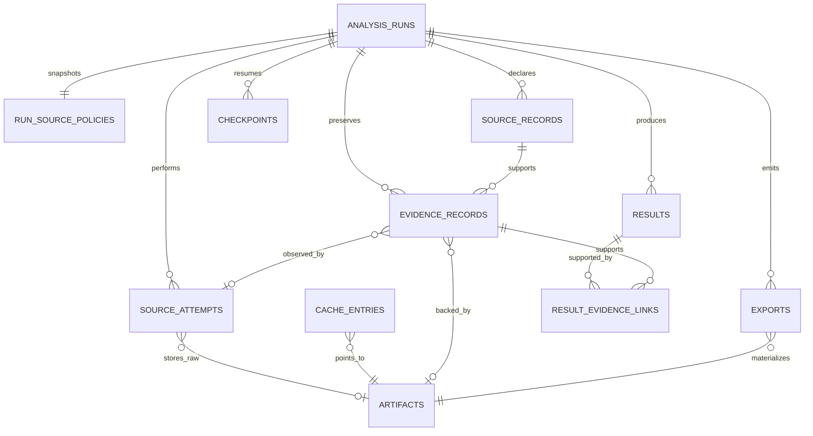

# SCAN 2026 SQLite 논리 DB Schema
> Created: 2026-07-27 15:52
> Last Updated: 2026-07-28 13:45
> Status: Approved 1.3 · SQLite Schema Version 2 · OPS-IMPL-02 Applied

## 1. 문서 목적

이 문서는 SCAN 분석 코어가 로컬 SQLite에 보존할 실행·소스 조회·캐시·
증거·결과·재개 상태의 논리 구조를 고정한다. `TASK-004`에서 SQLite
`user_version=1` DDL, WAL pragma, backup·무결성 검사와 artifact 경로를
이 논리 계약 안에서 구현했다.

SQLite는 검색과 정합에 필요한 메타데이터만 저장한다. 원본 응답과 export는
SHA-256 content-addressed artifact로 분리하며 JSON Analysis Result를 결과의
단일 source of truth로 유지한다.

## 2. 범위와 비범위

### 2.1 포함

- Analysis I/O `0.1` 요청·실행·결과 식별자
- 공급자별 요청 attempt와 fallback 이력
- canonical cache key와 artifact 무결성
- result·evidence·source·artifact 참조
- checkpoint와 재개 cursor
- JSON·Markdown export 위치와 hash
- 규정 판단 당시의 source policy snapshot

### 2.2 제외

- 개인 키·seed phrase·서명 payload·CTFd credential
- 원본 응답 body와 첨부 파일 blob
- 범용 주소 그래프·전체 체인 warehouse
- 팀 공유 서버와 다중 사용자 권한 모델
- schema version 2 이후 migration·garbage collection
- CTFd 자동 제출 상태

## 3. 설계 원칙

1. 모든 실행은 `analysis_id`로 격리한다.
2. 외부 조회 한 번은 공급자별 `source_attempt` 한 행으로 남긴다.
3. raw byte는 먼저 SHA-256으로 식별하고 artifact 파일에 원자적으로 쓴다.
4. DB에는 secret, 전체 인증 endpoint, raw body를 저장하지 않는다.
5. result와 evidence는 다대다 연결이며 모든 confirmed result는 하나 이상의
   evidence를 가진다.
6. historical immutable cache와 `latest`·TTL cache를 구분한다.
7. checkpoint는 완료된 stage만 기록하고 덮어쓰기 대신 revision을 증가시킨다.
8. 삭제·migration·backup은 명시적 사용자 승인과 복구 검증을 요구한다.

## 4. 관계 개요

## 5. 엔티티 정의

### 5.1 `analysis_runs`

한 Analysis I/O 요청과 실행 생명주기를 나타낸다.

| 필드 | 필수 | 의미 |
|:---|:---:|:---|
| `analysis_id` | 예 | PK, 공개 `AN-...` ID |
| `analysis_type` | 예 | 등록된 Analysis I/O type (`bitcoin_utxo` 포함) |
| `chain_id` | 예 | EVM mainnet `1`, Bitcoin mainnet `0` |
| `fixture_id` | 아니요 | 회귀 실행의 `FX-...` |
| `status` | 예 | queued/running/complete/partial/failed/interrupted/restricted |
| `schema_version` | 예 | Analysis I/O schema version |
| `tool_version` | 예 | 실행 코드 version 또는 commit |
| `request_artifact_sha256` | 예 | 정규화 요청 JSON artifact |
| `started_at` | 아니요 | UTC RFC 3339 |
| `finished_at` | 아니요 | UTC RFC 3339 |
| `created_at` | 예 | 행 생성 시각 |
| `updated_at` | 예 | 마지막 상태 변경 시각 |

불변조건:

- `complete`, `partial`, `failed`, `interrupted`, `restricted`만 종료 상태다.
- `finished_at`은 종료 상태에서만 필수다.
- 요청 JSON의 `analysis_id`, `analysis_type`, `chain_id`와 행 값이 일치한다.
- TASK-017 이후 새 SQLite v1 DB는 `chain_id IN (0, 1)`을 사용한다.
  이전 `chain_id = 1` DB는 자동 변형하지 않으며 Bitcoin 저장을 명확히
  거부한다. 기존 사용자 DB의 Bitcoin 지원은 별도 승인된 backup·migration
  Gate에서만 연다.

### 5.2 `run_source_policies`

실행 판단 당시 규정과 허용 source를 canonical JSON으로 보존한다.

| 필드 | 필수 | 의미 |
|:---|:---:|:---|
| `analysis_id` | 예 | PK·FK → `analysis_runs` |
| `rule_status` | 예 | unconfirmed/allowed/restricted |
| `allowed_source_ids_json` | 예 | 정렬된 source ID 배열 |
| `source_order_json` | 예 | 실제 우선순위 배열 |
| `allow_fallback` | 예 | boolean |
| `offline_mode` | 예 | boolean |
| `rules_snapshot_ref` | 아니요 | 적용한 Rules Register 변경 기록 |
| `canonical_sha256` | 예 | policy canonical JSON hash |

`restricted`이면 live `source_attempts`를 생성하기 전에 실행을 종료한다.

### 5.3 `source_attempts`

RPC·REST·공식 URL 조회의 개별 공급자 시도를 기록한다.

| 필드 | 필수 | 의미 |
|:---|:---:|:---|
| `source_attempt_id` | 예 | PK, 내부 불투명 ID |
| `analysis_id` | 예 | FK → `analysis_runs` |
| `source_record_id` | 아니요 | Analysis Result 생성 후 연결할 공급자 레코드 ID |
| `source_id` | 예 | `DS-...` 등록부 ID |
| `provider_id` | 예 | 동일 source의 실제 공급자 |
| `capability` | 예 | rpc_tx, receipt, logs, state, trace, context 등 |
| `method` | 예 | secret이 제거된 method |
| `request_fingerprint` | 예 | 정규화 요청 hash |
| `block_tag` | 아니요 | 명시적 block number/hash |
| `attempt_number` | 예 | 동일 요청 내 1부터 증가 |
| `outcome` | 예 | success/failed |
| `failure_kind` | 아니요 | timeout/rate_limited/transient/unavailable/invalid/permanent |
| `http_status` | 아니요 | 안전한 경우의 HTTP status |
| `retryable` | 예 | boolean |
| `wait_seconds` | 아니요 | retry 전 대기 초 |
| `raw_sha256` | 아니요 | 성공·실패 raw byte hash |
| `started_at` | 예 | 시도 시작 |
| `finished_at` | 예 | 시도 종료 |
| `artifact_sha256` | 아니요 | 성공 또는 진단 raw artifact FK |

`analysis_id + request_fingerprint + provider_id + attempt_number`는 유일하다.
endpoint query·header·API key는 저장하지 않는다.
분석 결과 전의 attempt에는 가짜 `SRC-*`를 만들지 않는다. 후속 분석기가
공개 source record와 evidence를 만들 때 `evidence_records.source_attempt_id`로
실제 조회를 연결한다.

### 5.4 `artifacts`

content-addressed 파일의 무결성·보존 메타데이터다.

| 필드 | 필수 | 의미 |
|:---|:---:|:---|
| `sha256` | 예 | PK, lowercase 64 hex |
| `byte_length` | 예 | 원본 byte 길이 |
| `media_type` | 예 | JSON, text, binary 등 |
| `relative_path` | 예 | `.scan/` 기준 상대 경로 |
| `artifact_kind` | 예 | request/raw_response/result/export/context |
| `redaction_status` | 예 | not_required/redacted/rejected/pending |
| `license_status` | 예 | owned/public_reference/restricted/unknown |
| `source_id` | 아니요 | 생성 원본 `DS-...` |
| `retrieved_at` | 아니요 | 원본 조회 시각 |
| `created_at` | 예 | 최초 저장 시각 |

같은 SHA-256 파일은 덮어쓰지 않는다. `relative_path`에는 사용자 홈 절대
경로를 저장하지 않는다.

### 5.5 `cache_entries`

정규화 source 요청을 raw artifact와 연결한다.

| 필드 | 필수 | 의미 |
|:---|:---:|:---|
| `cache_key` | 예 | PK, canonical request hash |
| `source_id` | 예 | `DS-...` |
| `provider_id` | 예 | 실제 공급자 |
| `capability` | 예 | 조회 기능 |
| `block_tag` | 아니요 | 명시적 block |
| `artifact_sha256` | 예 | FK → `artifacts` |
| `immutability` | 예 | immutable/ttl/negative |
| `created_at` | 예 | 저장 시각 |
| `expires_at` | 아니요 | TTL/negative에 필수 |
| `last_verified_at` | 아니요 | 원본과 재대조 시각 |
| `endpoint_host` | 예 | query가 제거된 host |
| `endpoint_path` | 예 | query·fragment가 제거된 path |
| `status_code` | 예 | 원 응답 HTTP status |
| `media_type` | 아니요 | 원 응답 media type |
| `retrieved_at` | 예 | 원 응답 조회 시각 |
| `fallback_from_json` | 예 | 캐시 생성 당시 실패 source 배열 |

`latest`는 기본 cache 대상이 아니다. 확정 block hash 기반 historical 응답만
`immutable`로 승격할 수 있다.

### 5.5.1 `source_records`

Analysis Result의 source record를 실행별로 보존한다.

| 필드 | 필수 | 의미 |
|:---|:---:|:---|
| `source_record_id` | 예 | PK, 공개 `SRC-...` ID |
| `analysis_id` | 예 | FK → `analysis_runs` |
| `source_id` | 예 | `DS-...` |
| `provider_id` | 예 | 실제 공급자 |
| `role` | 예 | scoring/context/supporting |
| `required` | 예 | 필수 source 여부 |
| `capability` | 예 | 조회 기능 |
| `endpoint_host` | 예 | 안전한 host |
| `retrieved_at` | 예 | 조회 시각 |
| `fallback_from` | 아니요 | 최초 실패 source record |

evidence는 `source_record_id + analysis_id` 복합 FK로 같은 run의 source만
참조한다.

### 5.6 `results`

Analysis Result의 결정적 결과 항목이다.

| 필드 | 필수 | 의미 |
|:---|:---:|:---|
| `result_id` | 예 | PK, 공개 result ID |
| `analysis_id` | 예 | FK → `analysis_runs` |
| `result_type` | 예 | 분석기 확장 결과 유형 |
| `classification` | 예 | confirmed_fact/external_context/heuristic/not_assessed |
| `requirement_ids_json` | 예 | `REQ-*` 배열 |
| `fixture_requirement_ids_json` | 예 | fixture 채점 `REQ-*` 배열 |
| `value_json` | 예 | canonical result value |
| `value_sha256` | 예 | `value_json` hash |
| `created_at` | 예 | 생성 시각 |

float를 raw token·wei 값에 사용하지 않는다. 동일 `analysis_id` 내 result ID도
유일해야 한다.

### 5.7 `evidence_records`

event·call·state·context 증거를 정규화한다.

| 필드 | 필수 | 의미 |
|:---|:---:|:---|
| `evidence_id` | 예 | PK, 공개 evidence ID |
| `analysis_id` | 예 | FK → `analysis_runs` |
| `evidence_type` | 예 | event/call/state/context |
| `source_id` | 예 | `DS-...` |
| `source_record_id` | 예 | Analysis Result source 레코드 |
| `source_attempt_id` | 아니요 | FK → `source_attempts` |
| `method` | 예 | RPC/API/문서 확인 방법 |
| `locator_json` | 예 | block·TX·log/trace index 또는 URL |
| `decoded_json` | 예 | 정규화된 해석 |
| `artifact_sha256` | 아니요 | FK → `artifacts` |
| `retrieved_at` | 예 | 실제 조회 시각 |

event evidence에는 calldata를 섞지 않고 call evidence로 분리한다. context는
온체인 사실을 대신하지 않는다.

### 5.8 `result_evidence_links`

결과와 근거의 다대다 관계다.

| 필드 | 필수 | 의미 |
|:---|:---:|:---|
| `result_id` | 예 | PK 일부·FK → `results` |
| `evidence_id` | 예 | PK 일부·FK → `evidence_records` |
| `role` | 예 | scoring/supporting/context/counterevidence |
| `created_at` | 예 | 연결 생성 시각 |

다른 `analysis_id`에 속한 result와 evidence를 연결할 수 없다.

### 5.9 `checkpoints`

중단 후 재개 가능한 완료 stage를 보존한다.

| 필드 | 필수 | 의미 |
|:---|:---:|:---|
| `checkpoint_id` | 예 | PK |
| `analysis_id` | 예 | FK → `analysis_runs` |
| `stage` | 예 | 완료된 pipeline stage |
| `revision` | 예 | stage별 1부터 증가 |
| `cursor_json` | 예 | secret이 제거된 재개 cursor |
| `completed_evidence_ids_json` | 예 | 재수집하지 않을 evidence |
| `state_sha256` | 예 | canonical checkpoint hash |
| `created_at` | 예 | 생성 시각 |

미완료 stage는 checkpoint로 기록하지 않는다.

### 5.10 `exports`

동일 result model에서 생성된 사용자 산출물을 기록한다.

| 필드 | 필수 | 의미 |
|:---|:---:|:---|
| `export_id` | 예 | PK |
| `analysis_id` | 예 | FK → `analysis_runs` |
| `export_type` | 예 | result_json/evidence_markdown |
| `artifact_sha256` | 예 | FK → `artifacts` |
| `schema_version` | 예 | 출력 계약 version |
| `created_at` | 예 | 생성 시각 |

한 run의 JSON과 Markdown은 같은 result·evidence ID와 값을 사용해야 한다.

### 5.11 Operations v2 신규 엔티티

`OPS-IMPL-02`는 v1 엔티티를 유지하면서 다음 15개 `STRICT` table을
additive migration으로 추가한다.

| 테이블 | PK·핵심 FK | 책임 |
|:---|:---|:---|
| `competitions` | `competition_id` | 운영 세션·Rules snapshot |
| `operation_ai_modes` | `mode_id`, competition FK | immutable provider/model/data/tool mode |
| `problems` | `problem_id`, competition·active plan FK | 문제 metadata·상태 |
| `problem_artifacts` | problem·artifact FK | 원문·첨부 artifact 역할 |
| `plans` | `plan_id`, problem·mode·planner job FK | AI 방법 가설·승인 상태 |
| `jobs` | `job_id`, problem·plan·analysis FK | worker 실행·idempotency·Analysis 연결 |
| `job_dependencies` | job·dependency FK | 문제 내부 leaf DAG |
| `problem_analysis_links` | problem·analysis·job FK | problem→Analysis I/O run 역할 |
| `candidates` | `candidate_id`, problem·creator job FK | 답 후보·불확실성·추천 |
| `candidate_result_links` | candidate·analysis FK | candidate→v1 result/evidence ID |
| `verifications` | `verification_id`, candidate·verifier job FK | 독립 검증 수명주기 |
| `verification_checks` | verification FK | 필수 check 결과·evidence 참조 |
| `submissions` | `submission_id`, candidate·artifact FK | 사람 제출 결과 기록 |
| `operation_events` | `event_id`, competition·problem FK | update/delete가 금지된 append-only audit |
| `operation_errors` | `error_id`, competition·problem·job FK | 안전한 운영 오류 기록 |

순환 관계인 active plan·planner job은 같은 transaction 안에서만 완성되도록
deferred FK를 사용한다. `candidate_result_links.ref_id`는 result/evidence
polymorphic ID이므로 repository가 v1 row를 조회해 실제 `analysis_id`와 함께
저장한다.

## 6. 관계·삭제·mutation 경계

| 동작 | 허용 범위 |
|:---|:---|
| run 생성 | 요청 검증 후 `analysis_runs`와 policy를 한 transaction으로 생성 |
| 상태 변경 | 유효한 상태 전이만 허용하고 `updated_at` 갱신 |
| attempt 추가 | append-only, 기존 실패를 성공으로 덮어쓰지 않음 |
| artifact 추가 | hash 검증 후 insert-or-verify |
| result/evidence 저장 | 한 transaction에서 ID·참조 무결성 확인 |
| checkpoint 추가 | append-only revision |
| cache 만료 | 행 삭제보다 expired 판정 우선 |
| 전체 삭제·reset | 기본 CLI에서 제외, 별도 사용자 승인 필요 |

분석 run 삭제가 필요해도 공유 artifact와 cache를 즉시 연쇄 삭제하지 않는다.
참조 수와 보존 정책을 확인한 garbage collection은 V1 이후 별도 결정이다.

## 7. 인덱스와 조회 계약

정확한 SQL 문법은 `TASK-004`에서 정하지만 다음 조회는 인덱스로 지원해야 한다.

- run status·analysis type·created time
- source ID·provider ID·request fingerprint
- cache key와 expiry
- artifact SHA-256
- result/evidence의 analysis ID
- evidence의 TX·block·log/trace locator
- checkpoint의 analysis ID·stage·최신 revision

## 8. Transaction·WAL·복구

- run 생성, policy 저장은 단일 transaction이다.
- result·evidence·link 승격도 단일 transaction이다.
- artifact 파일은 임시 파일에 쓴 뒤 hash 확인과 atomic rename을 수행하고,
  DB transaction에서 참조한다.
- WAL 사용 중 DB 파일만 복사하지 않는다.
- migration 전 일관된 backup과 restore rehearsal을 수행한다.
- 비정상 종료 후 orphan artifact는 삭제하지 않고 무결성 검사 대상으로 둔다.

## 9. 보존·보안·라이선스

| 데이터 | 기본 방침 |
|:---|:---|
| confirmed fixture | 저장소 정책에 따라 영구 보존 |
| run metadata | 사용자가 삭제를 승인할 때까지 로컬 보존 |
| raw artifact | source ToS·규정·민감성에 따라 보존 또는 참조만 유지 |
| API secret | 저장 금지 |
| CTFd session·credential | 저장 금지 |
| 공개 전 문제 원문 | 외부 전송 금지, 규정 미확정 시 로컬 최소 보존 |

프로젝트 MIT License는 제3자 원본 데이터·공식 문서·fixture provenance의
권리를 재허가하지 않는다. 각 artifact의 `license_status`와 source URL을
별도로 유지한다.

## 10. 구현 승격 Gate

- [x] 논리 엔티티·관계가 정의되었다.
- [x] raw artifact와 SQLite 책임이 분리되었다.
- [x] 보존·mutation·삭제 경계가 정의되었다.
- [x] Analysis I/O result→evidence→source 참조가 매핑되었다.
- [x] 정확한 DDL과 schema version 1 초기화를 `TASK-004`에서 작성했다.
- [x] WAL backup·restore를 임시 DB로 검증했다.
- [x] DB constraint와 Pydantic 불변조건의 의미상 차이를 검사했다.
- [x] fixture 3개를 저장·재개·export하는 integration test를 통과했다.

### 10.1 TASK-004 물리 기준선

| 항목 | 적용 |
|:---|:---|
| 구현 | `src/scan_tool/adapters/sqlite_storage.py` |
| Schema | SQLite `PRAGMA user_version = 1`, `STRICT` tables 11개 |
| Pragma | `foreign_keys=ON`, `journal_mode=WAL`, `synchronous=FULL`, `busy_timeout=5000` |
| Transaction | run+policy, result+evidence+links, checkpoint, export 단위 |
| Migration | 새 DB는 version 1 생성, 알 수 없는 version은 자동 변경 없이 거부 |
| Backup | 존재하지 않는 대상에 `Connection.backup()`, 완료 후 `integrity_check=ok` |
| Artifact root | `.scan/artifacts/<sha256 앞 2자리>/<sha256>` |
| Artifact URI | `artifact://sha256/<lowercase sha256>` |
| Atomic write | 같은 filesystem 임시 파일 `fsync` 후 hard-link create-if-absent |
| Cache | 고정 block tag만 immutable 자동 저장, `latest`·`pending`은 미저장 |

실제 사용자 `.scan/`을 사용하는 composition root와 request/result artifact
조회는 `TASK-005`에서 구현했다. 자동 검증은 모두 pytest 임시 디렉터리에서
실행했으며 기존 DB의
삭제·reset·migration은 수행하지 않았다.

### 10.2 OPS-IMPL-02 운영 확장 기준선

| 항목 | 적용 |
|:---|:---|
| 구현 | `src/scan_tool/adapters/sqlite_operations.py` |
| Schema | 명시적 SQLite `PRAGMA user_version = 2`, operations `STRICT` tables 15개 |
| 보존 | v1 tables 11개를 rewrite/drop하지 않고 그대로 재사용 |
| Migration | source integrity → 새 v1 backup → `BEGIN IMMEDIATE` additive DDL → FK check → v2 commit |
| 실패 | 전체 v2 DDL·version 변경 rollback, v1 코드로 재개방 가능 |
| v1 경계 | 기존 `SQLiteStorage`는 v2를 자동 변경하지 않고 version mismatch로 거부 |
| Repository | 검증된 `OperationsDocument`를 단일 transaction으로 저장 |
| Artifact | 문제 원문·첨부·plan raw·submission note는 기존 `artifacts.sha256` 선행 참조 |
| Analysis | job·candidate가 기존 analysis run·result·evidence row를 재사용 |
| Audit | `operation_events` API는 append-only, trigger가 update/delete를 차단 |

빈 DB와 데이터가 있는 v1 DB, 중간 DDL 오류를 모두 pytest 임시 경로에서
검증했다. 실제 사용자 `.scan/scan.sqlite3`에는 migration을 실행하지 않았다.

## 11. 365 글로벌 평가 기준 연결

| 기준 | DB Schema 기여 |
|:---|:---|
| Functionality | 실행·cache·증거·결과·resume의 참조 무결성 |
| Potential Impact | 새 체인·분석기를 같은 provenance 구조에 추가 가능 |
| Novelty | 결론보다 원본 증거 연결을 우선하는 evidence-first 저장 |
| UX | cache·resume·partial 상태를 빠르게 조회 |
| Open-source | SQLite·공개 JSON Schema 기반 재현 가능한 구조 |
| Business Plan | 상용 DB 없이 로컬 우선 운영, 규모 확인 후 확장 |

## 12. Related Documents

- **Concept_Design**: [분석 도구 기능 우선순위](../01_Concept_Design/04_SCAN_2026_TOOL_PRIORITY.md) - BASE-CACHE·PROVENANCE·EXPORT 우선순위
- **UI_Screens**: [CLI Screen Flow](../02_UI_Screens/00_SCREEN_FLOW.md) - run·resume·show·export 사용자 흐름
- **UI_Screens**: [CLI Terminal UI Design](../02_UI_Screens/01_UI_DESIGN.md) - cache·run·evidence 표시 계약
- **Technical_Specs**: [Python 개발 원칙](./00_DEVELOPMENT_PRINCIPLES.md) - SQLite·artifact·보안 규칙
- **Technical_Specs**: [데이터 소스 등록부](./01_DATA_SOURCE_REGISTRY.md) - source·provider ID와 보존 제약
- **Technical_Specs**: [P0·V1 기술 선택 기록](./04_SCAN_2026_TECHNOLOGY_DECISION.md) - SQLite·WAL·artifact 결정
- **Technical_Specs**: [공통 분석 I/O Schema](./05_ANALYSIS_IO_SCHEMA.md) - request·result·evidence·source 공개 계약
- **Technical_Specs**: [TASK-010 Pre-Code Technical Brief](./08_TASK_010_PRE_CODE_TECHNICAL_BRIEF.md) - additive schema v2 운영 테이블 제안
- **Logic_Progress**: [P0·V1 구현 Backlog](../04_Logic_Progress/00_BACKLOG.md) - `TASK-004` DDL·migration 구현
- **QA_Validation**: [P0·V1 QA Checklist](../05_QA_Validation/02_QA_CHECKLIST.md) - 저장·복구·보안 Gate
- **QA_Validation**: [TASK-004 Storage 보고서](../05_QA_Validation/08_TASK_004_STORAGE_REPORT.md) - DDL·cache·checkpoint·artifact·export 검증
- **QA_Validation**: [TASK-005 CLI 보고서](../05_QA_Validation/09_TASK_005_CLI_REPORT.md) - `.scan/` composition·show 조회·종료 상태 검증
- **QA_Validation**: [OPS-IMPL-02 SQLite v2 보고서](../05_QA_Validation/15_OPS_IMPL_02_SQLITE_REPORT.md) - additive migration·rollback·repository·event log 검증
