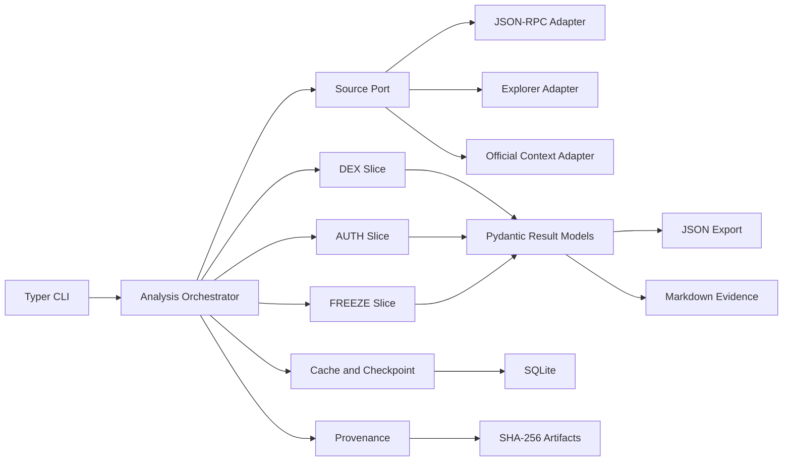

# SCAN 2026 P0·V1 기술 선택 기록
> Created: 2026-07-26 00:01
> Last Updated: 2026-07-27 21:22
> Status: Approved 1.2 · TASK-001~002 Applied

## 1. 문서 목적

이 문서는 [P0·V1 분석 도구 요구사항](./03_SCAN_2026_TOOL_REQUIREMENTS.md)을
구현할 기술 후보를 비교하고, V1에서 채택·보류·기각할 선택을 기록한다.

결정의 목표는 가장 많은 기술을 사용하는 것이 아니라 다음 세 가지를 동시에
만족하는 최소 조합을 고르는 것이다.

1. DEX·AUTH·FREEZE confirmed fixture를 exact match로 재현한다.
2. 공급자 fallback, raw provenance, cache·resume을 도구가 직접 통제한다.
3. 대회 중 새 분석 기능을 작은 adapter와 vertical slice로 빠르게 추가한다.

이 문서는 구현 승인이 아니다. 버전 lock, 저장 경로, CLI command schema는
후속 초기화·JSON Schema 문서에서 확정한다.

## 2. 입력과 제약

| 입력 | 결정에 미치는 영향 |
|:---|:---|
| P0·V1 요구사항 66개 | 입력·증거·오류·cache·export 계약을 기술 선택보다 우선 |
| confirmed fixture 3개 | Python 검증기와 JSON fixture를 그대로 회귀 입력으로 사용 |
| EVM raw 정수·historical state | uint256 정밀도와 명시적 block tag가 필수 |
| 복수 RPC·탐색기·공식 URL | 하나의 공급자 SDK에 core를 종속시키지 않음 |
| CLI·노트북·웹 UI 미결정 | V1 core와 사용자 인터페이스를 분리 |
| 2026 공식 규정 미확인 | 자동화·API 실행 전 source policy gate 필요 |
| 짧은 대회 대응 시간 | 설치·변경·디버깅 비용이 낮은 단일 런타임 우선 |
| 오픈소스 포렌식 사전조사 | 기존 포렌식·ETL·탐색기 기능을 비교한 뒤 직접 구현 여부 재검증 |

## 3. 평가 기준

후보는 5점 척도로 평가한다. 점수는 벤치마크 결과가 아니라 Draft 1의 비교
근거이며, 실제 구현 측정값이 생기면 다시 평가한다.

| 기준 | 가중치 | 판단 질문 |
|:---|---:|:---|
| Fixture 적합성 | 25 | 기존 JSON·Python 검증과 exact-match 테스트를 바로 재사용하는가 |
| 데이터·EVM 적합성 | 20 | JSON-RPC, ABI, 큰 정수, historical state를 안전하게 처리하는가 |
| 반복 개발 속도 | 20 | 대회 중 adapter와 분석기를 빠르게 추가·수정할 수 있는가 |
| 재현성·감사성 | 15 | lockfile, raw artifact, provenance와 오프라인 재생이 쉬운가 |
| UX 확장성 | 10 | CLI 즉시 피드백과 향후 웹 UI 연결이 가능한가 |
| 운영 단순성 | 10 | 런타임·배포·장애 지점이 적은가 |

## 4. 런타임 후보 비교

### 4.1 비교표

가중 합계는 계산값을 소수 둘째 자리까지 표기한다.

| 후보 | Fixture | EVM | 개발 속도 | 재현성 | UX 확장 | 운영 | 가중 합계 |
|:---|---:|---:|---:|---:|---:|---:|---:|
| A. Python 단일 core + CLI | 5 | 5 | 5 | 5 | 3 | 5 | 4.80 |
| B. Python core + TypeScript 웹 동시 구축 | 5 | 5 | 3 | 4 | 5 | 2 | 4.15 |
| C. TypeScript 단일 full stack | 2 | 4 | 3 | 4 | 5 | 4 | 3.40 |

### 4.2 결정

`TD-001` — **Python 단일 core + CLI를 V1으로 채택한다.**

- Python `int`와 raw 10진 문자열을 함께 사용해 uint256 정밀도를 유지한다.
- 현재 fixture 검증기를 같은 런타임에서 재사용한다.
- 네트워크·디코딩·정합·export를 작은 모듈로 빠르게 분리할 수 있다.
- 기준 런타임은 `Python >=3.12,<3.15` 가안으로 두고, 초기화 시 실제
  dependency resolver 검증 후 patch 버전을 lock한다.

`TD-002` — **TypeScript와 웹 UI는 V1 core에서 보류한다.**

웹 UI가 공식 평가·제출에 필요하거나 반복 검토 UX의 병목으로 확인되면 Python
core의 JSON 계약을 소비하는 별도 client로 추가한다. 같은 분석 로직을
TypeScript로 중복 구현하지 않는다.

## 5. 채택 기술

| 영역 | 선택 | 결정 ID | 근거 |
|:---|:---|:---|:---|
| Project·lock | `uv`, `pyproject.toml`, `uv.lock` | `TD-003` | 환경과 exact dependency를 저장소에서 재현 |
| HTTP transport | `httpx.AsyncClient` | `TD-004` | RPC·REST·공식 URL을 같은 timeout·pool·hook 계약으로 처리 |
| EVM ABI·utility | `eth-abi`, `eth-utils` | `TD-005` | ABI strict decode, keccak, 주소 검증을 독립 모듈로 사용 |
| 모델·검증 | Pydantic v2 | `TD-006` | Python 모델에서 JSON Schema Draft 2020-12 생성 |
| 메타데이터 저장 | Python `sqlite3`, SQLite WAL | `TD-007` | cache index·run·source·checkpoint의 원자적 로컬 저장 |
| Raw artifact | SHA-256 content-addressed files | `TD-008` | 대형 raw 응답을 DB와 분리하고 hash로 무결성 연결 |
| CLI | Typer | `TD-009` | type hint 기반 command·help·입력 검증 |
| Export | 표준 `json` + 자체 Markdown renderer | `TD-010` | JSON과 증거 표의 ID·값을 같은 모델에서 생성 |
| Test | pytest + 기존 jsonschema 검증기 | `TD-011` | 세 fixture parametrization과 schema 회귀 |
| Lint·format | Ruff | `TD-012` | 한 도구로 lint·format 계약을 단순화 |

dependency의 exact 버전은 이 문서에 고정하지 않는다. 프로젝트 초기화 시
호환 범위를 `pyproject.toml`, 실제 해석 결과를 `uv.lock`에 기록하고 CI에서는
lockfile 변경 없이 실행한다.

`TASK-001` 적용 결과 Python 재현 기준은 `3.13.7`이며 직접 dependency의
현재 lock 결과는 Typer `0.27.0`, Pydantic `2.13.4`, jsonschema `4.26.0`,
pytest `9.1.1`, Ruff `0.16.0`이다. build backend는 Hatchling `1.31.0`으로
고정했다. HTTPX·eth-abi·eth-utils는 후속 작업에서 실제 사용 코드와 함께
추가한다. TASK-001 전체 간접 dependency 점검은
[TASK-001 검증 보고서](../05_QA_Validation/05_TASK_001_BOOTSTRAP_REPORT.md)에
기록하며, Pydantic 추가 점검은
[TASK-002 검증 보고서](../05_QA_Validation/06_TASK_002_CONTRACT_REPORT.md)에
기록한다.

## 6. HTTP·EVM adapter 결정

### 6.1 직접 adapter를 core로 선택

`TD-013` — **HTTPX 기반 source adapter가 raw JSON-RPC·REST 요청을 직접
수행한다.**

이 선택은 `web3.py`를 사용할 수 없다는 뜻이 아니다. V1 core transport에서
제외한다는 뜻이다.

| 항목 | HTTPX 직접 adapter | web3.py core provider |
|:---|:---|:---|
| Raw 요청·응답 hash | 같은 transport hook에서 직접 보존 | 별도 middleware·wrapper 필요 |
| RPC·Blockscout·공식 URL | 한 client 정책으로 통합 | RPC 밖의 REST client가 추가로 필요 |
| 공급자 fallback | source policy와 동일 단위로 제어 | provider instance 밖의 orchestration 필요 |
| provider별 trace | raw method·params를 그대로 기록 | 공급자별 method wrapper가 여전히 필요 |
| ABI·contract 편의성 | `eth-abi`와 작은 decoder 필요 | 높음 |

web3.py 공식 문서는 provider가 JSON-RPC 요청을 생성하고 각 Web3 instance가
한 provider를 사용한다고 설명한다. 따라서 여러 공급자의 실패·fallback을
증거로 남기는 책임은 어느 경우에도 애플리케이션 orchestration에 남는다.

### 6.2 Adapter port

모든 source adapter는 최소한 아래 논리 계약을 구현한다.

```text
SourceAdapter.execute(
  capability,
  method,
  normalized_params,
  block_tag,
  request_context
) -> SourceResponse
```

`SourceResponse`는 `source_id`, `provider_id`, `request_fingerprint`,
`retrieved_at`, `status`, `raw_bytes`, `raw_sha256`, `attempts`,
`cache_status`, `error`를 가진다.

`TD-014` — **재시도와 fallback은 adapter 내부가 아니라 orchestration
layer에서 수행한다.** 각 실패 시도와 공급자 변경을 provenance에 남기기
위해서다.

## 7. 저장소 결정

### 7.1 SQLite와 artifact 분리

`TD-015` — SQLite에는 검색·정합에 필요한 메타데이터만 저장하고, raw body는
SHA-256 경로의 파일로 저장한다.

```text
.scan/
├── scan.sqlite3
├── artifacts/
│   └── sha256/ab/cd/<full-sha256>
├── runs/<analysis_id>/
│   ├── result.json
│   └── evidence.md
└── checkpoints/
```

`.scan/`은 기본 로컬 작업 디렉터리이며 Git에 포함하지 않는다. confirmed
fixture처럼 저장소에 보존할 데이터는 검토·redaction·라이선스 확인 후
`docs/05_QA_Validation/fixtures/`로 승격한다.

### 7.2 최소 테이블 책임

| 논리 테이블 | 책임 |
|:---|:---|
| `analysis_runs` | analysis ID, type, status, schema·tool version, 시각 |
| `source_attempts` | source·provider, method, attempt, timeout·오류, fallback |
| `cache_entries` | canonical key, raw hash, block tag, immutable·TTL 상태 |
| `artifacts` | SHA-256, byte length, media type, local path, redaction 상태 |
| `results` | result ID, 분류, 값, requirement ID |
| `evidence_links` | result·evidence·source·artifact 연결 |
| `checkpoints` | 완료 단계와 재개 cursor |

실제 SQL DDL은 출력 JSON Schema와 command 경계가 승인된 후 별도 문서로
작성한다.

`TD-016` — **WAL mode는 단일 로컬 프로세스와 향후 read-heavy 검토를 위한
가안으로 채택한다.** WAL·SHM 파일도 활성 연결 중 DB 상태의 일부이므로
실행 중 DB 파일만 복사하지 않는다.

### 7.3 보류한 저장 기술

| 후보 | V1 판정 | 재검토 조건 |
|:---|:---|:---|
| DuckDB | 보류 | 다수 fixture·경로의 대규모 열 분석과 집계가 SQLite 병목이 될 때 |
| PostgreSQL | 기각 | 팀 공유 서버·동시 다중 사용자가 실제 요구될 때 재검토 |
| 그래프 DB | 기각 | P1 PATH에서 관계 탐색 성능을 fixture로 입증할 때 재검토 |
| JSON 파일만 | 기각 | cache key·resume·source attempt 정합을 원자적으로 관리하기 어려움 |

## 8. 아키텍처 경계



`TD-017` — domain·application layer는 HTTPX, SQLite, Typer 객체를 직접
참조하지 않는다. port protocol과 Pydantic domain model만 사용한다.

### 8.1 권장 코드 구조

```text
src/scan_tool/
├── domain/             # model, classification, error enum
├── application/        # orchestration, retry, fallback, resume
├── ports/              # source, cache, artifact, exporter protocols
├── adapters/
│   ├── rpc/
│   ├── explorer/
│   ├── context/
│   └── storage/
├── slices/
│   ├── dex/
│   ├── auth/
│   └── freeze/
├── export/
└── cli/
```

fixture JSON은 application test input이며 production domain model을
fixture 구조에 직접 결합하지 않는다. fixture adapter가 공통 작업 입력으로
변환한다.

## 9. CLI와 UX 결정

`TD-018` — **CLI command와 core library를 분리한다.** CLI는 입력 파일을
검증하고 application use case를 호출하며 결과를 렌더링할 뿐, 분석 규칙을
포함하지 않는다.

Draft command surface:

```text
scan analyze --request <json>
scan validate <json>
scan resume <analysis-id>
scan show <analysis-id>
```

Analysis Request Schema의 `analysis_type`이 DEX·AUTH·FREEZE를 dispatch한다.
유형별 별칭과 fixture·cache 관리 명령은 V1 사용자 흐름에서 실제 필요가
확인될 때 추가한다. 이 command surface는 terminal HTML Preview 사용자 확인을
거쳐 V1 기준으로 채택했다.

| UX 상태 | V1 동작 |
|:---|:---|
| 시작 | 400ms 안에 analysis ID와 첫 진행 상태 표시를 목표로 함 |
| 진행 | 현재 source·attempt·cache hit 여부 표시, secret·전체 endpoint 숨김 |
| 부분 성공 | 확보한 결과와 누락 requirement를 함께 표시 |
| 오류 | error code, retry 여부, 다음 수동 조치를 표시 |
| 완료 | 핵심 결과 요약과 JSON·Markdown export 경로 표시 |

외부 네트워크 완료 시간을 400ms로 약속하지 않는다. 캐시 hit 결과와 명령
피드백을 빠르게 제공하고, live 조회에는 timeout과 진행 상태를 제공하는 방식으로
UX 기준을 적용한다. 실제 p95 목표는 V1 benchmark 후 확정한다.

## 10. Schema·오류·정밀도 결정

`TD-019` — Pydantic model을 실행 중 검증의 기준으로 사용하고, 공개 계약은
생성된 JSON Schema Draft 2020-12 파일로 version control한다.

- 입력·결과·오류 schema를 분리한다.
- schema 생성 결과가 저장된 파일과 다르면 CI를 실패시킨다.
- `extra="forbid"`를 기본으로 하고 명시적 확장점만 허용한다.
- EVM raw 수량은 JSON string, Python 내부 계산은 `int`를 사용한다.
- 사람이 읽는 decimal 값은 채점에 사용하지 않는다.
- `complete`, `partial`, `failed`와 error enum은 요구사항 문서와 동일하게
  유지한다.

`TD-020` — Markdown evidence는 JSON 결과 모델에서 생성한다. 별도 계산을
수행하거나 JSON과 다른 source of truth를 가지지 않는다.

## 11. Retry·cache 기본값 가안

아래 값은 구현 시작점이며 공급자 측정 후 조정한다.

| 항목 | Draft 1 값 |
|:---|:---|
| Idempotent read 최대 시도 | 최초 1회 + retry 2회 |
| Retry 대상 | timeout, 429, 일시적 5xx와 명시된 provider transient error |
| Backoff | `base 0.5s × 2^attempt + jitter`, `Retry-After`가 있으면 우선 |
| Connect timeout | 5초 |
| Read timeout | 일반 20초, trace 60초 가안 |
| 동시 요청 | source별 semaphore 기본 4 |
| Historical immutable | block hash 확인 후 만료 없음 |
| `latest` | 기본 cache 금지, 필요 기능에서만 짧은 TTL 명시 |
| Failed response | 성공 cache와 분리, 짧은 negative TTL 또는 미저장 |

HTTPX는 connect·read·write·pool timeout과 connection limit를 개별 설정할 수
있다. 각 source adapter는 등록부의 실제 rate limit을 확인한 뒤 기본값을
더 엄격하게 낮출 수 있다.

## 12. 보안·규정·오픈소스

| 항목 | 결정 |
|:---|:---|
| Secret | 환경변수 또는 OS secret store 참조만 허용. SQLite·artifact·export 금지 |
| Endpoint | host·source ID는 provenance에 기록하되 query·header secret은 redaction |
| 요청 범위 | read-only RPC·HTTP만 V1에 허용. 서명·송신 기능은 구현하지 않음 |
| 규정 gate | source policy가 `rule_restricted`이면 네트워크 호출 전에 중단 |
| Raw 공개 | 개인정보·ToS·라이선스 검토 전 fixture나 Git에 승격하지 않음 |
| Dependency | 허용 SPDX와 고정 버전을 dependency manifest에 기록 |
| Project license | MIT. 제3자 데이터·문서·fixture 원본은 원 권리와 약관 유지 |

`TD-021` — dependency는 공식 배포 패키지와 lockfile로 고정하며, 초기화 시
직접·간접 dependency의 라이선스와 알려진 취약점을 확인한다.

`TD-022` — adapter·schema·fixture validator를 재사용 가능한 공개 경계로
설계한다. 특정 공급자 endpoint와 API 키를 코드에 내장하지 않는다.

## 13. 365 글로벌 평가 기준 연결

| 기준 | 이 기술 선택의 대응 | 상태 |
|:---|:---|:---:|
| Functionality | exact-match fixture, strict schema, cache·fallback·부분 성공 테스트 | 포함 |
| Potential Impact | 공급자·문제별 adapter 추가로 다른 온체인 조사에도 재사용 | 포함 |
| Novelty | 확정 사실·맥락·휴리스틱 분리와 evidence-first 출력 | 포함 |
| UX | CLI 진행·부분 결과·evidence 표, 캐시 hit와 첫 피드백 400ms 목표 | 포함 |
| Open-source | port 기반 adapter, 공개 schema·fixture validator, dependency provenance | 포함 |
| Business Plan | 대회 준비 도구이므로 V1 기술 결정 대상이 아님 | N/A |

Business Plan을 억지로 기술 선택에 넣지 않는다. 대회 이후 제품화가 결정되면
운영 비용·유료 데이터·호스팅·지원 모델을 별도 Concept 문서에서 평가한다.

## 14. 요구사항 추적

| 요구사항 그룹 | 기술 결정 |
|:---|:---|
| `REQ-COM-IN-*`, `REQ-COM-OUT-*` | `TD-006`, `TD-019`, `TD-020` |
| `REQ-P0-PROV-*` | `TD-008`, `TD-013`, `TD-014`, `TD-015` |
| `REQ-P0-EXPORT-*` | `TD-009`, `TD-010`, `TD-018`, `TD-020` |
| `REQ-P0-CACHE-*` | `TD-004`, `TD-007`, `TD-014`~`TD-016` |
| `REQ-P0-EVM-*` | `TD-004`, `TD-005`, `TD-013`, `TD-019` |
| `REQ-V1-DEX-*` | `TD-005`, `TD-017`, DEX slice |
| `REQ-V1-AUTH-*` | `TD-005`, `TD-017`, AUTH slice |
| `REQ-V1-FREEZE-*` | `TD-004`, `TD-017`, FREEZE·context adapter |
| `REQ-NFR-*` | `TD-003`, `TD-007`~`TD-012`, `TD-015`, `TD-021`, `TD-022` |

## 15. 공식 근거

확인일은 2026-07-26이다. exact package version은 초기화 시 lock한다.

| 기술 | 공식 근거 | 이 문서에서 확인한 능력 |
|:---|:---|:---|
| HTTPX | [Async support](https://www.python-httpx.org/async/), [Timeouts](https://www.python-httpx.org/advanced/timeouts/), [Limits](https://www.python-httpx.org/advanced/resource-limits/) | async client, connection pool, 세분화 timeout |
| Pydantic | [JSON Schema](https://docs.pydantic.dev/latest/concepts/json_schema/) | Draft 2020-12 schema 생성·customization |
| SQLite | [WAL](https://www.sqlite.org/wal.html), [Python sqlite3](https://docs.python.org/3/library/sqlite3.html) | 로컬 transaction, WAL·checkpoint |
| uv | [Project structure](https://docs.astral.sh/uv/concepts/projects/layout/), [Locking](https://docs.astral.sh/uv/concepts/projects/sync/) | `pyproject.toml`, cross-platform exact lock |
| eth-abi | [Decoding](https://eth-abi.readthedocs.io/en/stable/decoding.html) | ABI strict decode |
| eth-utils | [Utilities](https://eth-utils.readthedocs.io/en/stable/utilities.html) | keccak·주소 utility |
| Typer | [Official documentation](https://typer.tiangolo.com/) | type hint 기반 CLI |
| pytest | [Parametrization](https://docs.pytest.org/en/stable/how-to/parametrize.html) | fixture별 반복 회귀 |
| Ruff | [Linter](https://docs.astral.sh/ruff/linter/), [Formatter](https://docs.astral.sh/ruff/formatter/) | lint·format 단일 설정 |
| web3.py | [Providers](https://web3py.readthedocs.io/en/stable/providers.html) | provider·AsyncHTTPProvider, optional helper 판단 |

## 16. 미결정·재검토 조건

| 항목 | 현재 상태 | 결정 시점 |
|:---|:---|:---|
| exact Python·dependency 버전 | Python 3.13.7 재현 기준, 실제 해석은 `uv.lock` | lock 변경 PR에서 재검증 |
| Project LICENSE | MIT 확정 | 제3자 데이터·공식 문서·fixture 원본은 원 권리·약관 유지 |
| 출력 JSON Schema 0.1 | Draft 작성 | 공통 계약 검토·승인 후 Pydantic 생성본과 대조 |
| SQLite DDL | 후속 | 출력 schema와 command ID 확정 후 |
| 웹 UI | 보류 | CLI evidence 검토의 실제 병목 또는 공식 제출 요건 확인 |
| DuckDB | 보류 | P1 대규모 집계 benchmark에서 SQLite 한계 확인 |
| web3.py | 선택 보조 | 직접 adapter보다 contract 호출·ABI 조립 비용이 큰 기능 발생 |
| 성능 수치 | 미결정 | V1 fixture cold·warm benchmark 후 |
| 공급자별 rate limit | 미결정 | 공식 규정·계정·플랜 확정 후 |
| 기능별 오픈소스 결정 | P0/V1 경계 확정 | exact dependency·adapter 검증은 담당 Task |

## 17. 다음 단계

1. 이 Draft의 `TD-001`~`TD-022`를 검토하고 채택 범위를 확정했다.
2. 공통 작업 입력·결과·오류 JSON Schema 0.1과 fixture 변환 예제를 작성했다.
3. Python package 초기화 전 `00_DEVELOPMENT_PRINCIPLES.md` Draft 1을 작성했다.
4. CLI command flow와 terminal HTML Preview Draft를 작성했다.
5. 사용자가 Preview를 확인하고 UI-First Gate를 통과시켰다.
6. schema·UI 경계 승인 후 원자적 backlog와 QA 시나리오를 작성했다.
7. P0·V1 오픈소스 결정은 `BUILD/WRAP/ADOPT/BORROW/REJECT` 경계로 확정했다.
8. SQLite 논리 DB Schema와 MIT License를 문서 기준선에 반영했다.
9. 새 공식 규정은 Rules Register Notification Intake를 통해 source policy에 반영한다.
10. `TASK-001`에서 Python 3.13.7 재현 기준과 exact dependency lockfile을 확정했다.
11. `TASK-002`에서 Pydantic 2.13.4와 Analysis I/O runtime 계약을 확정했다.
12. 다음 구현은 별도 승인 후 `TASK-003`에서 시작한다.

## 18. Related Documents

- **Concept_Design**: [참가·분석 도구 준비 전략](../01_Concept_Design/01_SCAN_2026_PREPARATION_STRATEGY.md) - 문제 우선·fixture 우선 기술 선택 원칙
- **Concept_Design**: [분석 도구 기능 우선순위](../01_Concept_Design/04_SCAN_2026_TOOL_PRIORITY.md) - P0·V1 범위와 단계 제한
- **UI_Screens**: [CLI Screen Flow](../02_UI_Screens/00_SCREEN_FLOW.md) - `TD-018`의 명령·상태 흐름
- **UI_Screens**: [CLI Terminal UI Design](../02_UI_Screens/01_UI_DESIGN.md) - terminal 정보 계층과 접근성
- **UI_Screens**: [HTML Terminal Preview](../02_UI_Screens/previews/01_cli_terminal_preview.html) - 구현 전 사용자 확인 화면
- **Technical_Specs**: [데이터 소스 등록부](./01_DATA_SOURCE_REGISTRY.md) - source capability·공급자 제약
- **Technical_Specs**: [SQLite 논리 DB Schema](./01_DB_SCHEMA.md) - SQLite·artifact·checkpoint 논리 계약
- **Technical_Specs**: [Python 개발 원칙](./00_DEVELOPMENT_PRINCIPLES.md) - 기술 결정을 코드 구조·품질·보안 규칙으로 전환
- **Technical_Specs**: [Reference Fixture Schema](./02_REFERENCE_FIXTURE_SCHEMA.md) - 기존 fixture JSON 계약
- **Technical_Specs**: [P0·V1 도구 요구사항](./03_SCAN_2026_TOOL_REQUIREMENTS.md) - 기술 선택의 규범적 요구사항
- **Technical_Specs**: [공통 분석 I/O Schema](./05_ANALYSIS_IO_SCHEMA.md) - `TD-019`의 요청·결과·오류 공개 계약
- **Technical_Specs**: [오픈소스 포렌식 사전조사](./06_OPEN_SOURCE_FORENSICS_REVIEW.md) - 기존 TD의 재사용·직접 구현 재검증 Gate
- **QA_Validation**: [Reference Fixtures](../05_QA_Validation/01_REFERENCE_FIXTURES.md) - DEX·AUTH·FREEZE 회귀 입력
- **QA_Validation**: [TASK-001 Bootstrap 보고서](../05_QA_Validation/05_TASK_001_BOOTSTRAP_REPORT.md) - 실제 Python·lock·license·품질 Gate
- **QA_Validation**: [TASK-002 Contract 보고서](../05_QA_Validation/06_TASK_002_CONTRACT_REPORT.md) - Pydantic·Schema·참조 불변조건 검증
