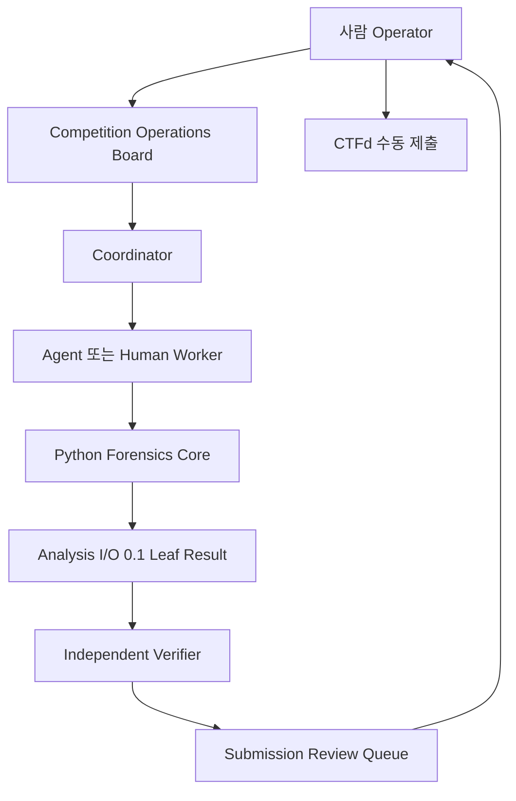
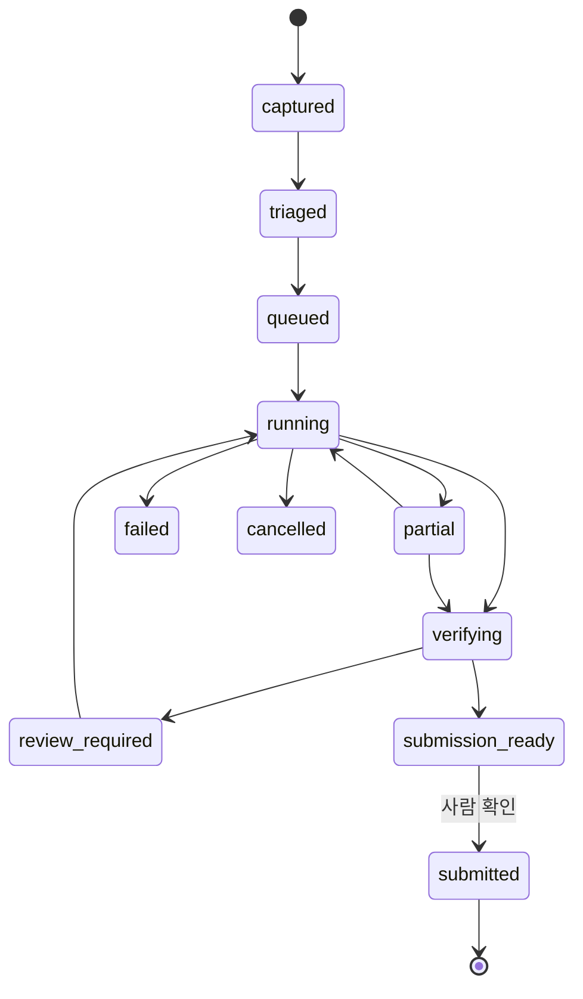

# SCAN 2026 Agentic Parallel Solve Flow
> Created: 2026-07-27 00:54
> Last Updated: 2026-07-27 00:54
> Status: Draft 1 · Rules-Gated · Implementation Not Approved

## 1. 문서 목적

이 문서는 SCAN 2026에서 여러 문제를 동시에 접수·분류·분석·검증하고,
사람이 최종 답을 제출하기까지의 운영·오케스트레이션 계약을 정의한다.

목표는 생성형 AI가 정답을 추측해 자동 제출하는 시스템이 아니다.

> 사람은 문제 입력·우선순위·최종 제출을 통제하고, Coordinator는 분석
> 작업을 분해하며, Python 포렌식 엔진은 결정적 계산을 수행하고, 독립
> Verifier는 원본 증거로 정답 후보를 재검증한다.

이 문서는 구현 승인이 아니다. 생성형 AI·외부 API·사전 제작 도구 허용
범위가 공식 규정에서 확인된 기능만 활성화한다.

## 2. 아키텍처 원칙

### 2.1 Python 코어와 에이전트 계층 분리

- Python 코어는 AI 없이 CLI에서 직접 실행할 수 있어야 한다.
- 에이전트는 승인된 CLI·port를 호출하며 코어의 계산 규칙을 복제하지 않는다.
- Analysis I/O `0.1` result가 leaf 분석의 단일 source of truth다.
- Operations Board는 결과를 지휘·집계하지만 새로운 온체인 사실을 만들지 않는다.
- CTFd 제출은 사람이 직접 수행한다. 자동 제출은 본 문서 범위 밖이다.

### 2.2 두 단계 병렬성

| 수준 | 병렬화 단위 | 예시 | 격리 경계 |
|:---|:---|:---|:---|
| 문제 간 | 서로 다른 `problem_id` | Q01 DEX, Q02 AUTH, Q03 FLOW | 문제 workspace·상태·제출 후보 |
| 문제 내부 | 한 문제의 leaf analysis | receipt, trace, state, label, OSINT | `analysis_id`·source policy·artifact |

문제 간 병렬성은 풀이 시간을 줄이고, 문제 내부 병렬성은 서로 독립적인
조회·분석을 동시에 수행한다. 정합·검증 단계는 선행 결과를 기다리는 명시적
dependency로 둔다.

## 3. 역할 모델

| Role ID | 역할 | 책임 | 금지 |
|:---|:---|:---|:---|
| `ROLE-COORDINATOR` | 문제 분류·배정 | 요구 정답, 체인, 유형, 난이도, leaf job 계획 | 근거 없는 정답 확정 |
| `ROLE-EVM` | EVM 분석 | TX·receipt·log·call·state·프로토콜 해석 | 외부 귀속 단정 |
| `ROLE-TRACER` | 자금 흐름 | N-hop, 분기·재병합, 브리지 후보, 종착지 | 휴리스틱을 확정 경로로 표시 |
| `ROLE-OSINT` | 라벨·공식 맥락 | 공식 출처·주소 라벨·시점·반례 수집 | 비공개 데이터 무단 전송 |
| `ROLE-VERIFIER` | 독립 검증 | 원본 재조회, 수량·단위·참조·형식 확인 | 분석자 설명만 근거로 통과 |
| `ROLE-REPORTER` | 제출 후보 정리 | 답·증거·신뢰도·불확실성·형식 요약 | CTFd 자동 제출 |
| `ROLE-OPERATOR` | 사람 운영자 | 우선순위·중단·승인·수동 제출 | 승인되지 않은 기능 활성화 |

하나의 프로세스·서브에이전트가 여러 역할을 겸할 수 있지만, 같은 실행이
`ROLE-EVM`과 최종 `ROLE-VERIFIER`를 동시에 맡아 독립 검증을 통과했다고
표시하면 안 된다.

AI가 제한되면 `ROLE-COORDINATOR`, `ROLE-EVM`, `ROLE-TRACER`,
`ROLE-OSINT`, `ROLE-VERIFIER`, `ROLE-REPORTER`를 사람 또는 직접 실행한
Python worker가 담당한다. 역할 ID와 증거 계약은 유지한다.

## 4. 식별자와 작업 단위

| 식별자 | 범위 | 예시 | 규칙 |
|:---|:---|:---|:---|
| `competition_id` | 한 경기 | `SCAN-2026-QUALIFIER` | 운영 세션 기준 |
| `problem_id` | CTFd 문항 | `SCAN-Q01` | CTFd 표시 ID가 있으면 원문 보존 |
| `job_id` | 배정 가능한 작업 | `JOB-Q01-EVM-01` | 한 역할·한 목적 |
| `analysis_id` | Python leaf 실행 | `AN-Q01-DEX-001` | Analysis I/O 계약 사용 |
| `verification_id` | 독립 검증 | `VER-Q01-001` | 검증 입력과 판정 기록 |
| `candidate_id` | 제출 후보 | `CAND-Q01-001` | 답 형식별 버전 분리 |

한 `problem_id`는 여러 `job_id`와 `analysis_id`를 가질 수 있다. 하나의
`analysis_id`를 여러 문제의 결과처럼 재사용하지 않는다. 공유 가능한 raw
응답은 content-addressed cache로 재사용하되, 어느 문제와 실행에서 사용했는지
provenance를 각각 남긴다.

## 5. 문제 수명주기

| 상태 | 의미 | 다음 행동 |
|:---|:---|:---|
| `captured` | 문제 원문·첨부·정답 형식 접수 | 규정·비밀정보 확인 후 triage |
| `triaged` | 유형·체인·난이도·필요 기능 식별 | job 계획 승인 |
| `queued` | 실행 가능, worker 대기 | 우선순위에 따라 배정 |
| `running` | 하나 이상의 job 실행 중 | 진행·비용·source health 관찰 |
| `partial` | 일부 확정 결과와 누락 조건 존재 | 재시도·fallback·사람 판단 |
| `verifying` | 독립 검증 중 | 원본 재조회와 정답 형식 확인 |
| `review_required` | 충돌·휴리스틱·낮은 신뢰도 | 사람 검토 또는 추가 job |
| `submission_ready` | 필수 검증 통과 | 사람에게 답·증거 표시 |
| `submitted` | 사람이 CTFd 제출 완료 표시 | 점수·응답 기록 |
| `failed` | 유효 후보 생성 불가 | 오류·checkpoint 보존 |
| `cancelled` | 사람이 중단 | 확보 증거·사유 보존 |

`submitted`는 CTFd API 호출 성공을 의미하지 않는다. Operator가 실제 제출을
확인한 뒤 UI에서 수동으로 표시한 운영 상태다.

## 6. 오케스트레이션 요구사항

### 6.1 문제 접수와 분류

| ID | 요구사항 |
|:---|:---|
| `REQ-OPS-IN-001` | 문제 원문, 제공 파일·URL, CTFd 문제 ID, 배점, 요구 답 형식을 원문과 구조화 필드로 함께 보존해야 한다. |
| `REQ-OPS-IN-002` | 공개 전 문제·답안을 외부 AI·웹 서비스에 보내기 전에 Rules Gate를 통과해야 한다. |
| `REQ-OPS-IN-003` | Coordinator의 유형·난이도·도구 추천은 운영 가설이며 확정 사실로 표시하면 안 된다. |
| `REQ-OPS-IN-004` | 문제별 우선순위는 배점·예상 시간·필수 dependency·현재 worker·source 상태와 사람이 지정한 값을 구분해야 한다. |

### 6.2 Queue와 worker

| ID | 요구사항 |
|:---|:---|
| `REQ-OPS-QUEUE-001` | 문제 Queue와 job Queue를 분리하고 한 문제의 여러 leaf job dependency를 표현해야 한다. |
| `REQ-OPS-QUEUE-002` | job은 idempotency key를 가지며 동일 목적의 중복 실행을 감지해야 한다. |
| `REQ-OPS-QUEUE-003` | worker별 동시 실행 수와 source capability별 동시 요청 수를 별도로 제한해야 한다. |
| `REQ-OPS-QUEUE-004` | 사람이 문제·job의 우선순위를 변경하고 queued·running 작업을 안전하게 중단할 수 있어야 한다. |
| `REQ-OPS-QUEUE-005` | worker 실패는 다른 문제의 상태를 실패로 전파하지 않고 해당 job과 dependency에만 영향을 표시해야 한다. |
| `REQ-OPS-QUEUE-006` | 완료된 source 조회·artifact·checkpoint를 재사용하되 source·retrieved_at·hash를 보존해야 한다. |

### 6.3 결과 통합과 독립 검증

| ID | 요구사항 |
|:---|:---|
| `REQ-OPS-VERIFY-001` | 제출 후보의 모든 결정적 필드는 하나 이상의 Analysis I/O result와 evidence를 참조해야 한다. |
| `REQ-OPS-VERIFY-002` | Verifier는 후보 생성 worker의 자연어 결론이 아니라 raw TX·log·call·state 또는 공식 출처를 재확인해야 한다. |
| `REQ-OPS-VERIFY-003` | 독립 검증자가 없으면 `submission_ready`가 아니라 `review_required`로 유지해야 한다. |
| `REQ-OPS-VERIFY-004` | 에이전트·도구 결과가 충돌하면 둘 중 하나를 조용히 선택하지 않고 충돌 필드·근거·다음 행동을 표시해야 한다. |
| `REQ-OPS-VERIFY-005` | 주소·TX·chain·raw amount·decimals·answer format은 제출 전 필수 검증 항목이어야 한다. |
| `REQ-OPS-VERIFY-006` | confidence는 증거를 대체하지 않으며 계산 근거·상한·휴리스틱 포함 여부를 표시해야 한다. |

### 6.4 제출 통제

| ID | 요구사항 |
|:---|:---|
| `REQ-OPS-SUBMIT-001` | 답 후보, 요구 형식, 결정적 증거, 불확실성, 검증 상태, 복사 가능한 값을 함께 표시해야 한다. |
| `REQ-OPS-SUBMIT-002` | CTFd 자동 제출·brute force·credential 저장 기능을 구현 범위에서 제외해야 한다. |
| `REQ-OPS-SUBMIT-003` | `submitted` 전환은 사람 Operator의 명시적 확인이 있어야 한다. |
| `REQ-OPS-SUBMIT-004` | 오답·정답 응답과 제출 시각은 사람이 기록할 수 있으나 credential·session cookie를 저장하면 안 된다. |

## 7. 병렬 실행과 자원 제어

### 7.1 동시성 예산

구체 수치는 구현 전 provider 제한과 장비 측정으로 확정한다. 기본값을
무제한으로 두지 않는다.

| 예산 | 목적 | 초과 시 |
|:---|:---|:---|
| 전체 active job | CPU·memory·운영 복잡도 제한 | 낮은 우선순위 queued 유지 |
| provider별 request | rate limit·ban 방지 | throttle·`Retry-After` 적용 |
| chain별 archive call | 고비용 상태 조회 제한 | batching 또는 순차화 |
| AI worker | 비용·정보 전송·중복 추론 제한 | 사람 승인 또는 대기 |
| OSINT fetch | ToS·외부 접촉 위험 제한 | Rules Gate·도메인별 제한 |

### 7.2 중복 제거

- 정규화된 source request와 block tag로 idempotency key를 만든다.
- 동일 요청이 실행 중이면 새 호출 대신 기존 future를 구독할 수 있다.
- 서로 다른 problem이 같은 응답을 써도 problem별 evidence 참조를 생성한다.
- `latest`와 mutable 웹 문서는 immutable cache처럼 공유하지 않는다.
- 실패·429 응답을 성공 artifact처럼 장기 캐시하지 않는다.

### 7.3 공정성과 기아 방지

- 쉬운 고확률 문제를 먼저 처리하는 대회 전략을 허용한다.
- 사람이 `critical`, `high`, `normal`, `deferred`를 지정할 수 있다.
- 오래 대기한 작업의 age를 표시한다.
- 고난도 작업 하나가 모든 worker·RPC slot을 점유하지 않도록 예약량을 둔다.

## 8. Analysis I/O 0.1과의 관계

현재 Analysis I/O Schema `0.1`을 변경하지 않는다.

| 운영 개념 | 현재 계약 |
|:---|:---|
| leaf 실행 | `analysis-request` / `analysis-result` |
| 문제와 분석 연결 | 운영 manifest의 `problem_id` → `analysis_id[]` |
| worker 배정 | 운영 manifest의 assignment |
| 검증 | `verification_id`와 참조한 result·evidence ID |
| 제출 후보 | `candidate_id`와 검증된 값·형식·참조 |

운영 manifest·verification·submission candidate의 영구 JSON Schema는 구현
전 별도 승인한다. 이 Draft에서 Analysis I/O 공통 필드를 추가하거나
`schema_version`을 올리지 않는다.

## 9. UI 계약

Competition Operations Board는 다음을 한 화면에서 보여야 한다.

1. 문제별 상태·배점·우선순위·담당 role·경과 시간
2. worker별 현재 job·source·진행 단계·오류·재시도
3. 검증 대기·충돌·누락 requirement
4. 제출 준비 후보와 사람 승인 상태
5. 규정 상태와 자동 제출 비활성화
6. provider별 health·rate limit·queue depth

단일 문제의 graph·timeline·Evidence Inspector는
[Web Investigation Workbench](../02_UI_Screens/03_WEB_INVESTIGATION_WORKBENCH.md)로
이동해 확인한다. Operations Board가 증거 세부 화면을 중복 구현하지 않는다.

## 10. 보안·규정·윤리 Gate

- `RULE-AI-001`, `RULE-AUTO-001`, `RULE-PREBUILT-TOOL-001`,
  `RULE-COLLAB-001`이 허용 범위를 제공하기 전 관련 worker를 기본 활성화하지
  않는다.
- `RULE-DATA-001`이 불명확하면 문제 원문·첨부·답안을 외부 서비스에 보내지
  않는다.
- `RULE-AUTO-SUBMIT-001`과 무관하게 본 Draft는 수동 제출만 허용한다.
- 외부 개인·기관에 연락하는 행동은 자동화하지 않는다.
- API key·CTFd credential·session·private key를 agent prompt, result,
  artifact, log에 포함하지 않는다.
- AI 출력은 `confirmed_fact`가 아니며 Python 결과·원본 증거로 승격해야 한다.

## 11. Degraded Mode

| 제한 | 대체 경로 |
|:---|:---|
| 생성형 AI 금지 | 사람이 Coordinator·Reporter 역할, Python CLI worker 직접 실행 |
| 외부 API 제한 | 허용 RPC·offline cache·제공 데이터만 사용 |
| Web UI 미구현 | terminal multiplexing과 결과 JSON·Markdown 사용 |
| 일부 provider 장애 | 허용 fallback 또는 partial·checkpoint |
| 서브에이전트 실패 | job 재배정, 확보 artifact 재사용 |
| 독립 검증 불가 | `review_required`, 제출 권고 보류 |

Degraded Mode에서도 Analysis I/O·evidence·source·human submission 계약은
유지한다.

## 12. 완료·부분·실패 기준

### 12.1 문서 완료

- 역할·상태·ID·Queue·검증·제출 경계가 정의되어 있다.
- Operations Board 문서와 HTML Preview가 연결되어 있다.
- Backlog와 QA 시나리오가 이 요구사항 ID를 참조한다.
- 공식 Rules 미확정 기능이 `allowed`로 표시되지 않는다.

### 12.2 구현 완료

- 두 개 이상의 문제를 동시에 실행해 결과·상태·artifact가 격리된다.
- 한 문제의 독립 leaf job 두 개 이상이 병렬 실행되고 정합 단계에서 합쳐진다.
- provider concurrency·dedup·retry가 제한 내에서 동작한다.
- 독립 검증 없는 후보가 `submission_ready`로 승격되지 않는다.
- 사람이 제출 상태를 통제하고 자동 제출 호출이 0건이다.

### 12.3 부분·실패

- 일부 worker·source 실패에도 확보한 증거가 있으면 문제는 `partial` 또는
  `review_required`가 될 수 있다.
- 필수 정답 필드에 결정적 증거가 없으면 `submission_ready`가 될 수 없다.
- Rules Gate가 제한하면 해당 기능은 실행 전에 `rule_restricted`로 차단한다.
- 문제·worker 상태가 교착되거나 다른 문제의 데이터를 혼합하면 실패다.

## 13. 365 글로벌 평가 기준

| 기준 | 기여 |
|:---|:---|
| Functionality | 여러 문제와 leaf 분석을 격리·병렬 실행하고 검증 Queue로 통합 |
| Potential Impact | 한 사람이 반복 조회를 줄이고 제한 시간에 더 많은 문항 검토 |
| Novelty | AI 답변보다 evidence-first 독립 검증과 역할 교체 가능성에 집중 |
| UX | 문제·worker·검증·제출 상태를 한 운영 화면에서 통제 |
| Open-source | CLI·Analysis I/O·role adapter가 교체 가능한 구조 |
| Business Plan | 현재 대회 운영 명세이므로 수익 모델 N/A |

## 14. 구현 승격 Gate

- [ ] 공식 Rules에서 활성화할 AI·자동화·외부 source 범위를 확인했다.
- [ ] Operations Board HTML Preview를 사용자가 검토했다.
- [ ] 운영 manifest·verification·candidate persistence 범위를 승인했다.
- [ ] worker 수·provider별 concurrency 기본값을 측정·승인했다.
- [ ] agent adapter 없이 Python CLI만으로 같은 leaf 분석이 가능하다.
- [ ] 자동 제출·credential 저장이 범위 밖임을 확인했다.
- [ ] Backlog `TASK-010`의 Implementation Preconditions를 통과했다.
- [ ] 구현 착수를 별도로 승인했다.

## 15. Related Documents

- **Concept_Design**: [참가·분석 도구 준비 전략](../01_Concept_Design/01_SCAN_2026_PREPARATION_STRATEGY.md) - 문제 분배와 자동화 원칙
- **Concept_Design**: [공식 규정 Register](../01_Concept_Design/03_SCAN_2026_RULES_REGISTER.md) - AI·자동화·협업·데이터·제출 Gate
- **Concept_Design**: [기능 우선순위](../01_Concept_Design/04_SCAN_2026_TOOL_PRIORITY.md) - 재사용 기능과 단계 제한
- **UI_Screens**: [Competition Operations Board](../02_UI_Screens/04_COMPETITION_OPERATIONS_BOARD.md) - 운영 화면·상태·사용자 흐름
- **UI_Screens**: [Operations Board Preview](../02_UI_Screens/previews/03_competition_operations_board_preview.html) - 구현 전 정적 화면
- **UI_Screens**: [Web Investigation Workbench](../02_UI_Screens/03_WEB_INVESTIGATION_WORKBENCH.md) - 단일 문제 증거 검토 화면
- **Technical_Specs**: [P0·V1 요구사항](./03_SCAN_2026_TOOL_REQUIREMENTS.md) - Python leaf 분석 요구사항
- **Technical_Specs**: [Analysis I/O Schema](./05_ANALYSIS_IO_SCHEMA.md) - leaf result·evidence·source 계약
- **Logic_Progress**: [Backlog](../04_Logic_Progress/00_BACKLOG.md) - `TASK-010` 구현 책임과 Gate
- **Logic_Progress**: [Roadmap](../04_Logic_Progress/00_ROADMAP.md) - Rules 확인 후 비차단 운영 트랙
- **QA_Validation**: [QA 시나리오](../05_QA_Validation/01_TEST_SCENARIOS.md) - 병렬성·격리·검증·수동 제출 기준
- **QA_Validation**: [QA Checklist](../05_QA_Validation/02_QA_CHECKLIST.md) - 구현 전·대회 전 점검
