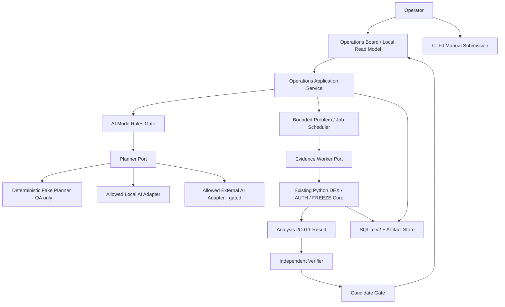

# TASK-010 Pre-Code Technical Brief
> Created: 2026-07-28 11:28
> Last Updated: 2026-07-28 11:28
> Status: Draft 1 · Review Pending · Runtime Not Implemented · Rules-Gated

## 1. 문서 목적

이 문서는 `TASK-010` AI-native 병렬 문제풀이 Operations를 구현하기 전에
데이터·상태·mutation·저장·동시성·adapter·검증 경계를 고정한다.

UI-First Gate는 통과했지만 이 문서의 승인은 runtime 실행 승인이 아니다.
공식 Rules가 미확정인 동안 external AI·RPC·CTFd 호출은 열지 않는다.

핵심 계약은 다음과 같다.

1. 모든 문제는 필수 AI Planner의 구조화된 방법 가설을 가진다.
2. AI 출력은 정답 증거가 아니며 Python evidence worker가 결정적 사실을 만든다.
3. 독립 Verifier가 원본 evidence를 확인하기 전에는 후보를 제출 준비 상태로
   승격하지 않는다.
4. 여러 문제와 한 문제의 leaf job을 제한된 동시성으로 실행한다.
5. Analysis I/O `0.1`은 leaf 계약으로 유지하고 운영 필드는 별도 model과
   SQLite schema v2에 둔다.
6. CTFd 제출은 사람이 수행하며 credential·session·자동 제출을 구현하지 않는다.

## 2. 승인 범위와 비범위

### 2.1 이 Draft가 결정하는 것

- Python runtime의 계층·port·adapter 경계
- problem·plan·job·verification·candidate·submission의 최소 필드
- 상태 전이와 mutation 권한
- SQLite schema v2의 논리 테이블과 v1 연결
- 병렬 Queue·dependency·dedup·checkpoint 규칙
- offline QA adapter와 external AI adapter의 Rules Gate
- Operations Board read model
- 구현 분할·수용 기준·QA 추적

### 2.2 이 Draft가 결정하지 않는 것

- 실제 external AI provider·model과 API key
- 공식 Rules의 `allowed/restricted` 판정
- web framework·TypeScript client·HTTP server
- CTFd API·자동 제출·로그인·session 저장
- 새로운 DEX·AUTH·FREEZE 계산 규칙
- Analysis I/O `0.1`의 필드·의미·버전
- live provider의 확정 concurrency와 비용 한도

## 3. 현재 기준선과 재사용

| 기준선 | TASK-010에서의 사용 |
|:---|:---|
| Analysis I/O `0.1` | 한 leaf job의 request/result 단일 source of truth |
| `CliRuntime.execute_analysis` | DEX·AUTH·FREEZE offline evidence worker 경계 |
| `SourceOrchestrator` | source policy·retry·fallback·attempt provenance 재사용 |
| SQLite schema v1 | analysis run·source·artifact·result·checkpoint 보존 |
| SHA-256 artifact store | 문제 원문·첨부·AI plan·운영 export의 로컬 artifact |
| confirmed fixture 3개 | offline planner·scheduler·verifier 통합 입력 |
| Operations Board Preview | read model·mutation·상태 표시의 UI 계약 |
| Agentic Parallel Solve QA | 병렬성·격리·검증·Rules·수동 제출 수용 기준 |

TASK-010은 기존 slice 내부의 decoding·reconciliation을 복제하지 않는다.
Operations 계층은 Analysis Request를 만들고 기존 실행 경계에 전달하며,
Analysis Result의 result·evidence·source 참조만 소비한다.

## 4. 목표 아키텍처



### 4.1 의존 방향

```text
UI/CLI composition -> operations application + concrete adapters
operations application -> operations domain + ports + Analysis I/O domain
planner/verifier/evidence adapters -> ports + approved domain models
SQLite operations repository -> operations domain + existing storage adapter
```

- operations domain은 Typer, HTTPX, SQLite와 provider SDK를 import하지 않는다.
- Planner는 Python evidence 계산을 수행하거나 Analysis Result를 위조하지 않는다.
- Verifier는 Planner의 설명이 아니라 Analysis Result와 raw evidence를 확인한다.
- UI는 read model을 표시하고 command를 보내며 온체인 사실을 계산하지 않는다.

### 4.2 제안 package 경로

```text
src/scan_tool/
├── domain/
│   └── operations.py
├── application/
│   ├── operations.py
│   ├── operations_scheduler.py
│   └── operations_read_model.py
├── ports/
│   ├── planner.py
│   ├── evidence_worker.py
│   ├── verifier.py
│   └── operations_repository.py
└── adapters/
    ├── fake_planner.py
    ├── local_ai.py             # provider 승인 후
    ├── external_ai.py          # provider·Rules 승인 후
    └── sqlite_operations.py
```

실제 구현에서 두 번째 구현이 없는 추상화는 추가하지 않는다. `fake_planner`는
결정적 QA double이며 실제 대회 문제의 full AI-native 완료를 증명하지 않는다.

## 5. 식별자와 최소 데이터 모델

모든 공개 ID는 생성 후 변경하지 않는다. DB 내부 row ID를 화면이나 evidence
참조로 대신 사용하지 않는다.

### 5.1 `CompetitionManifest`

| 필드 | 필수 | 의미 |
|:---|:---:|:---|
| `competition_id` | 예 | 운영 세션 ID |
| `name`, `phase` | 예 | 대회명과 qualifier/final |
| `rules_snapshot_ref` | 예 | 적용 Rules Register 기준 |
| `status` | 예 | setup/active/paused/closed |
| `created_at`, `updated_at` | 예 | UTC RFC 3339 |

### 5.2 `ProblemRecord`

| 필드 | 필수 | 의미 |
|:---|:---:|:---|
| `problem_id` | 예 | CTFd 표시 ID 보존 |
| `competition_id` | 예 | 소속 manifest |
| `title` | 예 | 화면 제목 |
| `original_text_artifact` | 예 | 로컬 artifact SHA-256 참조 |
| `provided_urls` | 예 | 입력된 URL 배열, 빈 배열 허용 |
| `provided_file_artifacts` | 예 | 파일명·hash·media type, 내용 미수집 가능 |
| `score`, `answer_format` | 예 | 배점과 요구 답 형식 |
| `priority`, `priority_source` | 예 | critical/high/normal/deferred, human/derived |
| `status` | 예 | 문제 수명주기 상태 |
| `active_plan_id` | 아니요 | 승인된 최신 plan |
| `created_at`, `updated_at` | 예 | 생성·변경 시각 |

원문과 첨부 내용은 DB text/blob에 직접 저장하지 않는다. redaction·license·
Rules 검사를 통과한 로컬 artifact만 참조한다.

### 5.3 `AIExecutionMode`

| 필드 | 필수 | 의미 |
|:---|:---:|:---|
| `mode_id` | 예 | mode snapshot ID |
| `competition_id` | 예 | 적용 세션 |
| `provider_id`, `model_id` | 조건부 | `rules_gated`에서는 미확정 가능 |
| `adapter_kind` | 예 | fake_qa/local/external |
| `data_boundary` | 예 | synthetic_only/local_only/redacted_external/approved_problem_data |
| `tool_mode` | 예 | planning_only/planning_and_approved_tools |
| `rule_state` | 예 | allowed/rules_gated/rule_restricted |
| `affected_rule_ids` | 예 | `RULE-*` 배열 |
| `rules_snapshot_ref` | 예 | 결정 근거 |
| `created_at` | 예 | immutable snapshot 시각 |

Rules Gate는 `rule_state`를 바꾸며 기존 mode row를 덮어쓰지 않는다. 새 판단은
새 snapshot으로 추가한다.

### 5.4 `PlanHypothesis`

| 필드 | 필수 | 의미 |
|:---|:---:|:---|
| `plan_id` | 예 | AI plan ID |
| `problem_id`, `mode_id` | 예 | 문제·실행 mode |
| `planner_job_id` | 예 | 생성 job |
| `status` | 예 | rules_gated/proposed/approved/rejected/superseded |
| `problem_type_hypothesis` | 예 | 유형 가설 |
| `method_hypothesis` | 예 | 정답이 아닌 해결 방법 |
| `assumptions`, `missing_inputs` | 예 | 명시적 불확실성 |
| `leaf_job_specs` | 예 | 구조화 job 배열 |
| `raw_output_artifact` | 예 | 원 AI 응답의 redacted artifact |
| `created_at`, `decided_at` | 예/조건부 | 생성·사람 승인 시각 |

`leaf_job_specs`는 최소 `role`, `purpose`, `analysis_type`, `inputs_projection`,
`depends_on`, `required_capabilities`, `expected_output`을 가진다.

### 5.5 `JobRecord`

| 필드 | 필수 | 의미 |
|:---|:---:|:---|
| `job_id` | 예 | 배정 가능한 작업 ID |
| `problem_id`, `plan_id` | 예 | 소속 문제·plan |
| `role`, `job_type` | 예 | planner/evidence/verifier/reporter와 작업 유형 |
| `status` | 예 | queued/running/waiting/complete/partial/failed/cancelled |
| `priority` | 예 | 사람 우선순위를 상한으로 사용 |
| `idempotency_key` | 예 | 목적·입력·mode·version canonical hash |
| `analysis_id` | 조건부 | evidence leaf면 Analysis I/O run |
| `attempt`, `max_attempts` | 예 | job 실행 시도 |
| `assigned_worker_id` | 아니요 | 현재 worker |
| `error_code`, `checkpoint_ref` | 아니요 | 실패·재개 |
| `queued_at`, `started_at`, `finished_at` | 조건부 | 수명주기 시각 |

dependency는 `job_dependencies(job_id, depends_on_job_id)`로 분리한다. 한 job이
다른 문제의 job에 의존하는 것은 V1에서 금지한다.

### 5.6 `VerificationRecord`

| 필드 | 필수 | 의미 |
|:---|:---:|:---|
| `verification_id` | 예 | 독립 검증 ID |
| `problem_id`, `candidate_id` | 예 | 검증 대상 |
| `verifier_job_id` | 예 | 후보 생성 job과 다른 job |
| `status` | 예 | queued/running/pass/fail/conflict/incomplete |
| `required_checks` | 예 | address/TX/chain/raw amount/decimals/format |
| `check_results` | 예 | check별 pass/fail·result/evidence refs |
| `independent_from_job_ids` | 예 | self-check 방지 |
| `conflicts`, `missing_evidence` | 예 | 빈 배열 허용 |
| `created_at`, `finished_at` | 조건부 | 수명주기 시각 |

### 5.7 `CandidateRecord`와 `SubmissionRecord`

| 필드 | 필수 | 의미 |
|:---|:---:|:---|
| `candidate_id` | 예 | 제출 후보 ID |
| `problem_id` | 예 | 문제 |
| `answer_format`, `answer_value` | 예 | 전체 복사 값 |
| `status` | 예 | draft/review_required/submission_ready/submitted/rejected |
| `result_refs`, `evidence_refs` | 예 | 결정적 근거 |
| `verification_refs` | 예 | 독립 검증 |
| `confidence`, `confidence_basis` | 예 | 증거 대체 금지 |
| `uncertainties` | 예 | 빈 배열 허용 |
| `recommendation` | 예 | hold/investigate/submit |
| `created_at`, `updated_at` | 예 | 수명주기 시각 |

`SubmissionRecord`는 `submission_id`, `candidate_id`, `operator_confirmed`,
`response`(correct/incorrect/unknown), `submitted_at`, `note_artifact`만 가진다.
CTFd endpoint·credential·cookie·Authorization은 필드로 만들지 않는다.

### 5.8 `OperationEvent`

모든 mutation은 append-only event를 남긴다.

| 필드 | 의미 |
|:---|:---|
| `event_id`, `competition_id`, `problem_id` | 범위 |
| `entity_type`, `entity_id` | 변경 대상 |
| `event_type` | captured/plan_proposed/approved/queued/started/... |
| `actor_type`, `actor_id` | operator/AI/worker/system |
| `from_status`, `to_status` | 상태 전이 |
| `safe_details_json` | secret이 제거된 사유·참조 |
| `created_at` | UTC 시각 |

## 6. 상태와 mutation 계약

### 6.1 상태 전이

| 엔티티 | 허용 핵심 전이 |
|:---|:---|
| Problem | captured → triaged → queued → running → partial/verifying → review_required/submission_ready → submitted |
| Plan | rules_gated → proposed → approved/rejected; approved → superseded |
| Job | queued → running/waiting → complete/partial/failed/cancelled |
| Verification | queued → running → pass/fail/conflict/incomplete |
| Candidate | draft → review_required/submission_ready; review_required → draft; submission_ready → submitted |

종료 상태를 이전 상태로 직접 되돌리지 않는다. 재분석은 새 job·analysis·
verification·candidate version을 만든다.

### 6.2 command와 권한

| Command | 실행 주체 | 선행조건 | 원자적 결과 |
|:---|:---|:---|:---|
| `capture_problem` | Operator | competition active | problem+artifact+event |
| `request_plan` | System | problem captured, mode 존재 | planner job 또는 rules_gated plan |
| `propose_plan` | AI adapter | allowed mode | plan artifact+leaf specs+event |
| `approve_plan` | Operator | plan proposed | plan approved+jobs queued+event |
| `change_priority` | Operator | 미종료 problem | problem/jobs 우선순위+event |
| `pause_job` | Operator/System | running/waiting | checkpoint 요청+cancel signal+event |
| `complete_job` | Worker | running | analysis link/result status+event |
| `build_candidate` | Reporter | evidence results 존재 | candidate draft+refs+event |
| `verify_candidate` | 독립 Verifier | candidate draft/review_required | checks+status+event |
| `promote_candidate` | Application Gate | verification pass | submission_ready+event |
| `mark_submitted` | Operator | submission_ready | submission row+candidate submitted+event |

`promote_candidate`는 UI·AI adapter가 직접 호출할 수 없다. Application Gate가
참조 무결성, 독립성, 필수 check를 다시 검사한다.

### 6.3 불변조건

1. 승인된 plan 없는 evidence job은 실행할 수 없다.
2. 모든 problem은 AI plan을 거치며 사람이 만든 plan으로 대체 완료할 수 없다.
3. 서로 다른 problem의 job·analysis·candidate 참조는 거부한다.
4. `submission_ready`는 pass verification과 결정적 evidence ref를 요구한다.
5. 후보 생성 job과 verifier job은 같을 수 없다.
6. AI 자연어 출력은 result/evidence ref가 될 수 없다.
7. `submitted`는 Operator command에서만 생성된다.
8. `rules_gated`는 대기 상태이고 `rule_restricted`는 금지된 mode 호출 거부다.

## 7. SQLite schema v2 제안

기존 `.scan/scan.sqlite3`와 WAL을 유지하고 additive migration으로
`user_version=2`를 제안한다. Analysis I/O schema version `0.1`과는 별개다.

### 7.1 신규 논리 테이블

| 테이블 | 책임 |
|:---|:---|
| `competitions` | 운영 세션·Rules snapshot |
| `operation_ai_modes` | immutable provider/model/data/tool mode |
| `problems` | 문제 metadata·artifact 참조·상태 |
| `problem_artifacts` | 원문·첨부·note artifact 역할 |
| `plans` | AI 방법 가설·승인 상태 |
| `jobs` | worker 실행·idempotency·analysis link |
| `job_dependencies` | 문제 내부 DAG |
| `problem_analysis_links` | problem→Analysis I/O run 역할 |
| `candidates` | 답 후보·상태·불확실성 |
| `candidate_result_links` | candidate→result/evidence |
| `verifications` | 독립 검증 수명주기 |
| `verification_checks` | 필수 check 결과 |
| `submissions` | 사람 제출 결과 기록 |
| `operation_events` | append-only audit |

### 7.2 기존 v1 연결

- `jobs.analysis_id`와 `problem_analysis_links.analysis_id`는
  `analysis_runs.analysis_id`를 참조한다.
- candidate의 result/evidence link는 같은 `analysis_id`의 v1 row만 참조한다.
- 문제 원문·plan raw output·note는 `artifacts.sha256`을 참조한다.
- 기존 `source_attempts`, `cache_entries`, `checkpoints`, `exports`를 복제하지
  않는다.

### 7.3 migration Gate

- v1 DB backup과 `integrity_check=ok`를 먼저 확인한다.
- migration은 새 테이블·인덱스 추가만 허용하고 v1 table rewrite/drop을 금지한다.
- migration 실패 시 transaction rollback 후 v1을 계속 열 수 있어야 한다.
- v2 DB를 v1 코드로 여는 동작은 명시적 version mismatch로 실패시킨다.
- 임시 DB에서 v1→v2와 빈 DB→v2를 모두 테스트한다.

정확한 DDL은 첫 구현 단위 `OPS-IMPL-01`에서 별도 검토한다. 이 Draft 승인만으로
사용자 `.scan/` DB를 migration하지 않는다.

## 8. AI Planner와 Rules Gate

### 8.1 Planner port

```text
PlannerPort.plan(
  problem_view,
  execution_mode,
  available_capabilities,
  prior_safe_context
) -> PlanHypothesis
```

- 입력은 data boundary에 맞게 projection한 값만 포함한다.
- 출력은 strict model로 검증하고 추가 필드를 거부한다.
- provider raw output은 secret·민감정보 검사 후 artifact로 보존한다.
- timeout·token/cost budget·model ID·mode ID를 event에 기록한다.
- Planner가 답 후보를 포함해도 confirmed fact로 승격하지 않는다.

### 8.2 adapter 단계

| Adapter | 목적 | 대회 문제 사용 |
|:---|:---|:---:|
| deterministic fake | offline QA·fault injection | 금지 |
| allowed local AI | Rules와 model 설치 승인 후 planning | 조건부 |
| allowed external AI | provider·model·data 전송 승인 후 planning | 조건부 |

fake adapter는 정해진 문제 유형·leaf plan을 반환해 scheduler와 Gate를
검증한다. AI-native 제품 계약을 삭제하지 않지만 실제 AI 품질 증거도 아니다.

### 8.3 mode 판정

| 상태 | runtime 동작 |
|:---|:---|
| `allowed` | 선택 mode로 Planner 실행 |
| `rules_gated` | planner job과 problem을 대기, 외부 I/O 0건 |
| `rule_restricted` | 요청 adapter 호출을 I/O 전에 거부, event·오류 보존 |

허용 mode가 없으면 Python evidence worker가 독립 준비를 수행할 수 있어도
full TASK-010 flow를 완료로 표시하지 않는다.

## 9. Queue·병렬성·dedup

### 9.1 scheduler

Python `asyncio.TaskGroup`, bounded `asyncio.Queue`, 역할별 semaphore를
기본 구현 후보로 한다. 외부 distributed queue는 V1에서 사용하지 않는다.

정렬은 `human priority → queued_at → job_id`의 결정적 순서를 사용한다.
AI 추천 점수는 표시할 수 있지만 사람 우선순위를 조용히 덮어쓰지 않는다.

### 9.2 Draft 1 offline QA 기본값

| 예산 | 기본값 | 비고 |
|:---|---:|:---|
| active problems | 4 | 더 많은 문제는 queued |
| global active jobs | 6 | planner·evidence·verifier 합계 |
| active jobs per problem | 3 | 한 문제의 slot 독점 방지 |
| AI Planner | 1 | model/provider 허용 범위가 더 낮출 수 있음 |
| Verifier | 2 | 후보 생성 worker와 분리 |
| provider general request | 4 | 기존 기술 결정 가안 재사용 |
| archive/state request | 1 | 고비용 historical call |
| OSINT fetch | 2 | domain·ToS Gate 추가 적용 |

이 값은 성능 약속이 아니라 offline fault-injection 시작점이다. 실제 provider
제한과 장비 측정 전에는 Backlog의 concurrency 승인 체크를 닫지 않는다.

### 9.3 dependency·실패 전파

- dependency가 모두 `complete`가 아니면 reconciliation/verifier를 실행하지 않는다.
- optional leaf 실패는 problem을 `partial`, required leaf 실패는
  `review_required` 또는 `failed`로 보낸다.
- 한 problem의 exception은 해당 TaskGroup 경계에서 result로 변환하고 다른
  problem TaskGroup을 cancel하지 않는다.
- pause는 새 job 배정을 막고 running leaf에 cooperative cancel을 요청한 뒤
  완료 checkpoint를 보존한다.

### 9.4 source request dedup

- 기존 canonical source request fingerprint와 block tag를 key로 사용한다.
- 같은 in-flight key는 새 외부 호출 대신 같은 future를 구독한다.
- 완료된 값은 기존 cache/artifact를 사용하되 problem별 evidence link를 만든다.
- mutable `latest`·웹 문서·실패 응답은 immutable 공유하지 않는다.

## 10. Evidence worker와 독립 Verifier

### 10.1 Evidence worker port

```text
EvidenceWorkerPort.execute(
  job,
  analysis_request,
  approved_inputs
) -> AnalysisResult
```

첫 구현은 기존 `CliRuntime.execute_analysis`와 동일한 application 경계를
호출하는 in-process adapter를 사용한다. subprocess CLI parsing은 단일
source of truth가 아니므로 기본 경로로 쓰지 않는다.

### 10.2 Verifier Gate

Verifier는 다음을 다시 확인한다.

1. request/result envelope 일치
2. result→evidence→source 참조
3. answer format과 전체 복사값
4. address·TX·chain ID
5. raw amount·decimals가 요구될 때의 정밀도
6. conflict·heuristic·not_assessed 범위
7. 후보 생성 job과 verifier job의 독립성

Verifier가 raw source를 재조회할 수 없는 offline QA에서는 confirmed fixture의
raw replay hash를 독립 입력으로 사용한다. 같은 자연어 결론을 재사용하는 것은
독립 검증이 아니다.

## 11. Operations Board read model

첫 구현은 HTTP API가 아니라 application query가 반환하는 strict read model을
만든다. CLI JSON snapshot과 향후 local web adapter가 같은 model을 소비한다.

### 11.1 `OperationsSnapshot`

| 영역 | 최소 필드 |
|:---|:---|
| competition | ID, phase, elapsed/remaining 입력, rules snapshot |
| ai_mode | provider, model, data boundary, tool mode, rule state |
| summary | total/active/verifying/ready/submitted/queue age |
| problems | ID, score, priority, status, owner, progress, age |
| workers | role, job, stage, health, queue, budget |
| verifications | ID, candidate, checks, conflicts, missing evidence |
| submissions | candidate, answer format, confidence, evidence, human state |
| sources | capability, provider, health, concurrency, retry, cache |
| activity | 최근 append-only event |
| stale_at | snapshot 생성 시각과 freshness |

### 11.2 mutation 응답

모든 command는 `command_id`, `accepted`, `entity_id`, `new_status`,
`event_id`, `warnings`를 반환한다. UI optimistic state를 source of truth로
사용하지 않고 mutation 후 새 snapshot을 읽는다.

Loading·Empty·Partial·Failed·Stale·Rules 상태는 Preview와 동일한 label을
사용한다. 첫 피드백 400ms 목표는 command 접수·queue 표시까지이며 AI·RPC
완료 시간이 아니다.

## 12. 오류·보안·보존

### 12.1 운영 오류

Analysis I/O 11개 error code는 leaf 결과에 유지한다. Operations 계층은 다음
stage를 추가로 구분하되 공개 Analysis Schema를 변경하지 않는다.

| stage | 예 |
|:---|:---|
| `operations_input` | problem·answer format 오류 |
| `ai_mode_policy` | rules_gated/rule_restricted |
| `planner` | timeout·invalid structured output |
| `scheduler` | dependency cycle·budget exhaustion |
| `evidence_worker` | Analysis I/O failed/partial |
| `verification` | conflict·missing evidence·self-check |
| `submission_record` | 사람 확인 누락 |

operations error code의 공개 JSON Schema는 `OPS-IMPL-01`에서 model과 함께
승인한다.

### 12.2 secret·데이터 경계

- API key·Authorization·CTFd credential·session은 model·DB·artifact·log에서
  금지한다.
- 문제 원문은 mode의 data boundary가 허용한 projection만 AI adapter에 전달한다.
- external 전송 전 redaction 결과와 rules snapshot을 기록한다.
- provider exception 원문을 그대로 UI·event에 저장하지 않는다.
- local absolute path와 사용자 홈은 read model·export에 포함하지 않는다.
- CTFd 자동 submit method와 endpoint field를 만들지 않는다.

## 13. 구현 분할

| 단위 | 범위 | 완료 증거 |
|:---|:---|:---|
| `OPS-IMPL-01` | operations domain model·공개 Schema·state validator | positive/negative contract probe |
| `OPS-IMPL-02` | SQLite v2 additive migration·repository·event log | v1→v2 rollback·integrity test |
| `OPS-IMPL-03` | Planner port·fake QA adapter·AI mode Gate | QA-OPS-RULE-001 offline |
| `OPS-IMPL-04` | bounded Queue·dependency·isolation·dedup | QA-OPS-PAR/INTRA-001 |
| `OPS-IMPL-05` | DEX·AUTH·FREEZE evidence worker adapter | Analysis I/O pair·artifact link |
| `OPS-IMPL-06` | candidate builder·independent Verifier Gate | QA-OPS-VERIFY/CONFLICT-001 |
| `OPS-IMPL-07` | OperationsSnapshot·command result·local CLI view | Preview state mapping test |
| `OPS-IMPL-08` | security·submission record·integration report | QA-OPS-SUBMIT-001, full verify |

각 단위는 별도 승인·branch·검증 보고서를 사용한다. `OPS-IMPL-01` 전에는
runtime 파일을 만들지 않는다.

## 14. Acceptance Criteria 추적

| 요구사항 | 설계 위치 | QA |
|:---|:---|:---|
| `REQ-OPS-IN-001`~`004` | §5.2~5.4, §8 | `QA-OPS-RULE-001` |
| `REQ-OPS-QUEUE-001`~`006` | §5.5, §9 | `QA-OPS-PAR-001`, `QA-OPS-INTRA-001` |
| `REQ-OPS-VERIFY-001`~`006` | §5.6~5.7, §10 | `QA-OPS-VERIFY-001`, `QA-OPS-CONFLICT-001` |
| `REQ-OPS-SUBMIT-001`~`004` | §5.7, §6.2, §12 | `QA-OPS-SUBMIT-001` |

Analysis I/O와 fixture 회귀는 기존 133개 테스트·Schema/fixture PASS 3 기준을
후퇴시키지 않는다.

## 15. 구현 승격 Gate

- [ ] 이 Pre-Code Technical Brief를 사용자가 검토·승인했다.
- [ ] operations 최소 필드·상태·mutation을 승인했다.
- [ ] SQLite v2 additive migration 방향을 승인했다.
- [ ] Draft 1 offline QA concurrency 값을 승인했다.
- [ ] AI adapter 단계와 data boundary를 승인했다.
- [ ] OperationsSnapshot 최소 필드를 승인했다.
- [ ] 공식 Rules에서 실제 사용할 AI provider·model·data·tool mode를 확인했다.
- [ ] `OPS-IMPL-01` 구현 착수를 별도로 승인했다.

공식 Rules가 미확정이어도 fake adapter 기반 contract·scheduler QA 구현은
별도 승인 후 시작할 수 있다. 실제 대회 문제에 사용할 AI adapter와 external
data 전송은 `allowed` mode가 확정되기 전까지 `rules_gated`다.

## 16. 365 글로벌 평가 기준

| 기준 | 이 Brief의 기여 |
|:---|:---|
| Functionality | 문제·AI plan·leaf 실행·검증·제출 기록의 구현 가능 계약 |
| Potential Impact | 한 명이 여러 문제를 동시에 운영하는 병목 감소 |
| Novelty | AI 방법 가설을 Python evidence와 독립 검증으로 실증 |
| UX | Operations Board read model·상태·400ms command feedback 경계 |
| Open-source | provider·planner·worker·storage port 교체 가능성 |
| Business Plan | 대회 운영 기술 Brief이므로 현재 수익 모델 N/A |

## 17. Originality & Ethics Check

- [ ] AI output·provider·model·mode와 전송 데이터가 감사 가능하다.
- [ ] 타인의 답안·비공개 데이터·credential을 수집하는 기능이 없다.
- [ ] heuristic·external context·confirmed fact를 합치지 않는다.
- [ ] 범죄·신원 귀속을 증거 없이 자동 확정하지 않는다.
- [ ] CTFd 자동 제출·brute force·팀 외 답안 공유가 없다.
- [ ] 사람이 최종 제출과 불확실성을 확인한다.

## 18. Related Documents

- **Concept_Design**: [공식 규정 Register](../01_Concept_Design/03_SCAN_2026_RULES_REGISTER.md) - AI·agent·데이터 전송 mode
- **UI_Screens**: [Competition Operations Board](../02_UI_Screens/04_COMPETITION_OPERATIONS_BOARD.md) - 승인된 화면·mutation 흐름
- **UI_Screens**: [Operations Board Preview](../02_UI_Screens/previews/03_competition_operations_board_preview.html) - UI-First Gate 기준선
- **Technical_Specs**: [Python 개발 원칙](./00_DEVELOPMENT_PRINCIPLES.md) - 계층·품질·보안 원칙
- **Technical_Specs**: [SQLite DB Schema](./01_DB_SCHEMA.md) - schema v1·artifact 기준선
- **Technical_Specs**: [Analysis I/O Schema](./05_ANALYSIS_IO_SCHEMA.md) - leaf request/result 계약
- **Technical_Specs**: [Agentic Parallel Solve Flow](./07_AGENTIC_PARALLEL_SOLVE_FLOW.md) - `REQ-OPS-*` 규범
- **Logic_Progress**: [Backlog](../04_Logic_Progress/00_BACKLOG.md) - `TASK-010` 구현 책임
- **Logic_Progress**: [Roadmap](../04_Logic_Progress/00_ROADMAP.md) - 비차단 운영 트랙
- **QA_Validation**: [Agentic Parallel Solve QA](../05_QA_Validation/03_AGENTIC_PARALLEL_SOLVE_QA.md) - 6개 수용 시나리오
- **QA_Validation**: [QA Checklist](../05_QA_Validation/02_QA_CHECKLIST.md) - 대회 전 Gate
