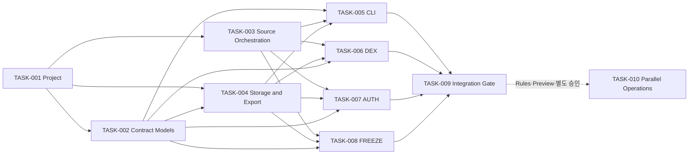

# SCAN 2026 P0·V1 및 대회 운영 Backlog
> Created: 2026-07-26 16:46
> Last Updated: 2026-07-27 21:22
> Status: Approved 1.2 · TASK-001~002 Done

## 1. 문서 목적

이 문서는 승인된 P0·V1 요구사항, Analysis I/O Schema `0.1`, Python 개발 원칙,
CLI UI-First Gate와 confirmed fixture 3개를 구현 가능한 원자적 작업으로
전환한다.

Backlog 범위와 `TASK-001`·`TASK-002` 구현은 별도로 승인되었다. 두 작업은
완료됐고 나머지 작업은 `ToDo`다. 후속 작업은 각각 별도 승인 전에는
`In Progress`로 이동하지 않는다.

`TASK-010`은 공식 Rules·Operations Board Preview·별도 구현 승인에 의존하는
비차단 운영 트랙이다. `TASK-001`~`TASK-009`의 P0·V1 의존 순서와 완료 Gate를
변경하지 않는다.

## 2. 범위와 작업 규칙

### 2.1 포함 범위

- Python project·quality tool 초기화
- Analysis I/O Pydantic model과 Schema diff
- source adapter·policy·retry·fallback
- SQLite cache·checkpoint와 SHA-256 artifact
- provenance·JSON·Markdown export
- `analyze`, `validate`, `resume`, `show` CLI
- DEX·AUTH·FREEZE vertical slice
- confirmed fixture 3개 회귀와 UI·보안 Gate
- Rules-gated 복수 문제 Queue·worker·독립 검증·수동 제출 운영

### 2.2 제외 범위

- P1 PATH·LABEL·VIZ 범용 기능
- Bitcoin·브리지·일반 OSINT·휴리스틱
- Web Investigation Workbench 구현·노트북·그래프 DB
- 서명·거래 전송·private key 입력
- 새로운 fixture 정답·증거 변경

### 2.3 상태 규칙

| 상태 | 의미 |
|:---|:---|
| `ToDo` | 문서 승인 또는 선행 작업 대기 |
| `In Progress` | Implementation Preconditions를 다시 확인하고 구현 중 |
| `Done` | Acceptance Criteria·QA·Document Sync Check 완료 |

작업을 `In Progress`로 옮길 때 구현자는 해당 항목의 모든 관련 문서를 실제로
다시 읽고 Preconditions를 체크한다. 코드만 완료하고 문서·QA가 남으면 `Done`으로
이동할 수 없다.

### 2.4 오픈소스 사전조사 Gate

모든 구현 작업은 [오픈소스 포렌식 사전조사](../03_Technical_Specs/06_OPEN_SOURCE_FORENSICS_REVIEW.md)의
관련 `OSSR-*` 조사와 `OSS-*` 결정을 입력으로 사용한다. 적합한 기존 기능을
검색하지 않았거나 결정 근거가 없으면 해당 작업을 `In Progress`로 이동하지
않는다.

P2·P3 조사는 해당 단계 승격 전까지 보류할 수 있지만, P0·V1 구현에는 관련
P0·V1 조사 결정이 필수다.

## 3. 의존 순서

TASK-002와 TASK-003은 TASK-001 뒤에 병렬 진행할 수 있다. TASK-004는
계약 model(TASK-002)에 의존하므로 TASK-002 이후에 시작한다. TASK-005는
TASK-002·003·004 모두에 의존한다. DEX·AUTH·FREEZE는 공통 계약을 재사용하되
서로의 내부 구현에 의존하지 않는다.
TASK-010은 통합된 Python leaf 분석을 사용하지만 P0·V1 완료를 차단하지 않는다.

## 4. Task Register

작업은 의존 순서를 보존하기 위해 ID 순으로 둔다. 실제 상태는 각 카드와
§5·§6에서 관리한다.

### [x] TASK-001: Python project와 기본 품질 Gate 초기화

- Status: Done
- Priority: P0 · High
- Depends On: 없음
- Requirement IDs: `TD-001`, `TD-002`, `TD-003`, `TD-008`, `TD-009`,
  `TD-010`, `TD-011`, `TD-012`
- Atomic Tasks:
  - [x] `.gitignore`에 `.scan/`, `.env*`, pytest·Ruff·coverage·build 산출물을 추가한다.
  - [x] 현재 환경변수가 없어 `.env.example`을 생성하지 않기로 결정했다.
  - [x] `pyproject.toml`에 Python `>=3.12,<3.15`, src layout과 package metadata를 정의한다.
  - [x] 최소 runtime dependency와 dev dependency를 Dependency Gate로 검토한다.
  - [x] `uv.lock`을 생성하고 독립 임시 환경 cold install을 재현한다.
  - [x] `src/scan_tool/`과 `tests/unit`, `tests/integration`, `tests/regression`를 만든다.
  - [x] `scripts/verify.py`로 Ruff·pytest와 기존 두 Schema 검증을 한 번에 실행한다.
- Related Concept Docs:
  - [분석 도구 기능 우선순위](../01_Concept_Design/04_SCAN_2026_TOOL_PRIORITY.md) - P0 공통 기반 선행 원칙
- Related UI Docs:
  - [CLI Screen Flow](../02_UI_Screens/00_SCREEN_FLOW.md) - 초기 package가 제공할 command surface
  - [CLI Prototype Review](../02_UI_Screens/02_CLI_PROTOTYPE_REVIEW.md) - UI-First Gate 통과와 FB-001
- Related HTML Preview:
  - [CLI Terminal Preview](../02_UI_Screens/previews/01_cli_terminal_preview.html) - 구현 전 확인된 사용자 화면
- Related Technical Docs:
  - [Python 개발 원칙](../03_Technical_Specs/00_DEVELOPMENT_PRINCIPLES.md) - 구조·dependency·Git·보안 기준
  - [기술 선택 기록](../03_Technical_Specs/04_SCAN_2026_TECHNOLOGY_DECISION.md) - Python·uv·Typer·pytest·Ruff 결정
- Related QA Docs:
  - [P0·V1 QA 시나리오](../05_QA_Validation/01_TEST_SCENARIOS.md) - `QA-BOOT-*`, `QA-SEC-*`
- Implementation Preconditions:
  - [x] 관련 Concept·UI·Technical·QA 문서를 다시 확인했다.
  - [x] HTML Preview 사용자 확인과 FB-001 기록을 확인했다.
  - [x] CLI 진입·전환·이탈과 loading·empty·error 상태를 확인했다.
  - [x] 데이터 소스·최소 필드·local mutation·상태 저장 경계를 확인했다.
  - [x] dependency license·취약점·공식 package를 확인했다.
  - [x] 구현 범위가 P0·V1과 충돌하지 않는다.
- Acceptance Criteria:
  - [x] 독립 임시 환경에서 `uv sync --locked`가 성공한다.
  - [x] `uv run ruff check .`, `uv run ruff format --check .`, `uv run pytest`가 성공한다.
  - [x] 기존 fixture·analysis Schema 검증이 모두 `PASS 3`이다.
  - [x] Git 추적 파일에서 secret·`.scan/`·로컬 DB가 0건이다.
  - [x] package import와 `scan --help`가 src layout 설치에서 성공한다.
- Document Sync Check:
  - [x] 실제 Python·dependency version과 명령을 개발 원칙·기술 선택 기록에 반영했다.
  - [x] 구현과 문서 차이를 검토하고 TASK-001 결과 보고서에 기록했다.

### [x] TASK-002: Analysis I/O 계약 model과 Schema diff 구현

- Status: Done
- Priority: P0 · High
- Depends On: TASK-001
- Requirement IDs: `REQ-COM-IN-*`, `REQ-COM-OUT-*`, `REQ-NFR-001`,
  `REQ-NFR-004`, `TD-003`, `TD-006`, `TD-019`
- Atomic Tasks:
  - [x] request·result·error Pydantic v2 model을 분리한다.
  - [x] 공통 model에 `extra="forbid"`를 적용한다.
  - [x] analysis type·status·classification·evidence type·error code enum을 정의한다.
  - [x] 주소·TX hash·RFC 3339·raw decimal string validator를 구현한다.
  - [x] complete·partial·failed 불변조건과 ID 유일성을 검증한다.
  - [x] result→evidence→source 참조 무결성을 검증한다.
  - [x] Pydantic 생성 Schema와 승인 Schema `0.1`의 의미상 diff 명령을 만든다.
  - [x] confirmed request/result 예제 3쌍을 model round-trip한다.
- Related Concept Docs:
  - [예상문제 은행](../01_Concept_Design/02_SCAN_2026_EXPECTED_PROBLEM_BANK.md) - 완료·부분·실패와 증거 필드
- Related UI Docs:
  - [CLI Screen Flow](../02_UI_Screens/00_SCREEN_FLOW.md) - model 상태가 표시되는 순서
  - [CLI Terminal UI Design](../02_UI_Screens/01_UI_DESIGN.md) - raw·classification·error 표현
- Related HTML Preview:
  - [CLI Terminal Preview](../02_UI_Screens/previews/01_cli_terminal_preview.html) - model 기반 terminal 상태
- Related Technical Docs:
  - [공통 분석 I/O Schema](../03_Technical_Specs/05_ANALYSIS_IO_SCHEMA.md) - 규범적 공개 계약
  - [P0·V1 요구사항](../03_Technical_Specs/03_SCAN_2026_TOOL_REQUIREMENTS.md) - 입력·출력·오류 규칙
  - [Python 개발 원칙](../03_Technical_Specs/00_DEVELOPMENT_PRINCIPLES.md) - Pydantic·정밀도·시간 기준
- Related QA Docs:
  - [P0·V1 QA 시나리오](../05_QA_Validation/01_TEST_SCENARIOS.md) - `QA-SCHEMA-001`, `QA-SCHEMA-002`
  - [Analysis I/O 예제](../05_QA_Validation/examples/analysis/README.md) - round-trip 기준
  - [TASK-002 Contract 보고서](../05_QA_Validation/06_TASK_002_CONTRACT_REPORT.md) - model·불변조건·Schema 의미 검사 증거
- Implementation Preconditions:
  - [x] 관련 문서와 승인 Schema 3종을 다시 확인했다.
  - [x] HTML Preview 사용자 확인과 피드백 기록을 확인했다.
  - [x] HTML Preview의 complete·partial·failed 표현을 확인했다.
  - [x] 입력·출력 최소 필드와 상태 변화를 확인했다.
  - [x] 외부 mutation 없음과 local model validation 경계를 확인했다.
  - [x] fixture schema와 analysis schema의 독립 버전을 확인했다.
  - [x] 구현 범위가 공개 계약 `0.1`을 임의 변경하지 않는다.
- Acceptance Criteria:
  - [x] 유효한 요청·결과 예제 3쌍이 round-trip 후 의미상 동일하다.
  - [x] 잘못된 주소·TX hash·블록·유형은 `invalid_input`으로 거부한다.
  - [x] extra field·float raw amount·naive datetime·깨진 참조는
        `schema_invalid`로 거부한다.
  - [x] 깨진 result→evidence→source 참조를 거부한다.
  - [x] 저장 Schema와 생성 Schema의 의미상 probe diff가 0이다.
  - [x] `complete`+error, `failed`+no error 조합을 거부한다.
- Document Sync Check:
  - [x] model 경로와 Schema 생성·diff 명령을 Schema 문서에 기록했다.
  - [x] 공개 Schema 변경 없이 계약 `0.1`을 구현했다.

### [ ] TASK-003: Source port·policy·retry·fallback orchestration 구현

- Status: ToDo
- Priority: P0 · High
- Depends On: TASK-001
- Requirement IDs: `REQ-P0-PROV-001`, `REQ-P0-PROV-005`,
  `REQ-P0-CACHE-004`, `REQ-P0-CACHE-005`, `REQ-NFR-006`,
  `REQ-NFR-008`, `TD-013`, `TD-014`
- Atomic Tasks:
  - [ ] source request·response·attempt Protocol을 정의한다.
  - [ ] 주입 가능한 `httpx.AsyncClient`와 source별 timeout을 구성한다.
  - [ ] public RPC·archive RPC·explorer·official context adapter 경계를 만든다.
  - [ ] `allowed_source_ids`·`source_order`·offline·fallback 정책을 적용한다.
  - [ ] restricted 요청을 네트워크 호출 전에 차단한다.
  - [ ] timeout·429·일시적 5xx만 제한적으로 재시도한다.
  - [ ] `Retry-After`, backoff·jitter, 최대 시도와 모든 attempt를 기록한다.
  - [ ] fallback 시 최초 실패와 대체 provider를 모두 보존한다.
- Related Concept Docs:
  - [분석 도구 기능 우선순위](../01_Concept_Design/04_SCAN_2026_TOOL_PRIORITY.md) - source 교체·규정 위험을 포함한 P0
- Related UI Docs:
  - [CLI Screen Flow](../02_UI_Screens/00_SCREEN_FLOW.md) - retry·fallback·규정 차단 흐름
  - [CLI Terminal UI Design](../02_UI_Screens/01_UI_DESIGN.md) - source·attempt 표시와 FB-001
- Related HTML Preview:
  - [CLI Terminal Preview](../02_UI_Screens/previews/01_cli_terminal_preview.html) - AUTH retry·FREEZE 차단 상태
- Related Technical Docs:
  - [데이터 소스 등록부](../03_Technical_Specs/01_DATA_SOURCE_REGISTRY.md) - source ID·능력·제약
  - [P0·V1 요구사항](../03_Technical_Specs/03_SCAN_2026_TOOL_REQUIREMENTS.md) - provenance·retry·규정 계약
  - [Python 개발 원칙](../03_Technical_Specs/00_DEVELOPMENT_PRINCIPLES.md) - adapter·secret·orchestration 기준
- Related QA Docs:
  - [P0·V1 QA 시나리오](../05_QA_Validation/01_TEST_SCENARIOS.md) - `QA-SOURCE-*`, `QA-RETRY-*`, `QA-RULE-*`
- Implementation Preconditions:
  - [ ] 등록부와 source policy·오류 계약을 다시 확인했다.
  - [ ] HTML Preview 사용자 확인과 피드백 기록을 확인했다.
  - [ ] HTML Preview의 retry·fallback·rule blocked 상태를 확인했다.
  - [ ] source 입력·응답·attempt 최소 필드를 확인했다.
  - [ ] 외부 mutation 없이 read-only 호출만 수행함을 확인했다.
  - [ ] 공식 규정·provider plan·rate limit 미확정 값을 하드코딩하지 않는다.
  - [ ] FB-001의 stderr 상세·stdout 압축 경계를 확인했다.
- Acceptance Criteria:
  - [ ] restricted 정책에서 HTTP 호출이 0건이다.
  - [ ] offline mode에서 cache miss가 구조화 오류로 종료되고 network 호출은 0건이다.
  - [ ] timeout·429·5xx에만 제한된 재시도가 실행된다.
  - [ ] fallback 전후 provider가 모두 source record에 남는다.
  - [ ] endpoint query·header·API key가 log·error·artifact에 나타나지 않는다.
- Document Sync Check:
  - [ ] 실제 adapter·provider ID와 정책을 데이터 소스 등록부에 반영했다.
  - [ ] retry·fallback 기본값 변경 시 기술 선택·UI·QA를 동기화했다.

### [ ] TASK-004: SQLite cache·checkpoint·provenance·export 구현

- Status: ToDo
- Priority: P0 · High
- Depends On: TASK-001, TASK-002
- Requirement IDs: `REQ-P0-PROV-*`, `REQ-P0-EXPORT-*`,
  `REQ-P0-CACHE-001`, `REQ-P0-CACHE-002`, `REQ-P0-CACHE-003`,
  `REQ-P0-CACHE-006`, `REQ-P0-CACHE-007`, `TD-015`, `TD-016`,
  `TD-020`, `TD-021`
- Atomic Tasks:
  - [ ] run·source attempt·cache·checkpoint·artifact 최소 SQLite DDL을 정의한다.
  - [ ] WAL과 transaction 경계·parameter binding을 적용한다.
  - [ ] canonical cache key와 immutable historical 응답 정책을 구현한다.
  - [ ] raw body를 SHA-256 content-addressed artifact로 원자적 저장한다.
  - [ ] checkpoint에 완료 stage와 evidence ID를 기록한다.
  - [ ] JSON result를 단일 source of truth로 export한다.
  - [ ] 같은 result model에서 Markdown evidence를 렌더링한다.
  - [ ] export·DB·artifact·checkpoint의 secret redaction을 검사한다.
- Related Concept Docs:
  - [분석 도구 기능 우선순위](../01_Concept_Design/04_SCAN_2026_TOOL_PRIORITY.md) - BASE-CACHE·PROVENANCE·EXPORT 최우선 근거
- Related UI Docs:
  - [CLI Screen Flow](../02_UI_Screens/00_SCREEN_FLOW.md) - cache·resume·export 사용자 흐름
  - [CLI Terminal UI Design](../02_UI_Screens/01_UI_DESIGN.md) - RUN·EXPORTS 표시
- Related HTML Preview:
  - [CLI Terminal Preview](../02_UI_Screens/previews/01_cli_terminal_preview.html) - cache hit·resume·artifact 경로
- Related Technical Docs:
  - [Python 개발 원칙](../03_Technical_Specs/00_DEVELOPMENT_PRINCIPLES.md) - SQLite·artifact·provenance·export 기준
  - [SQLite 논리 DB Schema](../03_Technical_Specs/01_DB_SCHEMA.md) - 논리 엔티티·관계·mutation·보존 계약
  - [공통 분석 I/O Schema](../03_Technical_Specs/05_ANALYSIS_IO_SCHEMA.md) - run·sources·exports 계약
  - [P0·V1 요구사항](../03_Technical_Specs/03_SCAN_2026_TOOL_REQUIREMENTS.md) - cache·export 완료 조건
- Related QA Docs:
  - [P0·V1 QA 시나리오](../05_QA_Validation/01_TEST_SCENARIOS.md) - `QA-CACHE-*`, `QA-EXPORT-*`, `QA-SEC-*`
- Implementation Preconditions:
  - [ ] 저장·복구·export 관련 문서를 다시 확인했다.
  - [ ] HTML Preview 사용자 확인과 피드백 기록을 확인했다.
  - [ ] HTML Preview의 cache·resume·export 상태를 확인했다.
  - [ ] DB 최소 필드·artifact metadata·checkpoint 상태를 확인했다.
  - [ ] local mutation 범위가 `.scan/` 아래임을 확인했다.
  - [ ] WAL backup·migration·삭제에 사용자 승인 원칙을 확인했다.
  - [ ] JSON·Markdown ID·값 일치 기준을 확인했다.
- Acceptance Criteria:
  - [ ] 동일 immutable 요청 2회째 외부 호출이 0건이고 결과가 같다.
  - [ ] 중단 후 완료 stage를 재호출하지 않고 `resumed: true`로 완료한다.
  - [ ] artifact hash·byte length·source·retrieved time이 연결된다.
  - [ ] JSON·Markdown의 analysis·result·evidence ID와 값이 일치한다.
  - [ ] secret과 로컬 사용자 절대 경로가 export에서 0건이다.
  - [ ] 임시 DB·디렉터리 기반 integration test가 사용자 `.scan/`을 건드리지 않는다.
- Document Sync Check:
  - [ ] SQLite DDL·backup·artifact URI를 기술 문서에 기록했다.
  - [ ] export 형식 변경 시 Schema·UI·QA를 동기화했다.

### [ ] TASK-005: CLI command surface와 terminal renderer 구현

- Status: ToDo
- Priority: V1 · High
- Depends On: TASK-002, TASK-003, TASK-004
- Requirement IDs: `TD-009`, `TD-018`, `REQ-COM-*`, `REQ-NFR-005`
- Atomic Tasks:
  - [ ] Typer app과 `analyze`, `validate`, `resume`, `show` 명령을 정의한다.
  - [ ] CLI composition root에서 구체 adapter를 생성·주입한다.
  - [ ] 시작 400ms 이내 첫 피드백을 측정 가능한 시각으로 기록한다.
  - [ ] progress·cache·retry·fallback·warning을 stderr로 출력한다.
  - [ ] 최종 상태·결과·export 경로를 stdout으로 출력한다.
  - [ ] complete·partial·failed·restricted·interrupted 종료 코드를 적용한다.
  - [ ] `NO_COLOR`, non-TTY, 80 columns와 주소·TX 축약을 지원한다.
  - [ ] FB-001에 따라 최종 stdout retry 이력을 압축한다.
- Related Concept Docs:
  - [참가·분석 도구 준비 전략](../01_Concept_Design/01_SCAN_2026_PREPARATION_STRATEGY.md) - 빠른 문제 풀이와 재현성 목적
- Related UI Docs:
  - [CLI Screen Flow](../02_UI_Screens/00_SCREEN_FLOW.md) - canonical 명령·종료 코드·사용자 동선
  - [CLI Terminal UI Design](../02_UI_Screens/01_UI_DESIGN.md) - 상태별 layout·접근성·FB-001
  - [CLI Prototype Review](../02_UI_Screens/02_CLI_PROTOTYPE_REVIEW.md) - 사용자 승인 기록
- Related HTML Preview:
  - [CLI Terminal Preview](../02_UI_Screens/previews/01_cli_terminal_preview.html) - 구현 비교 기준
- Related Technical Docs:
  - [Python 개발 원칙](../03_Technical_Specs/00_DEVELOPMENT_PRINCIPLES.md) - composition root·stdout·stderr·logging
  - [기술 선택 기록](../03_Technical_Specs/04_SCAN_2026_TECHNOLOGY_DECISION.md) - Typer·command surface
  - [공통 분석 I/O Schema](../03_Technical_Specs/05_ANALYSIS_IO_SCHEMA.md) - renderer 입력 model
- Related QA Docs:
  - [P0·V1 QA 시나리오](../05_QA_Validation/01_TEST_SCENARIOS.md) - `QA-CLI-001`~`QA-CLI-004`, `QA-SEC-001`의 CLI 범위
- Implementation Preconditions:
  - [ ] 관련 UI 문서·Preview·사용자 피드백을 다시 확인했다.
  - [ ] 진입·전환·이탈과 complete·partial·failed 상태를 확인했다.
  - [ ] renderer가 받는 최소 result·run·error 필드를 확인했다.
  - [ ] CLI local mutation은 요청 파일 읽기와 export·checkpoint 쓰기로 제한된다.
  - [ ] core calculation을 CLI에 두지 않는 경계를 확인했다.
  - [ ] FB-001을 Acceptance Criteria와 테스트에 연결했다.
- Acceptance Criteria:
  - [ ] 네 명령의 `--help`와 잘못된 인자 동작이 명확하다.
  - [ ] command 실행 후 400ms 이내 `STARTING`이 stderr에 나타난다.
  - [ ] 최종 stdout에는 retry·fallback count와 첫 오류 code만 요약된다.
  - [ ] detailed attempt는 stderr와 JSON run·sources에 보존된다.
  - [ ] canary secret·Authorization 값과 사용자 이름을 포함한 로컬 절대 경로가 stdout·stderr·오류 출력에 노출되지 않는다.
  - [ ] 종료 코드 `0`, `2`, `3`, `4`, `5`, `130`이 문서와 일치한다.
  - [ ] `NO_COLOR`·non-TTY·80 columns에서 상태 의미와 핵심 값이 유지된다.
- Document Sync Check:
  - [ ] 실제 `--help`·snapshot을 UI 문서·Preview와 대조했다.
  - [ ] 의도된 차이가 있으면 FB 또는 문서 변경으로 기록했다.

### [ ] TASK-006: DEX vertical slice 구현

- Status: ToDo
- Priority: V1 · High
- Depends On: TASK-002, TASK-003, TASK-004
- Requirement IDs: `REQ-P0-EVM-001`~`REQ-P0-EVM-008`,
  `REQ-V1-DEX-001`~`REQ-V1-DEX-006`
- Atomic Tasks:
  - [ ] TX·receipt·Transfer·Swap·Withdrawal raw 증거를 수집한다.
  - [ ] internal native ETH call을 별도 call evidence로 정규화한다.
  - [ ] USDC input과 WETH pool output을 exact raw로 복원한다.
  - [ ] WETH pool output과 native ETH user output을 분리한다.
  - [ ] router·factory·pair metadata를 supporting provenance로 분리한다.
  - [ ] partial·failed에서 확보 증거와 누락 요구사항을 보존한다.
  - [ ] `FX-SVC-DEX-001` regression을 자동화한다.
- Related Concept Docs:
  - [예상문제 은행](../01_Concept_Design/02_SCAN_2026_EXPECTED_PROBLEM_BANK.md) - SVC-DEX 문제 조건
  - [분석 도구 기능 우선순위](../01_Concept_Design/04_SCAN_2026_TOOL_PRIORITY.md) - DEX vertical slice 선정
- Related UI Docs:
  - [CLI Terminal UI Design](../02_UI_Screens/01_UI_DESIGN.md) - DEX result 3행 구분
- Related HTML Preview:
  - [CLI Terminal Preview](../02_UI_Screens/previews/01_cli_terminal_preview.html) - DEX complete 기준 화면
- Related Technical Docs:
  - [P0·V1 요구사항](../03_Technical_Specs/03_SCAN_2026_TOOL_REQUIREMENTS.md) - DEX exact-match 계약
  - [공통 분석 I/O Schema](../03_Technical_Specs/05_ANALYSIS_IO_SCHEMA.md) - DEX request·result model
  - [데이터 소스 등록부](../03_Technical_Specs/01_DATA_SOURCE_REGISTRY.md) - RPC·explorer·DEX metadata
- Related QA Docs:
  - [P0·V1 QA 시나리오](../05_QA_Validation/01_TEST_SCENARIOS.md) - `QA-DEX-*`
  - [DEX fixture](../05_QA_Validation/fixtures/FX-SVC-DEX-001/README.md) - confirmed 정답·증거
- Implementation Preconditions:
  - [ ] DEX 요구사항·fixture·source 문서를 다시 확인했다.
  - [ ] HTML Preview 사용자 확인과 피드백 기록을 확인했다.
  - [ ] HTML Preview에서 pool output과 user output 분리를 확인했다.
  - [ ] TX·event·call·metadata 최소 필드를 확인했다.
  - [ ] 외부 mutation 없이 read-only 수집만 수행한다.
  - [ ] raw amount에 float를 사용하지 않는다.
  - [ ] 일반 N-hop·가격·범용 DEX 지원을 범위에 넣지 않는다.
- Acceptance Criteria:
  - [ ] USDC `25000000000` raw input이 exact match한다.
  - [ ] WETH `14449515027026387018` raw pool output이 exact match한다.
  - [ ] native ETH `14449515027026387018` raw user output이 exact match한다.
  - [ ] pool WETH와 user native ETH가 별도 result·evidence로 출력된다.
  - [ ] JSON·Markdown과 terminal summary가 같은 세 결과를 표시한다.
  - [ ] 한 필수 증거 누락 주입 시 complete가 아니라 partial이다.
- Document Sync Check:
  - [ ] 실제 DEX result·evidence ID를 Schema 예제·QA와 대조했다.
  - [ ] fixture 정답 변경 없이 구현 차이를 해결했다.

### [ ] TASK-007: AUTH vertical slice 구현

- Status: ToDo
- Priority: V1 · High
- Depends On: TASK-002, TASK-003, TASK-004
- Requirement IDs: `REQ-P0-EVM-001`~`REQ-P0-EVM-008`,
  `REQ-V1-AUTH-001`~`REQ-V1-AUTH-007`
- Atomic Tasks:
  - [ ] Approval event와 approve calldata의 owner·spender·amount를 정합한다.
  - [ ] 네 historical block의 allowance를 archive source에서 조회한다.
  - [ ] 성공 trace의 `transferFrom`과 Transfer event를 연결한다.
  - [ ] allowance 감소와 `4500000` raw 소비를 exact 정합한다.
  - [ ] receipt status 0인 중간 거래 3개를 소비에서 제외한다.
  - [ ] event·call·state evidence를 분리한다.
  - [ ] 피싱·탈취 귀속을 `not_assessed`로 출력한다.
  - [ ] `FX-EVM-AUTH-001` regression을 자동화한다.
- Related Concept Docs:
  - [예상문제 은행](../01_Concept_Design/02_SCAN_2026_EXPECTED_PROBLEM_BANK.md) - AUTH 권한 소비 문제 조건
  - [분석 도구 기능 우선순위](../01_Concept_Design/04_SCAN_2026_TOOL_PRIORITY.md) - AUTH vertical slice 선정
- Related UI Docs:
  - [CLI Terminal UI Design](../02_UI_Screens/01_UI_DESIGN.md) - AUTH complete·partial·not assessed와 FB-001
  - [CLI Prototype Review](../02_UI_Screens/02_CLI_PROTOTYPE_REVIEW.md) - AUTH 정보량 피드백
- Related HTML Preview:
  - [CLI Terminal Preview](../02_UI_Screens/previews/01_cli_terminal_preview.html) - AUTH partial·resume 화면
- Related Technical Docs:
  - [P0·V1 요구사항](../03_Technical_Specs/03_SCAN_2026_TOOL_REQUIREMENTS.md) - AUTH exact-match·범위 계약
  - [공통 분석 I/O Schema](../03_Technical_Specs/05_ANALYSIS_IO_SCHEMA.md) - AUTH request·result model
  - [데이터 소스 등록부](../03_Technical_Specs/01_DATA_SOURCE_REGISTRY.md) - archive·trace·explorer source
- Related QA Docs:
  - [P0·V1 QA 시나리오](../05_QA_Validation/01_TEST_SCENARIOS.md) - `QA-AUTH-*`
  - [AUTH fixture](../05_QA_Validation/fixtures/FX-EVM-AUTH-001/README.md) - confirmed 정답·증거
- Implementation Preconditions:
  - [ ] AUTH 요구사항·fixture·source 문서를 다시 확인했다.
  - [ ] HTML Preview 사용자 확인과 피드백 기록을 확인했다.
  - [ ] HTML Preview의 partial·retry·resume와 FB-001을 확인했다.
  - [ ] event·call·state·failed TX 최소 필드를 확인했다.
  - [ ] external mutation 없이 historical read만 수행한다.
  - [ ] archive·trace unavailable의 partial 기준을 확인했다.
  - [ ] 피해·피싱·탈취를 자동 단정하지 않는다.
- Acceptance Criteria:
  - [ ] 승인과 allowance 네 지점이 fixture와 exact match한다.
  - [ ] 성공 소비·Transfer·allowance delta가 `4500000` raw로 일치한다.
  - [ ] 실패 거래 3개가 결과에서 제외되고 실패 사실은 보존된다.
  - [ ] theft·phishing은 `not_assessed`이며 victim 문구를 사용하지 않는다.
  - [ ] archive state 누락 주입 시 확보한 승인 결과를 가진 partial이다.
  - [ ] resume에서 기존 evidence ID와 완료 cache를 재사용한다.
- Document Sync Check:
  - [ ] FB-001을 CLI snapshot·QA에 반영했다.
  - [ ] 실제 AUTH 결과를 fixture·Schema 예제·문제은행 표현과 대조했다.

### [ ] TASK-008: FREEZE vertical slice 구현

- Status: ToDo
- Priority: V1 · High
- Depends On: TASK-002, TASK-003, TASK-004
- Requirement IDs: `REQ-P0-EVM-001`~`REQ-P0-EVM-008`,
  `REQ-V1-FREEZE-001`~`REQ-V1-FREEZE-008`
- Atomic Tasks:
  - [ ] blacklist·unBlacklist calldata와 event를 분리 수집한다.
  - [ ] 네 historical block의 `isBlacklisted` 상태를 조회한다.
  - [ ] false→true와 true→false 전이를 exact 정합한다.
  - [ ] 주소 blacklist와 global pause를 구분한다.
  - [ ] Circle·OFAC 공식 URL의 원문·주소 명시 여부를 context로 보존한다.
  - [ ] 온체인 상태와 공식 맥락·현재 제재·범죄 의도를 분리한다.
  - [ ] restricted 정책에서 네트워크 전 차단한다.
  - [ ] `FX-EVM-FREEZE-001` regression을 자동화한다.
- Related Concept Docs:
  - [예상문제 은행](../01_Concept_Design/02_SCAN_2026_EXPECTED_PROBLEM_BANK.md) - FREEZE 문제 조건
  - [분석 도구 기능 우선순위](../01_Concept_Design/04_SCAN_2026_TOOL_PRIORITY.md) - FREEZE vertical slice 선정
- Related UI Docs:
  - [CLI Screen Flow](../02_UI_Screens/00_SCREEN_FLOW.md) - 규정 차단과 실패 흐름
  - [CLI Terminal UI Design](../02_UI_Screens/01_UI_DESIGN.md) - 온체인·맥락·미평가 표현
- Related HTML Preview:
  - [CLI Terminal Preview](../02_UI_Screens/previews/01_cli_terminal_preview.html) - FREEZE rule blocked 화면
- Related Technical Docs:
  - [P0·V1 요구사항](../03_Technical_Specs/03_SCAN_2026_TOOL_REQUIREMENTS.md) - FREEZE exact-match·OSINT 경계
  - [공통 분석 I/O Schema](../03_Technical_Specs/05_ANALYSIS_IO_SCHEMA.md) - FREEZE request·result model
  - [데이터 소스 등록부](../03_Technical_Specs/01_DATA_SOURCE_REGISTRY.md) - archive·explorer·공식 source
- Related QA Docs:
  - [P0·V1 QA 시나리오](../05_QA_Validation/01_TEST_SCENARIOS.md) - `QA-FREEZE-*`, `QA-RULE-*`
  - [FREEZE fixture](../05_QA_Validation/fixtures/FX-EVM-FREEZE-001/README.md) - confirmed 정답·증거
- Implementation Preconditions:
  - [ ] FREEZE 요구사항·fixture·source 문서를 다시 확인했다.
  - [ ] HTML Preview 사용자 확인과 피드백 기록을 확인했다.
  - [ ] HTML Preview의 rule blocked와 not assessed 표현을 확인했다.
  - [ ] event·call·state·context 최소 필드를 확인했다.
  - [ ] 입력 URL 수집 외 일반 OSINT 탐색을 하지 않는다.
  - [ ] 규정 상태와 source policy를 실행 전에 확인한다.
  - [ ] 현재 제재·범죄 의도를 자동 판정하지 않는다.
- Acceptance Criteria:
  - [ ] false→true와 true→false 전이·네 state가 exact match한다.
  - [ ] event·call·state·context가 서로 다른 evidence type이다.
  - [ ] Circle과 OFAC의 주소 명시 여부가 각각 보존된다.
  - [ ] current sanctions와 criminal intent가 `not_assessed`다.
  - [ ] restricted 정책에서 source attempt와 network call이 0건이다.
  - [ ] 한 전이만 확보하면 complete가 아니라 partial이다.
- Document Sync Check:
  - [ ] 실제 context source와 라이선스·조회 시각을 등록부와 대조했다.
  - [ ] FREEZE 결과를 fixture·Schema 예제·UI와 동기화했다.

### [ ] TASK-009: 통합 회귀·보안·문서 동기화 Gate

- Status: ToDo
- Priority: V1 · High
- Depends On: TASK-005, TASK-006, TASK-007, TASK-008
- Requirement IDs: `REQ-NFR-001`~`REQ-NFR-008`, `TEST-SCHEMA-001`,
  `TEST-CACHE-001`, `TEST-RETRY-001`, `TEST-FALLBACK-001`,
  `TEST-EXPORT-001`, `TEST-DEX-001`, `TEST-AUTH-001`, `TEST-FREEZE-001`
- Atomic Tasks:
  - [ ] unit·integration·regression suite를 네트워크 없이 실행한다.
  - [ ] confirmed fixture 3개 exact-match를 반복 실행한다.
  - [ ] cold·warm·resume와 400ms 첫 피드백을 측정한다.
  - [ ] timeout·429·5xx·malformed JSON·정합 실패를 주입한다.
  - [ ] secret·로컬 절대 경로·private key 문구를 scan한다.
  - [ ] JSON·Markdown·terminal result 값을 교차 비교한다.
  - [ ] UI Preview와 실제 CLI snapshot 차이를 검토한다.
  - [ ] 365 rubric·Originality·Ethics와 공식 규정 상태를 기록한다.
- Related Concept Docs:
  - [참가·분석 도구 준비 전략](../01_Concept_Design/01_SCAN_2026_PREPARATION_STRATEGY.md) - 빠르고 정확한 문제 해결 목표
  - [분석 도구 기능 우선순위](../01_Concept_Design/04_SCAN_2026_TOOL_PRIORITY.md) - P0·V1 완료 기준
- Related UI Docs:
  - [CLI Screen Flow](../02_UI_Screens/00_SCREEN_FLOW.md) - 전체 사용자 흐름
  - [CLI Prototype Review](../02_UI_Screens/02_CLI_PROTOTYPE_REVIEW.md) - 사용자 확인·FB-001
- Related HTML Preview:
  - [CLI Terminal Preview](../02_UI_Screens/previews/01_cli_terminal_preview.html) - 실제 CLI snapshot 비교 기준
- Related Technical Docs:
  - [Python 개발 원칙](../03_Technical_Specs/00_DEVELOPMENT_PRINCIPLES.md) - PR 완료·보안·테스트 Gate
  - [P0·V1 요구사항](../03_Technical_Specs/03_SCAN_2026_TOOL_REQUIREMENTS.md) - 전체 완료 기준
  - [공통 분석 I/O Schema](../03_Technical_Specs/05_ANALYSIS_IO_SCHEMA.md) - 계약·참조 무결성
- Related QA Docs:
  - [P0·V1 QA 시나리오](../05_QA_Validation/01_TEST_SCENARIOS.md) - 통합 실행 기준
  - [Reference Fixtures](../05_QA_Validation/01_REFERENCE_FIXTURES.md) - confirmed fixture 상태
- Implementation Preconditions:
  - [ ] 모든 선행 작업과 관련 문서를 다시 확인했다.
  - [ ] HTML Preview·사용자 확인·FB-001 반영 여부를 확인했다.
  - [ ] 전체 데이터 흐름·상태·오류·resume 경계를 확인했다.
  - [ ] live test는 명시적 opt-in이며 기본 suite는 network 0건이다.
  - [ ] 공식 규정·dependency·source license 상태를 확인했다.
  - [ ] 미완료 항목을 성공으로 표시하지 않는다.
- Acceptance Criteria:
  - [ ] lint·format·unit·integration·regression이 모두 통과한다.
  - [ ] fixture·analysis Schema 검증이 `PASS 3`이다.
  - [ ] DEX·AUTH·FREEZE exact-match와 오류 주입 시나리오가 통과한다.
  - [ ] secret·인증 header·로컬 사용자 절대 경로가 0건이다.
  - [ ] actual CLI와 Preview의 의도하지 않은 차이가 0건이다.
  - [ ] 문서·코드·Schema·fixture version이 서로 일치한다.
- Document Sync Check:
  - [ ] 구현 완료 상태를 Backlog·QA·기술 문서에 동기화했다.
  - [ ] 잔여 위험·미평가·공식 규정 제한을 최종 보고서에 기록했다.

### [ ] TASK-010: Rules-gated 병렬 문제풀이 Operations 구현

- Status: ToDo · Rules-Gated · Separate Approval Required
- Priority: Tournament Operations · Conditional
- Depends On: TASK-005, TASK-009, 공식 Rules 확인, Operations Board Preview 승인
- Requirement IDs: `REQ-OPS-IN-001`~`REQ-OPS-IN-004`,
  `REQ-OPS-QUEUE-001`~`REQ-OPS-QUEUE-006`,
  `REQ-OPS-VERIFY-001`~`REQ-OPS-VERIFY-006`,
  `REQ-OPS-SUBMIT-001`~`REQ-OPS-SUBMIT-004`
- Atomic Tasks:
  - [ ] problem·job·analysis·verification·candidate ID와 상태 model을 정의한다.
  - [ ] problem Queue와 dependency-aware job Queue를 분리한다.
  - [ ] Coordinator·EVM·Tracer·OSINT·Verifier·Reporter role adapter를 정의한다.
  - [ ] agent 없이 human·Python CLI worker로 같은 job을 실행하는 fallback을 만든다.
  - [ ] 문제 간 workspace·result·checkpoint·candidate를 격리한다.
  - [ ] 문제 내부 독립 leaf job을 제한된 동시성으로 실행한다.
  - [ ] source request idempotency·dedup·provider별 concurrency budget을 구현한다.
  - [ ] worker 실패를 해당 job·dependency에만 전파한다.
  - [ ] conflict·missing evidence·self-check를 `review_required`로 보낸다.
  - [ ] 독립 Verifier가 raw evidence를 재조회한 뒤에만 candidate를 승격한다.
  - [ ] Operations Board의 problem·worker·verification·submission 상태를 연결한다.
  - [ ] 답 전체 복사와 사람 `Mark submitted`를 분리한다.
  - [ ] CTFd 자동 제출·credential·session·brute force 경로가 없음을 검증한다.
  - [ ] 6개 Agentic Parallel Solve QA 시나리오를 자동화한다.
- Related Concept Docs:
  - [참가·분석 도구 준비 전략](../01_Concept_Design/01_SCAN_2026_PREPARATION_STRATEGY.md) - 대회 당일 병렬 운영과 사람 제출 원칙
  - [공식 규정 Register](../01_Concept_Design/03_SCAN_2026_RULES_REGISTER.md) - AI·agent·자동화·문제 데이터 전송·제출 Gate
  - [기능 우선순위](../01_Concept_Design/04_SCAN_2026_TOOL_PRIORITY.md) - leaf 분석 기능과 단계 제한
- Related UI Docs:
  - [Competition Operations Board](../02_UI_Screens/04_COMPETITION_OPERATIONS_BOARD.md) - 전체 문제·worker·검증·제출 화면
  - [Web Investigation Workbench](../02_UI_Screens/03_WEB_INVESTIGATION_WORKBENCH.md) - 선택한 leaf result의 증거 검토
  - [CLI Screen Flow](../02_UI_Screens/00_SCREEN_FLOW.md) - leaf 실행·partial·resume 계약
- Related HTML Preview:
  - [Operations Board Preview](../02_UI_Screens/previews/03_competition_operations_board_preview.html) - 구현 전 사용자 확인 화면
  - [Workbench Preview](../02_UI_Screens/previews/02_investigation_workbench_preview.html) - evidence drill-down 경계
- Related Technical Docs:
  - [Agentic Parallel Solve Flow](../03_Technical_Specs/07_AGENTIC_PARALLEL_SOLVE_FLOW.md) - 역할·상태·Queue·검증·수동 제출 규범
  - [공통 분석 I/O Schema](../03_Technical_Specs/05_ANALYSIS_IO_SCHEMA.md) - leaf 분석 단일 source of truth
  - [P0·V1 요구사항](../03_Technical_Specs/03_SCAN_2026_TOOL_REQUIREMENTS.md) - Python core·source·cache·evidence 계약
- Related QA Docs:
  - [Agentic Parallel Solve QA](../05_QA_Validation/03_AGENTIC_PARALLEL_SOLVE_QA.md) - 병렬성·격리·독립 검증·규정·수동 제출
  - [P0·V1 QA 시나리오](../05_QA_Validation/01_TEST_SCENARIOS.md) - leaf 분석 24개 기존 기준선
- Implementation Preconditions:
  - [ ] 관련 Concept·UI·Preview·Technical·QA 문서를 다시 읽었다.
  - [ ] Operations Board Preview를 사용자가 확인하고 피드백을 승인했다.
  - [ ] 공식 Rules에서 AI·agent·자동화·사전 도구·외부 전송 범위를 확인했다.
  - [ ] 활성화할 role·source와 human·CLI fallback을 승인했다.
  - [ ] 운영 manifest·verification·candidate 최소 필드와 mutation을 승인했다.
  - [ ] 전체 job·provider·AI worker concurrency budget을 측정·승인했다.
  - [ ] loading·empty·partial·failed·stale·rules unavailable 상태를 확인했다.
  - [ ] CTFd credential·자동 제출·brute force가 범위 밖임을 확인했다.
  - [ ] `TASK-010` 구현 착수를 별도로 승인받았다.
- Acceptance Criteria:
  - [ ] 두 개 이상의 문제를 동시에 처리하며 상태·결과·candidate가 격리된다.
  - [ ] 한 문제의 독립 leaf 두 개 이상이 병렬 실행되고 dependency 뒤에 정합된다.
  - [ ] 동일 source request가 dedup되고 provider 동시성 제한을 초과하지 않는다.
  - [ ] worker 하나의 실패가 다른 문제의 완료·제출 상태를 변경하지 않는다.
  - [ ] 독립 검증 없는 후보와 충돌 후보가 `submission_ready`가 아니다.
  - [ ] Operations Board와 Analysis I/O result·evidence·source 참조가 일치한다.
  - [ ] CTFd network call·credential 저장·brute force가 0건이다.
  - [ ] 6개 운영 QA의 구현된 범위가 통과하고 미실행 항목은 명시된다.
- Document Sync Check:
  - [ ] 실제 상태·필드·concurrency 기본값을 기술·UI·QA 문서와 동기화했다.
  - [ ] Rules 변경 시 활성 role·source·fallback과 Known Issue를 갱신했다.
  - [ ] Preview와 실제 Operations UI의 의도하지 않은 차이가 0건이다.

## 5. In Progress

없음. 후속 작업은 별도 구현 승인 전에는 `In Progress`로 이동하지 않는다.

## 6. Done

- `TASK-001` — Python 3.13.7, uv lock, 최소 CLI package, offline 품질 Gate
  ([검증 보고서](../05_QA_Validation/05_TASK_001_BOOTSTRAP_REPORT.md))
- `TASK-002` — Analysis I/O Pydantic model, 참조·uint256 불변조건, Schema probe
  ([검증 보고서](../05_QA_Validation/06_TASK_002_CONTRACT_REPORT.md))

## 7. Backlog 승인 Gate

- [x] [문서 완료 Roadmap](./00_ROADMAP.md)의 `DOC-M1`~`DOC-M5` 통과
- [x] P0·V1 9개 작업과 별도 Rules-gated `TASK-010`의 범위·의존 순서 승인
- [x] TASK-001을 첫 구현 작업으로 승인
- [x] TASK-002 Analysis I/O 계약 구현을 별도로 승인
- [x] QA 시나리오와 Acceptance Criteria 정합 확인
- [x] P0·V1 관련 오픈소스 후보의 `OSS-*` 결정과 fixture 검증 계획 확인
- [ ] 공식 규정 확인 전 live source 범위 재확인
- [x] Backlog 승인 후 `codex/task-001-python-bootstrap` branch 사용
- [x] TASK-002 승인 후 `codex/task-002-analysis-contract-models` branch 사용

## 8. 365 글로벌 평가 기준

| 기준 | Backlog 반영 |
|:---|:---|
| Functionality | Schema·공통 기반·3개 vertical slice·통합 Gate·조건부 병렬 운영 |
| Potential Impact | source·contract·fixture 재사용 가능한 공통 구조 |
| Novelty | evidence·context·not_assessed·partial 분리 |
| UX | UI-First Gate·400ms 피드백·FB-001·Operations Board |
| Open-source | 공개 Schema·fixture·adapter·재현 가능한 lock |
| Business Plan | 대회 준비 구현 Backlog이므로 현재 범위 N/A |

## 9. Related Documents

- **Concept_Design**: [분석 도구 기능 우선순위](../01_Concept_Design/04_SCAN_2026_TOOL_PRIORITY.md) - 구현 단계와 완료 기준
- **UI_Screens**: [CLI Screen Flow](../02_UI_Screens/00_SCREEN_FLOW.md) - 승인된 명령·상태 흐름
- **UI_Screens**: [CLI Prototype Review](../02_UI_Screens/02_CLI_PROTOTYPE_REVIEW.md) - Gate 통과·FB-001
- **UI_Screens**: [HTML Terminal Preview](../02_UI_Screens/previews/01_cli_terminal_preview.html) - 구현 전 확인 화면
- **UI_Screens**: [Competition Operations Board](../02_UI_Screens/04_COMPETITION_OPERATIONS_BOARD.md) - `TASK-010` 화면·상태·사용자 흐름
- **UI_Screens**: [Operations Board Preview](../02_UI_Screens/previews/03_competition_operations_board_preview.html) - `TASK-010` UI-First Gate
- **Technical_Specs**: [Python 개발 원칙](../03_Technical_Specs/00_DEVELOPMENT_PRINCIPLES.md) - 구현 규칙
- **Technical_Specs**: [P0·V1 요구사항](../03_Technical_Specs/03_SCAN_2026_TOOL_REQUIREMENTS.md) - 요구사항·검증 ID
- **Technical_Specs**: [공통 분석 I/O Schema](../03_Technical_Specs/05_ANALYSIS_IO_SCHEMA.md) - 공개 계약
- **Technical_Specs**: [오픈소스 포렌식 사전조사](../03_Technical_Specs/06_OPEN_SOURCE_FORENSICS_REVIEW.md) - 구현 전 재사용·직접 구현 결정 Gate
- **Technical_Specs**: [SQLite 논리 DB Schema](../03_Technical_Specs/01_DB_SCHEMA.md) - `TASK-004` 저장·artifact·resume 논리 계약
- **Technical_Specs**: [Agentic Parallel Solve Flow](../03_Technical_Specs/07_AGENTIC_PARALLEL_SOLVE_FLOW.md) - `TASK-010` 역할·Queue·검증·제출 요구사항
- **Logic_Progress**: [문서 완료 Roadmap](./00_ROADMAP.md) - 구현보다 먼저 통과할 문서 Gate
- **QA_Validation**: [P0·V1 QA 시나리오](../05_QA_Validation/01_TEST_SCENARIOS.md) - 수용·회귀 기준
- **QA_Validation**: [Reference Fixtures](../05_QA_Validation/01_REFERENCE_FIXTURES.md) - exact-match 입력
- **QA_Validation**: [Agentic Parallel Solve QA](../05_QA_Validation/03_AGENTIC_PARALLEL_SOLVE_QA.md) - `TASK-010` 별도 6개 QA
