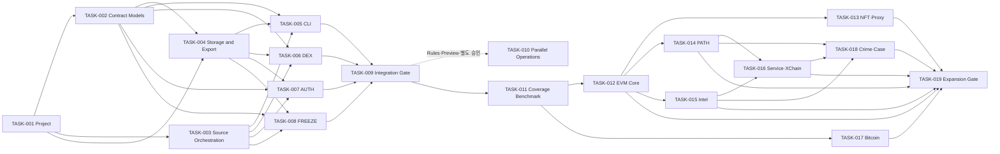

# SCAN 2026 P0·V1·Coverage 확장 및 대회 운영 Backlog
> Created: 2026-07-26 16:46
> Last Updated: 2026-07-29 01:55
> Status: TASK-001~009·011 Done · TASK-012~019 Proposed · Implementation Not Approved

## 1. 문서 목적

이 문서는 승인된 P0·V1 요구사항과 Benchmark 이후 Coverage 확장 계획,
Analysis I/O Schema, Python 개발 원칙, UI-First Gate와 fixture를 구현 가능한
원자적 작업으로 전환한다.

Backlog 범위와 `TASK-001`~`TASK-009` 구현은 별도로 승인되었다. 아홉 작업과
예상문제 benchmark `TASK-011`은 완료됐고 Rules-gated `TASK-010`은 offline
V1 범위가 완료됐다. live 후속 작업은 별도 승인 전에는 `In Progress`로
이동하지 않는다.

Benchmark 0.1 이후 Coverage 확장 `TASK-012`~`TASK-019`는 사용자 요청에
따라 계획됐지만 모두 `ToDo`다. fixture·Context Receipt·개별 구현 승인을
통과하기 전에는 코드를 작성하지 않는다.

`TASK-010`은 공식 Rules·Operations Board Preview·별도 구현 승인에 의존하는
비차단 운영 트랙이다. `TASK-001`~`TASK-009`의 P0·V1 의존 순서와 완료 Gate를
변경하지 않는다.

## 2. 범위와 작업 규칙

### 2.1 포함 범위

- Python project·quality tool 초기화
- Analysis I/O Pydantic model과 Schema diff
- source adapter·policy·retry·fallback
- SQLite cache·checkpoint와 SHA-256 artifact
- provenance·JSON·Markdown export
- `analyze`, `validate`, `resume`, `show` CLI
- DEX·AUTH·FREEZE vertical slice
- confirmed fixture 3개 회귀와 UI·보안 Gate
- Rules-gated 복수 문제 Queue·worker·독립 검증·수동 제출 운영

### 2.2 제외 범위

- P1 PATH·LABEL·VIZ 범용 기능
- Bitcoin·브리지·일반 OSINT·휴리스틱
- Web Investigation Workbench 구현·노트북·그래프 DB
- 서명·거래 전송·private key 입력
- 새로운 fixture 정답·증거 변경

### 2.3 상태 규칙

| 상태 | 의미 |
|:---|:---|
| `ToDo` | 문서 승인 또는 선행 작업 대기 |
| `In Progress` | Implementation Preconditions를 다시 확인하고 구현 중 |
| `Done` | Acceptance Criteria·QA·Document Sync Check 완료 |

작업을 `In Progress`로 옮길 때 구현자는 해당 항목의 모든 관련 문서를 실제로
다시 읽고 Preconditions를 체크한다. 코드만 완료하고 문서·QA가 남으면 `Done`으로
이동할 수 없다.

### 2.4 오픈소스 사전조사 Gate

모든 구현 작업은 [오픈소스 포렌식 사전조사](../03_Technical_Specs/06_OPEN_SOURCE_FORENSICS_REVIEW.md)의
관련 `OSSR-*` 조사와 `OSS-*` 결정을 입력으로 사용한다. 적합한 기존 기능을
검색하지 않았거나 결정 근거가 없으면 해당 작업을 `In Progress`로 이동하지
않는다.

P2·P3 조사는 해당 단계 승격 전까지 보류할 수 있지만, P0·V1 구현에는 관련
P0·V1 조사 결정이 필수다.

## 3. 의존 순서

TASK-002와 TASK-003은 TASK-001 뒤에 병렬 진행할 수 있다. TASK-004는
계약 model(TASK-002)에 의존하므로 TASK-002 이후에 시작한다. TASK-005는
TASK-002·003·004 모두에 의존한다. DEX·AUTH·FREEZE는 공통 계약을 재사용하되
서로의 내부 구현에 의존하지 않는다.
TASK-010은 통합된 Python leaf 분석을 사용하지만 P0·V1 완료를 차단하지 않는다.
TASK-012~019는 TASK-011의 3/6/21 측정 이후 별도 Phase 2다. TASK-012와
TASK-017은 fixture·source 준비가 독립적이면 병렬 가능하고, TASK-019는
실제로 승인·완료된 package만 통합한다.

## 4. Task Register

작업은 의존 순서를 보존하기 위해 ID 순으로 둔다. 실제 상태는 각 카드와
§5·§6에서 관리한다.

### [x] TASK-001: Python project와 기본 품질 Gate 초기화

- Status: Done
- Priority: P0 · High
- Depends On: 없음
- Requirement IDs: `TD-001`, `TD-002`, `TD-003`, `TD-008`, `TD-009`,
  `TD-010`, `TD-011`, `TD-012`
- Atomic Tasks:
  - [x] `.gitignore`에 `.scan/`, `.env*`, pytest·Ruff·coverage·build 산출물을 추가한다.
  - [x] 현재 환경변수가 없어 `.env.example`을 생성하지 않기로 결정했다.
  - [x] `pyproject.toml`에 Python `>=3.12,<3.15`, src layout과 package metadata를 정의한다.
  - [x] 최소 runtime dependency와 dev dependency를 Dependency Gate로 검토한다.
  - [x] `uv.lock`을 생성하고 독립 임시 환경 cold install을 재현한다.
  - [x] `src/scan_tool/`과 `tests/unit`, `tests/integration`, `tests/regression`를 만든다.
  - [x] `scripts/verify.py`로 Ruff·pytest와 기존 두 Schema 검증을 한 번에 실행한다.
- Related Concept Docs:
  - [분석 도구 기능 우선순위](../01_Concept_Design/04_SCAN_2026_TOOL_PRIORITY.md) - P0 공통 기반 선행 원칙
- Related UI Docs:
  - [CLI Screen Flow](../02_UI_Screens/00_SCREEN_FLOW.md) - 초기 package가 제공할 command surface
  - [CLI Prototype Review](../02_UI_Screens/02_CLI_PROTOTYPE_REVIEW.md) - UI-First Gate 통과와 FB-001
- Related HTML Preview:
  - [CLI Terminal Preview](../02_UI_Screens/previews/01_cli_terminal_preview.html) - 구현 전 확인된 사용자 화면
- Related Technical Docs:
  - [Python 개발 원칙](../03_Technical_Specs/00_DEVELOPMENT_PRINCIPLES.md) - 구조·dependency·Git·보안 기준
  - [기술 선택 기록](../03_Technical_Specs/04_SCAN_2026_TECHNOLOGY_DECISION.md) - Python·uv·Typer·pytest·Ruff 결정
- Related QA Docs:
  - [P0·V1 QA 시나리오](../05_QA_Validation/01_TEST_SCENARIOS.md) - `QA-BOOT-*`, `QA-SEC-*`
- Implementation Preconditions:
  - [x] 관련 Concept·UI·Technical·QA 문서를 다시 확인했다.
  - [x] HTML Preview 사용자 확인과 FB-001 기록을 확인했다.
  - [x] CLI 진입·전환·이탈과 loading·empty·error 상태를 확인했다.
  - [x] 데이터 소스·최소 필드·local mutation·상태 저장 경계를 확인했다.
  - [x] dependency license·취약점·공식 package를 확인했다.
  - [x] 구현 범위가 P0·V1과 충돌하지 않는다.
- Acceptance Criteria:
  - [x] 독립 임시 환경에서 `uv sync --locked`가 성공한다.
  - [x] `uv run ruff check .`, `uv run ruff format --check .`, `uv run pytest`가 성공한다.
  - [x] 기존 fixture·analysis Schema 검증이 모두 `PASS 3`이다.
  - [x] Git 추적 파일에서 secret·`.scan/`·로컬 DB가 0건이다.
  - [x] package import와 `scan --help`가 src layout 설치에서 성공한다.
- Document Sync Check:
  - [x] 실제 Python·dependency version과 명령을 개발 원칙·기술 선택 기록에 반영했다.
  - [x] 구현과 문서 차이를 검토하고 TASK-001 결과 보고서에 기록했다.

### [x] TASK-002: Analysis I/O 계약 model과 Schema diff 구현

- Status: Done
- Priority: P0 · High
- Depends On: TASK-001
- Requirement IDs: `REQ-COM-IN-*`, `REQ-COM-OUT-*`, `REQ-NFR-001`,
  `REQ-NFR-004`, `TD-003`, `TD-006`, `TD-019`
- Atomic Tasks:
  - [x] request·result·error Pydantic v2 model을 분리한다.
  - [x] 공통 model에 `extra="forbid"`를 적용한다.
  - [x] analysis type·status·classification·evidence type·error code enum을 정의한다.
  - [x] 주소·TX hash·RFC 3339·raw decimal string validator를 구현한다.
  - [x] complete·partial·failed 불변조건과 ID 유일성을 검증한다.
  - [x] result→evidence→source 참조 무결성을 검증한다.
  - [x] Pydantic 생성 Schema와 승인 Schema `0.1`의 의미상 diff 명령을 만든다.
  - [x] confirmed request/result 예제 3쌍을 model round-trip한다.
- Related Concept Docs:
  - [예상문제 은행](../01_Concept_Design/02_SCAN_2026_EXPECTED_PROBLEM_BANK.md) - 완료·부분·실패와 증거 필드
- Related UI Docs:
  - [CLI Screen Flow](../02_UI_Screens/00_SCREEN_FLOW.md) - model 상태가 표시되는 순서
  - [CLI Terminal UI Design](../02_UI_Screens/01_UI_DESIGN.md) - raw·classification·error 표현
- Related HTML Preview:
  - [CLI Terminal Preview](../02_UI_Screens/previews/01_cli_terminal_preview.html) - model 기반 terminal 상태
- Related Technical Docs:
  - [공통 분석 I/O Schema](../03_Technical_Specs/05_ANALYSIS_IO_SCHEMA.md) - 규범적 공개 계약
  - [P0·V1 요구사항](../03_Technical_Specs/03_SCAN_2026_TOOL_REQUIREMENTS.md) - 입력·출력·오류 규칙
  - [Python 개발 원칙](../03_Technical_Specs/00_DEVELOPMENT_PRINCIPLES.md) - Pydantic·정밀도·시간 기준
- Related QA Docs:
  - [P0·V1 QA 시나리오](../05_QA_Validation/01_TEST_SCENARIOS.md) - `QA-SCHEMA-001`, `QA-SCHEMA-002`
  - [Analysis I/O 예제](../05_QA_Validation/examples/analysis/README.md) - round-trip 기준
  - [TASK-002 Contract 보고서](../05_QA_Validation/06_TASK_002_CONTRACT_REPORT.md) - model·불변조건·Schema 의미 검사 증거
- Implementation Preconditions:
  - [x] 관련 문서와 승인 Schema 3종을 다시 확인했다.
  - [x] HTML Preview 사용자 확인과 피드백 기록을 확인했다.
  - [x] HTML Preview의 complete·partial·failed 표현을 확인했다.
  - [x] 입력·출력 최소 필드와 상태 변화를 확인했다.
  - [x] 외부 mutation 없음과 local model validation 경계를 확인했다.
  - [x] fixture schema와 analysis schema의 독립 버전을 확인했다.
  - [x] 구현 범위가 공개 계약 `0.1`을 임의 변경하지 않는다.
- Acceptance Criteria:
  - [x] 유효한 요청·결과 예제 3쌍이 round-trip 후 의미상 동일하다.
  - [x] 잘못된 주소·TX hash·블록·유형은 `invalid_input`으로 거부한다.
  - [x] extra field·float raw amount·naive datetime·깨진 참조는
        `schema_invalid`로 거부한다.
  - [x] 깨진 result→evidence→source 참조를 거부한다.
  - [x] 저장 Schema와 생성 Schema의 의미상 probe diff가 0이다.
  - [x] `complete`+error, `failed`+no error 조합을 거부한다.
- Document Sync Check:
  - [x] model 경로와 Schema 생성·diff 명령을 Schema 문서에 기록했다.
  - [x] 공개 Schema 변경 없이 계약 `0.1`을 구현했다.

### [x] TASK-003: Source port·policy·retry·fallback orchestration 구현

- Status: Done
- Priority: P0 · High
- Depends On: TASK-001
- Requirement IDs: `REQ-P0-PROV-001`, `REQ-P0-PROV-005`,
  `REQ-P0-CACHE-004`, `REQ-P0-CACHE-005`, `REQ-NFR-006`,
  `REQ-NFR-008`, `TD-013`, `TD-014`
- Atomic Tasks:
  - [x] source request·response·attempt Protocol을 정의한다.
  - [x] 주입 가능한 `httpx.AsyncClient`와 source별 timeout을 구성한다.
  - [x] public RPC·archive RPC·explorer·official context adapter 경계를 만든다.
  - [x] `allowed_source_ids`·`source_order`·offline·fallback 정책을 적용한다.
  - [x] restricted 요청을 네트워크 호출 전에 차단한다.
  - [x] timeout·429·일시적 5xx만 제한적으로 재시도한다.
  - [x] `Retry-After`, backoff·jitter, 최대 시도와 모든 attempt를 기록한다.
  - [x] fallback 시 최초 실패와 대체 provider를 모두 보존한다.
- Related Concept Docs:
  - [분석 도구 기능 우선순위](../01_Concept_Design/04_SCAN_2026_TOOL_PRIORITY.md) - source 교체·규정 위험을 포함한 P0
- Related UI Docs:
  - [CLI Screen Flow](../02_UI_Screens/00_SCREEN_FLOW.md) - retry·fallback·규정 차단 흐름
  - [CLI Terminal UI Design](../02_UI_Screens/01_UI_DESIGN.md) - source·attempt 표시와 FB-001
- Related HTML Preview:
  - [CLI Terminal Preview](../02_UI_Screens/previews/01_cli_terminal_preview.html) - AUTH retry·FREEZE 차단 상태
- Related Technical Docs:
  - [데이터 소스 등록부](../03_Technical_Specs/01_DATA_SOURCE_REGISTRY.md) - source ID·능력·제약
  - [P0·V1 요구사항](../03_Technical_Specs/03_SCAN_2026_TOOL_REQUIREMENTS.md) - provenance·retry·규정 계약
  - [Python 개발 원칙](../03_Technical_Specs/00_DEVELOPMENT_PRINCIPLES.md) - adapter·secret·orchestration 기준
- Related QA Docs:
  - [P0·V1 QA 시나리오](../05_QA_Validation/01_TEST_SCENARIOS.md) - `QA-SOURCE-*`, `QA-RETRY-*`, `QA-RULE-*`
  - [TASK-003 Source 보고서](../05_QA_Validation/07_TASK_003_SOURCE_REPORT.md) - policy·retry·fallback·dependency 증거
- Implementation Preconditions:
  - [x] 등록부와 source policy·오류 계약을 다시 확인했다.
  - [x] HTML Preview 사용자 확인과 피드백 기록을 확인했다.
  - [x] HTML Preview의 retry·fallback·rule blocked 상태를 확인했다.
  - [x] source 입력·응답·attempt 최소 필드를 확인했다.
  - [x] 외부 mutation 없이 read-only 호출만 수행함을 확인했다.
  - [x] 공식 규정·provider plan·rate limit 미확정 값을 하드코딩하지 않는다.
  - [x] FB-001의 stderr 상세·stdout 압축 경계를 확인했다.
- Acceptance Criteria:
  - [x] restricted 정책에서 HTTP 호출이 0건이다.
  - [x] offline mode에서 cache miss가 구조화 오류로 종료되고 network 호출은 0건이다.
  - [x] timeout·429·일시적 5xx에만 제한된 재시도가 실행된다.
  - [x] fallback 전후 provider가 모두 source attempt에 남는다.
  - [x] endpoint query·header·API key가 결과 repr·구조화 오류에 나타나지 않는다.
- Document Sync Check:
  - [x] 실제 adapter 경계와 provider ID 정책을 데이터 소스 등록부에 반영했다.
  - [x] retry·fallback 기본값을 기술 선택·Schema 실행 정책·QA와 동기화했다.

### [x] TASK-004: SQLite cache·checkpoint·provenance·export 구현

- Status: Done
- Priority: P0 · High
- Depends On: TASK-001, TASK-002
- Requirement IDs: `REQ-P0-PROV-*`, `REQ-P0-EXPORT-*`,
  `REQ-P0-CACHE-001`, `REQ-P0-CACHE-002`, `REQ-P0-CACHE-003`,
  `REQ-P0-CACHE-006`, `REQ-P0-CACHE-007`, `TD-015`, `TD-016`,
  `TD-020`, `TD-021`
- Atomic Tasks:
  - [x] run·source attempt·cache·checkpoint·artifact 최소 SQLite DDL을 정의한다.
  - [x] WAL과 transaction 경계·parameter binding을 적용한다.
  - [x] canonical cache key와 immutable historical 응답 정책을 구현한다.
  - [x] raw body를 SHA-256 content-addressed artifact로 원자적 저장한다.
  - [x] checkpoint에 완료 stage와 evidence ID를 기록한다.
  - [x] JSON result를 단일 source of truth로 export한다.
  - [x] 같은 result model에서 Markdown evidence를 렌더링한다.
  - [x] export·DB·artifact·checkpoint의 secret redaction을 검사한다.
- Related Concept Docs:
  - [분석 도구 기능 우선순위](../01_Concept_Design/04_SCAN_2026_TOOL_PRIORITY.md) - BASE-CACHE·PROVENANCE·EXPORT 최우선 근거
- Related UI Docs:
  - [CLI Screen Flow](../02_UI_Screens/00_SCREEN_FLOW.md) - cache·resume·export 사용자 흐름
  - [CLI Terminal UI Design](../02_UI_Screens/01_UI_DESIGN.md) - RUN·EXPORTS 표시
- Related HTML Preview:
  - [CLI Terminal Preview](../02_UI_Screens/previews/01_cli_terminal_preview.html) - cache hit·resume·artifact 경로
- Related Technical Docs:
  - [Python 개발 원칙](../03_Technical_Specs/00_DEVELOPMENT_PRINCIPLES.md) - SQLite·artifact·provenance·export 기준
  - [SQLite 논리 DB Schema](../03_Technical_Specs/01_DB_SCHEMA.md) - 논리 엔티티·관계·mutation·보존 계약
  - [공통 분석 I/O Schema](../03_Technical_Specs/05_ANALYSIS_IO_SCHEMA.md) - run·sources·exports 계약
  - [P0·V1 요구사항](../03_Technical_Specs/03_SCAN_2026_TOOL_REQUIREMENTS.md) - cache·export 완료 조건
- Related QA Docs:
  - [P0·V1 QA 시나리오](../05_QA_Validation/01_TEST_SCENARIOS.md) - `QA-CACHE-*`, `QA-EXPORT-*`, `QA-SEC-*`
  - [TASK-004 Storage 보고서](../05_QA_Validation/08_TASK_004_STORAGE_REPORT.md) - DDL·cache·checkpoint·artifact·export 증거
- Implementation Preconditions:
  - [x] 저장·복구·export 관련 문서를 다시 확인했다.
  - [x] HTML Preview 사용자 확인과 피드백 기록을 확인했다.
  - [x] HTML Preview의 cache·resume·export 상태를 확인했다.
  - [x] DB 최소 필드·artifact metadata·checkpoint 상태를 확인했다.
  - [x] local mutation 범위가 `.scan/` 아래임을 확인했다.
  - [x] WAL backup·migration·삭제에 사용자 승인 원칙을 확인했다.
  - [x] JSON·Markdown ID·값 일치 기준을 확인했다.
- Acceptance Criteria:
  - [x] 동일 immutable 요청 2회째 외부 호출이 0건이고 결과가 같다.
  - [x] 중단 후 완료 stage를 재호출하지 않고 `resumed: true`로 완료한다.
  - [x] artifact hash·byte length·source·retrieved time이 연결된다.
  - [x] JSON·Markdown의 analysis·result·evidence ID와 값이 일치한다.
  - [x] secret과 로컬 사용자 절대 경로가 export에서 0건이다.
  - [x] 임시 DB·디렉터리 기반 integration test가 사용자 `.scan/`을 건드리지 않는다.
- Document Sync Check:
  - [x] SQLite DDL·backup·artifact URI를 기술 문서에 기록했다.
  - [x] export 형식과 Analysis I/O `0.1` 비변경을 Schema·UI·QA에 동기화했다.

### [x] TASK-005: CLI command surface와 terminal renderer 구현

- Status: Done
- Priority: V1 · High
- Depends On: TASK-002, TASK-003, TASK-004
- Requirement IDs: `TD-009`, `TD-018`, `REQ-COM-*`, `REQ-NFR-005`
- Atomic Tasks:
  - [x] Typer app과 `analyze`, `validate`, `resume`, `show` 명령을 정의한다.
  - [x] CLI composition root에서 SQLite·artifact·export adapter를 생성·주입한다.
  - [x] 시작 400ms 이내 첫 피드백을 측정 가능한 시각으로 기록한다.
  - [x] progress·cache·retry·fallback·warning을 stderr로 출력한다.
  - [x] 최종 상태·결과·export 경로를 stdout으로 출력한다.
  - [x] complete·partial·failed·restricted·interrupted 종료 코드를 적용한다.
  - [x] `NO_COLOR`, non-TTY, 80 columns와 주소·TX 축약을 지원한다.
  - [x] FB-001에 따라 최종 stdout retry 이력을 압축한다.
- Related Concept Docs:
  - [참가·분석 도구 준비 전략](../01_Concept_Design/01_SCAN_2026_PREPARATION_STRATEGY.md) - 빠른 문제 풀이와 재현성 목적
- Related UI Docs:
  - [CLI Screen Flow](../02_UI_Screens/00_SCREEN_FLOW.md) - canonical 명령·종료 코드·사용자 동선
  - [CLI Terminal UI Design](../02_UI_Screens/01_UI_DESIGN.md) - 상태별 layout·접근성·FB-001
  - [CLI Prototype Review](../02_UI_Screens/02_CLI_PROTOTYPE_REVIEW.md) - 사용자 승인 기록
- Related HTML Preview:
  - [CLI Terminal Preview](../02_UI_Screens/previews/01_cli_terminal_preview.html) - 구현 비교 기준
- Related Technical Docs:
  - [Python 개발 원칙](../03_Technical_Specs/00_DEVELOPMENT_PRINCIPLES.md) - composition root·stdout·stderr·logging
  - [기술 선택 기록](../03_Technical_Specs/04_SCAN_2026_TECHNOLOGY_DECISION.md) - Typer·command surface
  - [공통 분석 I/O Schema](../03_Technical_Specs/05_ANALYSIS_IO_SCHEMA.md) - renderer 입력 model
- Related QA Docs:
  - [P0·V1 QA 시나리오](../05_QA_Validation/01_TEST_SCENARIOS.md) - `QA-CLI-001`~`QA-CLI-004`, `QA-SEC-001`의 CLI 범위
  - [TASK-005 CLI 보고서](../05_QA_Validation/09_TASK_005_CLI_REPORT.md) - 명령·renderer·exit code·보안·UI 대조 증거
- Implementation Preconditions:
  - [x] 관련 UI 문서·Preview·사용자 피드백을 다시 확인했다.
  - [x] 진입·전환·이탈과 complete·partial·failed 상태를 확인했다.
  - [x] renderer가 받는 최소 result·run·error 필드를 확인했다.
  - [x] CLI local mutation은 요청·run·export·checkpoint 저장으로 제한된다.
  - [x] core calculation을 CLI에 두지 않는 경계를 확인했다.
  - [x] FB-001을 Acceptance Criteria와 테스트에 연결했다.
- Acceptance Criteria:
  - [x] 네 명령의 `--help`와 잘못된 인자 동작이 명확하다.
  - [x] command 실행 후 400ms 이내 `STARTING`이 stderr에 나타난다.
  - [x] 최종 stdout에는 retry·fallback count와 첫 오류 code만 요약된다.
  - [x] detailed attempt는 stderr와 SQLite에, JSON에는 run 집계·source provenance로 보존된다.
  - [x] canary secret·Authorization 값과 사용자 이름을 포함한 로컬 절대 경로가 stdout·stderr·오류 출력에 노출되지 않는다.
  - [x] 종료 코드 `0`, `2`, `3`, `4`, `5`, `130`이 문서와 일치한다.
  - [x] `NO_COLOR`·non-TTY·80 columns에서 상태 의미와 핵심 값이 유지된다.
- Document Sync Check:
  - [x] 실제 `--help`·snapshot을 UI 문서·Preview와 대조했다.
  - [x] Typer help frame과 analyzer 미구현 경계를 의도된 차이로 기록했다.

### [x] TASK-006: DEX vertical slice 구현

- Status: Done
- Priority: V1 · High
- Depends On: TASK-002, TASK-003, TASK-004
- Requirement IDs: `REQ-P0-EVM-001`~`REQ-P0-EVM-008`,
  `REQ-V1-DEX-001`~`REQ-V1-DEX-006`
- Atomic Tasks:
  - [x] TX·receipt·Transfer·Swap·Withdrawal raw 증거를 수집한다.
  - [x] internal native ETH call을 별도 call evidence로 정규화한다.
  - [x] USDC input과 WETH pool output을 exact raw로 복원한다.
  - [x] WETH pool output과 native ETH user output을 분리한다.
  - [x] router·factory·pair metadata를 supporting provenance로 분리한다.
  - [x] partial·failed에서 확보 증거와 누락 요구사항을 보존한다.
  - [x] `FX-SVC-DEX-001` regression을 자동화한다.
- Related Concept Docs:
  - [예상문제 은행](../01_Concept_Design/02_SCAN_2026_EXPECTED_PROBLEM_BANK.md) - SVC-DEX 문제 조건
  - [분석 도구 기능 우선순위](../01_Concept_Design/04_SCAN_2026_TOOL_PRIORITY.md) - DEX vertical slice 선정
- Related UI Docs:
  - [CLI Terminal UI Design](../02_UI_Screens/01_UI_DESIGN.md) - DEX result 3행 구분
- Related HTML Preview:
  - [CLI Terminal Preview](../02_UI_Screens/previews/01_cli_terminal_preview.html) - DEX complete 기준 화면
- Related Technical Docs:
  - [P0·V1 요구사항](../03_Technical_Specs/03_SCAN_2026_TOOL_REQUIREMENTS.md) - DEX exact-match 계약
  - [공통 분석 I/O Schema](../03_Technical_Specs/05_ANALYSIS_IO_SCHEMA.md) - DEX request·result model
  - [데이터 소스 등록부](../03_Technical_Specs/01_DATA_SOURCE_REGISTRY.md) - RPC·explorer·DEX metadata
- Related QA Docs:
  - [P0·V1 QA 시나리오](../05_QA_Validation/01_TEST_SCENARIOS.md) - `QA-DEX-*`
  - [DEX fixture](../05_QA_Validation/fixtures/FX-SVC-DEX-001/README.md) - confirmed 정답·증거
  - [TASK-006 DEX 보고서](../05_QA_Validation/10_TASK_006_DEX_REPORT.md) - raw decode·정합·partial·resume·보안 증거
- Implementation Preconditions:
  - [x] DEX 요구사항·fixture·source 문서를 다시 확인했다.
  - [x] HTML Preview 사용자 확인과 피드백 기록을 확인했다.
  - [x] HTML Preview에서 pool output과 user output 분리를 확인했다.
  - [x] TX·event·call·metadata 최소 필드를 확인했다.
  - [x] 외부 mutation 없이 read-only 수집만 수행한다.
  - [x] raw amount에 float를 사용하지 않는다.
  - [x] 일반 N-hop·가격·범용 DEX 지원을 범위에 넣지 않는다.
- Acceptance Criteria:
  - [x] USDC `25000000000` raw input이 exact match한다.
  - [x] WETH `14449515027026387018` raw pool output이 exact match한다.
  - [x] native ETH `14449515027026387018` raw user output이 exact match한다.
  - [x] pool WETH와 user native ETH가 별도 result·evidence로 출력된다.
  - [x] JSON·Markdown과 terminal summary가 같은 세 결과를 표시한다.
  - [x] 한 필수 증거 누락 주입 시 complete가 아니라 partial이다.
- Document Sync Check:
  - [x] 실제 DEX result·evidence ID를 Schema 예제·QA와 대조했다.
  - [x] fixture 정답 변경 없이 raw replay adapter로 구현 차이를 해결했다.

### [x] TASK-007: AUTH vertical slice 구현

- Status: Done
- Priority: V1 · High
- Depends On: TASK-002, TASK-003, TASK-004
- Requirement IDs: `REQ-P0-EVM-001`~`REQ-P0-EVM-008`,
  `REQ-V1-AUTH-001`~`REQ-V1-AUTH-007`
- Atomic Tasks:
  - [x] Approval event와 approve calldata의 owner·spender·amount를 정합한다.
  - [x] 네 historical block의 allowance를 archive source에서 조회한다.
  - [x] 성공 trace의 `transferFrom`과 Transfer event를 연결한다.
  - [x] allowance 감소와 `4500000` raw 소비를 exact 정합한다.
  - [x] receipt status 0인 중간 거래 3개를 소비에서 제외한다.
  - [x] event·call·state evidence를 분리한다.
  - [x] 피싱·탈취 귀속을 `not_assessed`로 출력한다.
  - [x] `FX-EVM-AUTH-001` regression을 자동화한다.
- Related Concept Docs:
  - [예상문제 은행](../01_Concept_Design/02_SCAN_2026_EXPECTED_PROBLEM_BANK.md) - AUTH 권한 소비 문제 조건
  - [분석 도구 기능 우선순위](../01_Concept_Design/04_SCAN_2026_TOOL_PRIORITY.md) - AUTH vertical slice 선정
- Related UI Docs:
  - [CLI Terminal UI Design](../02_UI_Screens/01_UI_DESIGN.md) - AUTH complete·partial·not assessed와 FB-001
  - [CLI Prototype Review](../02_UI_Screens/02_CLI_PROTOTYPE_REVIEW.md) - AUTH 정보량 피드백
- Related HTML Preview:
  - [CLI Terminal Preview](../02_UI_Screens/previews/01_cli_terminal_preview.html) - AUTH partial·resume 화면
- Related Technical Docs:
  - [P0·V1 요구사항](../03_Technical_Specs/03_SCAN_2026_TOOL_REQUIREMENTS.md) - AUTH exact-match·범위 계약
  - [공통 분석 I/O Schema](../03_Technical_Specs/05_ANALYSIS_IO_SCHEMA.md) - AUTH request·result model
  - [데이터 소스 등록부](../03_Technical_Specs/01_DATA_SOURCE_REGISTRY.md) - archive·trace·explorer source
- Related QA Docs:
  - [P0·V1 QA 시나리오](../05_QA_Validation/01_TEST_SCENARIOS.md) - `QA-AUTH-*`
  - [AUTH fixture](../05_QA_Validation/fixtures/FX-EVM-AUTH-001/README.md) - confirmed 정답·증거
  - [TASK-007 AUTH 보고서](../05_QA_Validation/11_TASK_007_AUTH_REPORT.md) - 실제 raw replay·정합·partial·resume 증거
- Implementation Preconditions:
  - [x] AUTH 요구사항·fixture·source 문서를 다시 확인했다.
  - [x] HTML Preview 사용자 확인과 피드백 기록을 확인했다.
  - [x] HTML Preview의 partial·retry·resume와 FB-001을 확인했다.
  - [x] event·call·state·failed TX 최소 필드를 확인했다.
  - [x] external mutation 없이 historical read만 수행한다.
  - [x] archive·trace unavailable의 partial 기준을 확인했다.
  - [x] 피해·피싱·탈취를 자동 단정하지 않는다.
- Acceptance Criteria:
  - [x] 승인과 allowance 네 지점이 fixture와 exact match한다.
  - [x] 성공 소비·Transfer·allowance delta가 `4500000` raw로 일치한다.
  - [x] 실패 거래 3개가 결과에서 제외되고 실패 사실은 보존된다.
  - [x] theft·phishing은 `not_assessed`이며 victim 문구를 사용하지 않는다.
  - [x] archive state 누락 주입 시 확보한 승인 결과를 가진 partial이다.
  - [x] resume에서 기존 evidence ID와 완료 artifact를 재사용한다.
- Document Sync Check:
  - [x] FB-001을 CLI `SCOPE`·QA에 반영했다.
  - [x] 실제 AUTH 결과를 fixture·Schema 예제·문제은행 표현과 대조했다.

### [x] TASK-008: FREEZE vertical slice 구현

- Status: Done
- Priority: V1 · High
- Depends On: TASK-002, TASK-003, TASK-004
- Requirement IDs: `REQ-P0-EVM-001`~`REQ-P0-EVM-008`,
  `REQ-V1-FREEZE-001`~`REQ-V1-FREEZE-008`
- Atomic Tasks:
  - [x] blacklist·unBlacklist calldata와 event를 분리 수집한다.
  - [x] 네 historical block의 `isBlacklisted` 상태를 조회한다.
  - [x] false→true와 true→false 전이를 exact 정합한다.
  - [x] 주소 blacklist와 global pause를 구분한다.
  - [x] Circle·OFAC 공식 URL의 원문·주소 명시 여부를 context로 보존한다.
  - [x] 온체인 상태와 공식 맥락·현재 제재·범죄 의도를 분리한다.
  - [x] restricted 정책에서 네트워크 전 차단한다.
  - [x] `FX-EVM-FREEZE-001` regression을 자동화한다.
- Related Concept Docs:
  - [예상문제 은행](../01_Concept_Design/02_SCAN_2026_EXPECTED_PROBLEM_BANK.md) - FREEZE 문제 조건
  - [분석 도구 기능 우선순위](../01_Concept_Design/04_SCAN_2026_TOOL_PRIORITY.md) - FREEZE vertical slice 선정
- Related UI Docs:
  - [CLI Screen Flow](../02_UI_Screens/00_SCREEN_FLOW.md) - 규정 차단과 실패 흐름
  - [CLI Terminal UI Design](../02_UI_Screens/01_UI_DESIGN.md) - 온체인·맥락·미평가 표현
- Related HTML Preview:
  - [CLI Terminal Preview](../02_UI_Screens/previews/01_cli_terminal_preview.html) - FREEZE rule blocked 화면
- Related Technical Docs:
  - [P0·V1 요구사항](../03_Technical_Specs/03_SCAN_2026_TOOL_REQUIREMENTS.md) - FREEZE exact-match·OSINT 경계
  - [공통 분석 I/O Schema](../03_Technical_Specs/05_ANALYSIS_IO_SCHEMA.md) - FREEZE request·result model
  - [데이터 소스 등록부](../03_Technical_Specs/01_DATA_SOURCE_REGISTRY.md) - archive·explorer·공식 source
- Related QA Docs:
  - [P0·V1 QA 시나리오](../05_QA_Validation/01_TEST_SCENARIOS.md) - `QA-FREEZE-*`, `QA-RULE-*`
  - [FREEZE fixture](../05_QA_Validation/fixtures/FX-EVM-FREEZE-001/README.md) - confirmed 정답·증거
  - [TASK-008 FREEZE 보고서](../05_QA_Validation/12_TASK_008_FREEZE_REPORT.md) - raw replay·상태 전이·context·partial·resume 증거
- Implementation Preconditions:
  - [x] FREEZE 요구사항·fixture·source 문서를 다시 확인했다.
  - [x] HTML Preview 사용자 확인과 피드백 기록을 확인했다.
  - [x] HTML Preview의 rule blocked와 not assessed 표현을 확인했다.
  - [x] event·call·state·context 최소 필드를 확인했다.
  - [x] 입력 URL 수집 외 일반 OSINT 탐색을 하지 않는다.
  - [x] 규정 상태와 source policy를 실행 전에 확인한다.
  - [x] 현재 제재·범죄 의도를 자동 판정하지 않는다.
- Acceptance Criteria:
  - [x] false→true와 true→false 전이·네 state가 exact match한다.
  - [x] event·call·state·context가 서로 다른 evidence type이다.
  - [x] Circle과 OFAC의 주소 명시 여부가 각각 보존된다.
  - [x] current sanctions와 criminal intent가 `not_assessed`다.
  - [x] restricted 정책에서 source attempt와 network call이 0건이다.
  - [x] 한 전이만 확보하면 complete가 아니라 partial이다.
- Document Sync Check:
  - [x] 실제 context source와 라이선스·조회 시각을 등록부와 대조했다.
  - [x] FREEZE 결과를 fixture·Schema 예제·UI와 동기화했다.

### [x] TASK-009: 통합 회귀·보안·문서 동기화 Gate

- Status: Done
- Priority: V1 · High
- Depends On: TASK-005, TASK-006, TASK-007, TASK-008
- Requirement IDs: `REQ-NFR-001`~`REQ-NFR-008`, `TEST-SCHEMA-001`,
  `TEST-CACHE-001`, `TEST-RETRY-001`, `TEST-FALLBACK-001`,
  `TEST-EXPORT-001`, `TEST-DEX-001`, `TEST-AUTH-001`, `TEST-FREEZE-001`
- Atomic Tasks:
  - [x] unit·integration·regression suite를 네트워크 없이 실행한다.
  - [x] confirmed fixture 3개 exact-match를 반복 실행한다.
  - [x] cold·warm·resume와 400ms 첫 피드백을 측정한다.
  - [x] timeout·429·5xx·malformed JSON·정합 실패를 주입한다.
  - [x] secret·로컬 절대 경로·private key 문구를 scan한다.
  - [x] JSON·Markdown·terminal result 값을 교차 비교한다.
  - [x] UI Preview와 실제 CLI snapshot 차이를 검토한다.
  - [x] 365 rubric·Originality·Ethics와 공식 규정 상태를 기록한다.
- Related Concept Docs:
  - [참가·분석 도구 준비 전략](../01_Concept_Design/01_SCAN_2026_PREPARATION_STRATEGY.md) - 빠르고 정확한 문제 해결 목표
  - [분석 도구 기능 우선순위](../01_Concept_Design/04_SCAN_2026_TOOL_PRIORITY.md) - P0·V1 완료 기준
- Related UI Docs:
  - [CLI Screen Flow](../02_UI_Screens/00_SCREEN_FLOW.md) - 전체 사용자 흐름
  - [CLI Prototype Review](../02_UI_Screens/02_CLI_PROTOTYPE_REVIEW.md) - 사용자 확인·FB-001
- Related HTML Preview:
  - [CLI Terminal Preview](../02_UI_Screens/previews/01_cli_terminal_preview.html) - 실제 CLI snapshot 비교 기준
- Related Technical Docs:
  - [Python 개발 원칙](../03_Technical_Specs/00_DEVELOPMENT_PRINCIPLES.md) - PR 완료·보안·테스트 Gate
  - [P0·V1 요구사항](../03_Technical_Specs/03_SCAN_2026_TOOL_REQUIREMENTS.md) - 전체 완료 기준
  - [공통 분석 I/O Schema](../03_Technical_Specs/05_ANALYSIS_IO_SCHEMA.md) - 계약·참조 무결성
- Related QA Docs:
  - [P0·V1 QA 시나리오](../05_QA_Validation/01_TEST_SCENARIOS.md) - 통합 실행 기준
  - [Reference Fixtures](../05_QA_Validation/01_REFERENCE_FIXTURES.md) - confirmed fixture 상태
  - [TASK-009 통합 보고서](../05_QA_Validation/13_TASK_009_INTEGRATION_REPORT.md) - 결정성·오류 행렬·추적성·보안 증거
- Implementation Preconditions:
  - [x] 모든 선행 작업과 관련 문서를 다시 확인했다.
  - [x] HTML Preview·사용자 확인·FB-001 반영 여부를 확인했다.
  - [x] 전체 데이터 흐름·상태·오류·resume 경계를 확인했다.
  - [x] live test는 명시적 opt-in이며 기본 suite는 network 0건이다.
  - [x] 공식 규정·dependency·source license 상태를 확인했다.
  - [x] 미완료 항목을 성공으로 표시하지 않는다.
- Acceptance Criteria:
  - [x] lint·format·unit·integration·regression이 모두 통과한다.
  - [x] fixture·analysis Schema 검증이 `PASS 3`이다.
  - [x] DEX·AUTH·FREEZE exact-match와 오류 주입 시나리오가 통과한다.
  - [x] secret·인증 header·로컬 사용자 절대 경로가 0건이다.
  - [x] actual CLI와 Preview의 의도하지 않은 차이가 0건이다.
  - [x] 문서·코드·Schema·fixture version이 서로 일치한다.
- Document Sync Check:
  - [x] 구현 완료 상태를 Backlog·QA·기술 문서에 동기화했다.
  - [x] 잔여 위험·미평가·공식 규정 제한을 최종 보고서에 기록했다.

### [ ] TASK-010: AI-native Rules-gated 병렬 문제풀이 Operations 구현

- Status: Offline V1 Complete · OPS-IMPL-01~08 Done · Live Rules-Gated
- Work Type: code
- Priority: Tournament Operations · Conditional
- Depends On: TASK-005, TASK-009, Operations Board Preview 승인;
  live AI mode만 공식 Rules 확인 필요
- Requirement IDs: `REQ-OPS-IN-001`~`REQ-OPS-IN-004`,
  `REQ-OPS-QUEUE-001`~`REQ-OPS-QUEUE-006`,
  `REQ-OPS-VERIFY-001`~`REQ-OPS-VERIFY-006`,
  `REQ-OPS-SUBMIT-001`~`REQ-OPS-SUBMIT-004`
- Atomic Tasks:
  - [x] problem·job·analysis·verification·candidate ID와 상태 model을 정의한다.
  - [ ] AI Planner/Coordinator를 모든 문제의 필수 planning 단계로 구현한다.
  - [x] Rules Gate가 AI 사용 여부가 아니라 provider·model·data·tool mode를 선택하게 한다.
  - [x] AI가 해결 방법·leaf dependency·도구 계획을 구조화된 hypothesis로 생성하게 한다.
  - [ ] problem Queue와 dependency-aware job Queue를 분리한다.
  - [ ] AI Planner/Coordinator·EVM·Tracer·OSINT·Verifier·Reporter role adapter를 정의한다.
  - [x] AI plan에 따라 human-approved Python worker가 evidence job을 실행하게 한다.
  - [x] 문제 간 workspace·result·checkpoint를 격리한다.
  - [x] candidate의 problem·plan·job·Analysis 참조를 교차 문제에서 격리한다.
  - [x] 문제 내부 독립 leaf job을 제한된 동시성으로 실행한다.
  - [x] source request idempotency·in-flight dedup·capability별 concurrency budget을 구현한다.
  - [x] worker 실패를 해당 job·dependency에만 전파한다.
  - [x] conflict·missing evidence·self-check를 `review_required`로 보낸다.
  - [x] 독립 Verifier가 raw evidence를 재조회한 뒤에만 candidate를 승격한다.
  - [x] Operations Board의 problem·worker·verification·submission 상태를 read-only snapshot으로 연결한다.
  - [x] 답 전체 복사와 사람 `Mark submitted`를 분리한다.
  - [x] CTFd 자동 제출·credential·session·brute force 경로가 없음을 검증한다.
  - [x] 6개 Agentic Parallel Solve QA 시나리오를 자동화한다.
- Related Concept Docs:
  - [참가·분석 도구 준비 전략](../01_Concept_Design/01_SCAN_2026_PREPARATION_STRATEGY.md) - 대회 당일 병렬 운영과 사람 제출 원칙
  - [공식 규정 Register](../01_Concept_Design/03_SCAN_2026_RULES_REGISTER.md) - AI·agent·자동화·문제 데이터 전송·제출 Gate
  - [기능 우선순위](../01_Concept_Design/04_SCAN_2026_TOOL_PRIORITY.md) - leaf 분석 기능과 단계 제한
- Related UI Docs:
  - [Competition Operations Board](../02_UI_Screens/04_COMPETITION_OPERATIONS_BOARD.md) - 전체 문제·worker·검증·제출 화면
  - [Web Investigation Workbench](../02_UI_Screens/03_WEB_INVESTIGATION_WORKBENCH.md) - 선택한 leaf result의 증거 검토
  - [CLI Screen Flow](../02_UI_Screens/00_SCREEN_FLOW.md) - leaf 실행·partial·resume 계약
- Related HTML Preview:
  - [Operations Board Preview](../02_UI_Screens/previews/03_competition_operations_board_preview.html) - 구현 전 사용자 확인 화면
  - [Workbench Preview](../02_UI_Screens/previews/02_investigation_workbench_preview.html) - evidence drill-down 경계
- Related Technical Docs:
  - [Agentic Parallel Solve Flow](../03_Technical_Specs/07_AGENTIC_PARALLEL_SOLVE_FLOW.md) - 역할·상태·Queue·검증·수동 제출 규범
  - [TASK-010 Pre-Code Technical Brief](../03_Technical_Specs/08_TASK_010_PRE_CODE_TECHNICAL_BRIEF.md) - 최소 필드·mutation·SQLite v2·동시성·구현 분할 제안
  - [공통 분석 I/O Schema](../03_Technical_Specs/05_ANALYSIS_IO_SCHEMA.md) - leaf 분석 단일 source of truth
  - [P0·V1 요구사항](../03_Technical_Specs/03_SCAN_2026_TOOL_REQUIREMENTS.md) - Python core·source·cache·evidence 계약
- Related QA Docs:
  - [Agentic Parallel Solve QA](../05_QA_Validation/03_AGENTIC_PARALLEL_SOLVE_QA.md) - 병렬성·격리·독립 검증·규정·수동 제출
  - [P0·V1 QA 시나리오](../05_QA_Validation/01_TEST_SCENARIOS.md) - leaf 분석 24개 기존 기준선
  - [OPS-IMPL-05 Evidence Worker 보고서](../05_QA_Validation/18_OPS_IMPL_05_EVIDENCE_WORKER_REPORT.md) - 세 vertical·Queue·workspace·artifact·checkpoint 검증
  - [OPS-IMPL-06 Candidate·Verifier 보고서](../05_QA_Validation/19_OPS_IMPL_06_CANDIDATE_VERIFIER_REPORT.md) - canonical answer·fresh replay·conflict·promotion Gate 검증
  - [OPS-IMPL-07 OperationsSnapshot 보고서](../05_QA_Validation/20_OPS_IMPL_07_OPERATIONS_SNAPSHOT_REPORT.md) - SQLite read-back·strict snapshot·local view 검증
  - [OPS-IMPL-08 Final Integration 보고서](../05_QA_Validation/21_OPS_IMPL_08_FINAL_INTEGRATION_REPORT.md) - 사람 제출·leaf 병렬·보안·6개 offline 운영 QA
- Component & Library Plan:
  - shadcn/ui: N/A - OPS-IMPL-08은 승인된 HTML Preview를 바꾸지 않는 Python local runtime이다.
  - Custom components: strict `OperationsSnapshot`, terminal/JSON renderer, SQLite v2 read-back, human-confirmed submission recorder.
  - Reused components: Pydantic v2 contract model, Typer CLI, stdlib `sqlite3`·`hashlib`, 기존 Operations contract validator.
  - New libraries: 없음 - 승인된 dependency와 lockfile을 유지한다.
  - Excluded libraries: React graph/table·웹 상태관리·CTFd SDK - 웹 runtime과 자동 제출은 후속 별도 범위다.
  - State management: persisted OperationsDocument를 검증한 뒤 immutable snapshot 한 개를 terminal/JSON에 공통 투영한다.
  - shadcn preset: N/A - UI component 구현이 아닌 local CLI projection이다.
- Implementation Preconditions:
  - [x] 관련 Concept·UI·Preview·Technical·QA 문서를 다시 읽었다.
  - [x] Operations Board Preview를 사용자가 확인하고 피드백을 승인했다.
  - [x] TASK-010 Pre-Code Technical Brief를 검토·승인했다.
  - [ ] 공식 Rules에서 AI Planner용 provider·model·data·사전 도구 mode를 확인했다.
  - [x] 필수 AI Planner·role·Python evidence worker 구조를 승인했다.
  - [ ] 공식 Rules에 따라 실제 활성화할 source·AI mode를 승인했다.
  - [x] 운영 manifest·verification·candidate 최소 필드와 mutation을 승인했다.
  - [x] Draft 1 offline QA concurrency 기본값을 승인했다.
  - [ ] live job·provider·AI worker concurrency budget을 측정·승인했다.
  - [x] loading·empty·partial·failed·stale·rules unavailable 상태를 확인했다.
  - [x] CTFd credential·자동 제출·brute force가 범위 밖임을 확인했다.
  - [x] `OPS-IMPL-01` 구현 착수를 별도로 승인받았다.
  - [x] 후속 `OPS-IMPL-02` 구현 착수를 별도로 승인받았다.
  - [x] 후속 `OPS-IMPL-03` 구현 착수를 별도로 승인받았다.
  - [x] 후속 `OPS-IMPL-04` 구현 착수를 별도로 승인받았다.
  - [x] 후속 `OPS-IMPL-05` 구현 착수를 별도로 승인받았다.
  - [x] 후속 `OPS-IMPL-06` 구현 착수를 별도로 승인받았다.
  - [x] 후속 `OPS-IMPL-07` 구현 착수를 별도로 승인받았다.
  - [x] 후속 `OPS-IMPL-08` 구현 착수를 별도로 승인받았다.
- Acceptance Criteria:
  - [x] 두 개 이상의 문제를 동시에 처리하며 상태·결과·candidate가 격리된다.
  - [ ] 모든 문제에 AI method hypothesis와 승인된 leaf job plan이 존재한다.
  - [x] AI 자연어 답·confidence만으로 candidate가 `submission_ready`가 되지 않는다.
  - [x] AI plan을 Python 도구로 실행한 result·evidence가 candidate의 결정적 필드와 연결된다.
  - [x] 한 문제의 독립 leaf 두 개 이상이 병렬 실행되고 dependency 뒤에 정합된다.
  - [x] 동일 source request가 dedup되고 provider 동시성 제한을 초과하지 않는다.
  - [x] worker 하나의 실패가 다른 문제의 완료·제출 상태를 변경하지 않는다.
  - [x] 독립 검증 없는 후보와 충돌 후보가 `submission_ready`가 아니다.
  - [x] Operations Board snapshot과 persisted operations·candidate·verification 참조가 일치한다.
  - [x] CTFd network call·credential 저장·brute force가 0건이다.
  - [x] 6개 운영 QA의 구현된 범위가 통과하고 미실행 항목은 명시된다.
- Document Sync Check:
  - [x] OPS-IMPL-07 read model·상태 label·CLI·SQLite read-back을 UI·기술·QA 문서와 동기화했다.
  - [x] OPS-IMPL-08 leaf concurrency·submission record·security Gate를 동기화했다.
  - [ ] Rules 변경 시 활성 role·source·fallback과 Known Issue를 갱신했다.
  - [ ] Preview와 실제 Operations UI의 의도하지 않은 차이가 0건이다.
- Context Receipt:
  - Status: PASS
  - Required References Read:
    - [참가·분석 도구 준비 전략](../01_Concept_Design/01_SCAN_2026_PREPARATION_STRATEGY.md) - 대회 당일 병렬 운영과 사람 제출 경계를 확인했다.
    - [공식 규정 Register](../01_Concept_Design/03_SCAN_2026_RULES_REGISTER.md) - AI mode와 CTFd 자동 제출 제한을 확인했다.
    - [기능 우선순위](../01_Concept_Design/04_SCAN_2026_TOOL_PRIORITY.md) - leaf 분석 기능과 단계 제한을 확인했다.
    - [Competition Operations Board](../02_UI_Screens/04_COMPETITION_OPERATIONS_BOARD.md) - 화면 정보 계층과 상태 label을 확인했다.
    - [Web Investigation Workbench](../02_UI_Screens/03_WEB_INVESTIGATION_WORKBENCH.md) - evidence drill-down 경계를 확인했다.
    - [CLI Screen Flow](../02_UI_Screens/00_SCREEN_FLOW.md) - local 실행·partial·resume 계약을 확인했다.
    - [Operations Board Preview](../02_UI_Screens/previews/03_competition_operations_board_preview.html) - 승인된 Board 구성을 확인했다.
    - [Workbench Preview](../02_UI_Screens/previews/02_investigation_workbench_preview.html) - read-only evidence 화면 경계를 확인했다.
    - [Agentic Parallel Solve Flow](../03_Technical_Specs/07_AGENTIC_PARALLEL_SOLVE_FLOW.md) - role·Queue·검증·수동 제출 규범을 확인했다.
    - [TASK-010 Pre-Code Technical Brief](../03_Technical_Specs/08_TASK_010_PRE_CODE_TECHNICAL_BRIEF.md) - snapshot·command·SQLite·동시성 계약을 확인했다.
    - [공통 분석 I/O Schema](../03_Technical_Specs/05_ANALYSIS_IO_SCHEMA.md) - leaf 결과 단일 진실 원천을 확인했다.
    - [P0·V1 요구사항](../03_Technical_Specs/03_SCAN_2026_TOOL_REQUIREMENTS.md) - source·cache·evidence 불변조건을 확인했다.
    - [Agentic Parallel Solve QA](../05_QA_Validation/03_AGENTIC_PARALLEL_SOLVE_QA.md) - 병렬성·격리·Verifier·수동 제출 기준을 확인했다.
    - [P0·V1 QA 시나리오](../05_QA_Validation/01_TEST_SCENARIOS.md) - 기존 leaf 회귀 기준선을 확인했다.
    - [OPS-IMPL-05 Evidence Worker 보고서](../05_QA_Validation/18_OPS_IMPL_05_EVIDENCE_WORKER_REPORT.md) - replay pin·workspace 경계를 확인했다.
    - [OPS-IMPL-06 Candidate·Verifier 보고서](../05_QA_Validation/19_OPS_IMPL_06_CANDIDATE_VERIFIER_REPORT.md) - candidate·fresh replay 승격 기준을 확인했다.
    - [OPS-IMPL-07 OperationsSnapshot 보고서](../05_QA_Validation/20_OPS_IMPL_07_OPERATIONS_SNAPSHOT_REPORT.md) - 구현 범위와 검증 결과를 확인했다.
    - [OPS-IMPL-08 Final Integration 보고서](../05_QA_Validation/21_OPS_IMPL_08_FINAL_INTEGRATION_REPORT.md) - 수동 제출·병렬성·보안·최종 offline Gate를 확인했다.
  - Constraints:
    - 동일 validated snapshot이 terminal과 JSON의 유일한 입력이어야 한다.
    - live AI·RPC·CTFd·사용자 DB 자동 migration과 mutation은 포함하지 않는다.
    - candidate 전체 답은 보존하되 independent verification 없이 submission-ready로 승격하지 않는다.
  - Conflicts: None
- Change Receipt:
  - Files Changed:
    - `src/scan_tool/application/operations_snapshot.py`
    - `src/scan_tool/application/operations_terminal.py`
    - `src/scan_tool/adapters/sqlite_operations.py`
    - `src/scan_tool/application/candidate_verifier.py`
    - `src/scan_tool/cli.py`
    - `src/scan_tool/application/submission.py`
    - `src/scan_tool/adapters/evidence.py`
    - `src/scan_tool/application/evidence_worker.py`
    - `tests/integration/test_operations_snapshot.py`
    - `tests/integration/test_candidate_verifier.py`
    - `tests/integration/test_evidence_worker.py`
    - `tests/integration/test_submission_flow.py`
    - OPS-IMPL-07 관련 UI·기술·Backlog·QA 문서
  - Requirements Covered:
    - SQLite v2 read-back, strict Board snapshot, terminal/JSON 공통 projection, 상태·격리·안전한 CLI.
    - OPS-IMPL-06 chain·교차 문제·dual-label·adapter/response P2 회귀.
    - OPS-IMPL-08 같은 문제 leaf 병렬·복합 alert·SQLite Board·사람 제출 기록·6개 offline QA.
  - Excluded Scope:
    - live provider·웹 runtime·priority/pause/reassign mutation·CTFd network 제출.
  - Basic Checks:
    - `uv run python scripts/verify.py` - PASS - 271 tests, Schema·fixture·traceability·security Gate 통과.
    - 변경 핵심 integration 묶음 - PASS - 64 passed.
  - Remaining Risks:
    - SQLite v2 candidate reference 순서는 insertion rowid에 의존하며 ordinal은 차기 명시적 migration 대상이다.
- Verification Receipt:
  - Status: PASS
  - Commands and Results:
    - `uv run python scripts/verify.py` - PASS - 271 tests, fixture·Analysis·Operations Schema, traceability, security 통과.
    - 변경 핵심 integration 묶음 - PASS - 64 passed.
    - `uv run pytest tests/integration/test_submission_flow.py -q` - PASS - 9 passed.
    - `git diff --check` - PASS - whitespace 오류 없음.
  - Unrun Checks:
    - N/A - 웹 runtime·live provider·CTFd network 제출·실대회 성능·DDL migration은 OPS-IMPL-08 승인 범위 밖이다.
  - Detailed Evidence:
    - [OPS-IMPL-08 Final Integration 보고서](../05_QA_Validation/21_OPS_IMPL_08_FINAL_INTEGRATION_REPORT.md) - 독립 검증 명령·local submission·병렬성·보안·잔여 P2 기록.

### [x] TASK-011: 예상문제 Offline Benchmark 0.1

- Status: Done · 3 Automated Pass / 6 Assisted / 21 Unsupported
- Work Type: code
- Priority: Coverage Validation · High
- Depends On: TASK-006, TASK-007, TASK-008, TASK-009
- Requirement IDs: `TEST-DEX-001`, `TEST-AUTH-001`, `TEST-FREEZE-001`,
  `REQ-NFR-001`, `REQ-NFR-003`, `REQ-NFR-004`, `REQ-NFR-007`
- Atomic Tasks:
  - [x] 예상문제 은행 Draft 2의 30문항 ID를 manifest에 한 번씩 등록한다.
  - [x] `automated / assisted / unsupported` 판정 기준을 고정한다.
  - [x] confirmed DEX·AUTH·FREEZE를 실제 raw replay로 두 번 실행한다.
  - [x] result value exact match·evidence ref·fixture requirement·결정성을 채점한다.
  - [x] 잘못된 answer oracle이 benchmark 실패로 판정되는지 검증한다.
  - [x] benchmark 경로가 저장소 밖으로 이탈하지 못하게 한다.
  - [x] CLI 실행 중 network call이 0건인지 검증한다.
  - [x] 30문항 coverage와 기능 공백을 QA 보고서에 기록한다.
- Related Concept Docs:
  - [예상문제 은행](../01_Concept_Design/02_SCAN_2026_EXPECTED_PROBLEM_BANK.md) - Draft 2 30문항과 완료·부분·실패 기준
  - [기능 우선순위](../01_Concept_Design/04_SCAN_2026_TOOL_PRIORITY.md) - 기능별 빈도와 단계 제한
- Related UI Docs:
  - [CLI Screen Flow](../02_UI_Screens/00_SCREEN_FLOW.md) - offline 명령·오류·출력 경계
- Related HTML Preview:
  - N/A - 기존 CLI에 QA 전용 summary 명령을 추가하며 새로운 사용자 화면·동선은 만들지 않는다.
- Related Technical Docs:
  - [Python 개발 원칙](../03_Technical_Specs/00_DEVELOPMENT_PRINCIPLES.md) - fixture-first·offline·최소 구현 기준
  - [공통 Analysis I/O](../03_Technical_Specs/05_ANALYSIS_IO_SCHEMA.md) - 자동 사례의 result·evidence 계약
- Related QA Docs:
  - [Reference Fixtures](../05_QA_Validation/01_REFERENCE_FIXTURES.md) - confirmed DEX·AUTH·FREEZE oracle
  - [예상문제 Offline Benchmark 보고서](../05_QA_Validation/22_EXPECTED_PROBLEM_BENCHMARK_REPORT.md) - coverage·채점·공백 결과
- Component & Library Plan:
  - shadcn/ui: N/A - Python CLI benchmark이며 웹 UI를 변경하지 않는다.
  - Custom components: Pydantic manifest·runner·terminal/JSON summary.
  - Reused components: Analysis I/O validator, DEX·AUTH·FREEZE slice, Typer, confirmed fixture.
  - New libraries: 없음 - Pydantic·Typer·stdlib `json/pathlib/time`만 재사용한다.
  - Excluded libraries: benchmark framework·dataframe·statistics package - 30개 manifest와 3개 실행에는 불필요하다.
  - shadcn preset: N/A - UI 변경 없음.
- Implementation Preconditions:
  - [x] 사용자가 예상문제 실실행 benchmark를 승인했다.
  - [x] 예상문제 은행 30문항과 Challenge Pack 경계를 다시 확인했다.
  - [x] 현재 공개 Analysis type이 세 종류뿐임을 확인했다.
  - [x] confirmed fixture 외 문제의 정확도를 주장하지 않기로 했다.
  - [x] 입력은 reviewed repository fixture만 사용하고 live source를 호출하지 않는다.
  - [x] 새 화면이 없어 기존 CLI UI 경계와 terminal summary만 확인했다.
- Acceptance Criteria:
  - [x] manifest가 30개 고유 문제 ID를 포함한다.
  - [x] automated 3·assisted 6·unsupported 21 집계가 일치한다.
  - [x] automated 3개가 complete·answer exact·evidence·requirement·determinism을 통과한다.
  - [x] assisted·unsupported는 자동 성공률에 포함되지 않는다.
  - [x] benchmark CLI의 network call이 0건이다.
  - [x] 오류 oracle과 저장소 밖 path가 거부된다.
- Document Sync Check:
  - [x] 예상문제 은행·Backlog·Roadmap·README·QA 보고서를 동기화했다.
  - [x] 30문항 자동화율 10%와 기능 공백을 과장 없이 기록했다.
- Context Receipt:
  - Status: PASS
  - Required References Read:
    - [예상문제 은행](../01_Concept_Design/02_SCAN_2026_EXPECTED_PROBLEM_BANK.md) - 30문항 ID·난이도·기능 행렬을 확인했다.
    - [기능 우선순위](../01_Concept_Design/04_SCAN_2026_TOOL_PRIORITY.md) - 원자적 기능과 Challenge Pack을 확인했다.
    - [CLI Screen Flow](../02_UI_Screens/00_SCREEN_FLOW.md) - CLI 안전 출력 경계를 확인했다.
    - [Python 개발 원칙](../03_Technical_Specs/00_DEVELOPMENT_PRINCIPLES.md) - 최소 구현·fixture-first 기준을 확인했다.
    - [공통 Analysis I/O](../03_Technical_Specs/05_ANALYSIS_IO_SCHEMA.md) - result·evidence 참조 계약을 확인했다.
    - [Reference Fixtures](../05_QA_Validation/01_REFERENCE_FIXTURES.md) - confirmed oracle 범위를 확인했다.
    - [예상문제 Offline Benchmark 보고서](../05_QA_Validation/22_EXPECTED_PROBLEM_BENCHMARK_REPORT.md) - 채점 결과와 잔여 공백을 확인했다.
  - Constraints:
    - 새 vertical·live adapter·fixture 정답을 만들지 않는다.
    - confirmed fixture가 없는 문제는 automated로 분류하지 않는다.
    - 실행 시간은 관찰값이며 SLA로 주장하지 않는다.
  - Conflicts: None
- Change Receipt:
  - Files Changed:
    - `src/scan_tool/application/expected_problem_benchmark.py`
    - `src/scan_tool/cli.py`
    - `docs/05_QA_Validation/benchmarks/expected-problem-v0.1.json`
    - `tests/integration/test_expected_problem_benchmark.py`
    - 예상문제·Roadmap·Backlog·README·QA 보고서
  - Requirements Covered:
    - 30문항 coverage 분류, confirmed 3개 exact/evidence/requirement/determinism 채점, offline CLI.
  - Excluded Scope:
    - 새 analyzer, live source, Challenge Pack fixture, 실제 대회 처리량.
  - Basic Checks:
    - `uv run pytest tests/integration/test_expected_problem_benchmark.py -q` - PASS - 6 passed.
    - `uv run scan benchmark ...` - PASS - automated 3/3, network calls 0.
  - Remaining Risks:
    - assisted 6개와 unsupported 21개에는 reference fixture·전용 analyzer가 없다.
- Verification Receipt:
  - Status: PASS
  - Commands and Results:
    - `uv run python scripts/verify.py` - PASS - 277 tests와 Schema·traceability·security Gate.
    - expected-problem benchmark integration - PASS - 6 passed.
    - benchmark CLI - PASS - automated 3/3, assisted 6, unsupported 21.
    - `git diff --check` - PASS.
  - Unrun Checks:
    - N/A - live source·Challenge Pack·실대회 성능은 TASK-011 범위 밖이다.
  - Detailed Evidence:
    - [예상문제 Offline Benchmark 보고서](../05_QA_Validation/22_EXPECTED_PROBLEM_BENCHMARK_REPORT.md) - 채점 기준·30문항 coverage·우선 공백.

### [ ] TASK-012: 범용 EVM Query·State·Transfer 엔진

- Status: ToDo
- Work Type: code
- Priority: Phase 2 · P0
- Depends On: TASK-011
- Target Problems: `BASIC-EVM-001/002`, `EVM-TOKEN-001/002`
- Atomic Tasks:
  - [ ] 네 문제의 공개 사례·reference answer·partial 조건을 확정한다.
  - [ ] TX·receipt·block·historical state·ERC-20/native flow 최소 입력을 고정한다.
  - [ ] 기존 source/cache/decode/reconciliation을 재사용한 Analysis type을 설계한다.
  - [ ] complete·partial·failed와 negative oracle을 구현·검증한다.
  - [ ] 네 문제의 Benchmark 승격 여부를 독립 검증한다.
- Related Concept Docs:
  - [예상문제 은행](../01_Concept_Design/02_SCAN_2026_EXPECTED_PROBLEM_BANK.md) - 직접 대상 4문항
  - [기능 우선순위](../01_Concept_Design/04_SCAN_2026_TOOL_PRIORITY.md) - EVM-TX/STATE/LOG/TRACE 우선 근거
- Related UI Docs:
  - [CLI Screen Flow](../02_UI_Screens/00_SCREEN_FLOW.md) - 공통 analyze·partial·failed 흐름
- Related HTML Preview:
  - [CLI Preview](../02_UI_Screens/previews/01_cli_terminal_preview.html) - 기존 terminal 결과 구조
- Related Technical Docs:
  - [Coverage 확장 Brief](../03_Technical_Specs/09_EXPECTED_PROBLEM_EXPANSION_BRIEF.md) - WP-EVM-CORE 계약
  - [Analysis I/O](../03_Technical_Specs/05_ANALYSIS_IO_SCHEMA.md) - Schema 변경 Gate
  - [오픈소스 조사](../03_Technical_Specs/06_OPEN_SOURCE_FORENSICS_REVIEW.md) - build/wrap 결정
- Related QA Docs:
  - [Coverage 확장 QA](../05_QA_Validation/23_EXPECTED_PROBLEM_EXPANSION_QA.md) - QA-EXP-EVM-001/002
  - [Offline Benchmark](../05_QA_Validation/22_EXPECTED_PROBLEM_BENCHMARK_REPORT.md) - Assisted 4개 기준선
- Implementation Preconditions:
  - [ ] 관련 문서와 네 문제의 입력·출력·상태를 확인한다.
  - [ ] confirmed fixture와 reference answer를 확보한다.
  - [ ] CLI Preview 재검토와 사용자 구현 승인을 기록한다.
  - [ ] CLI 진입·전환·이탈과 loading·empty·partial·failed 표시를 확인한다.
  - [ ] source 최소 필드·mutation 없음·checkpoint 상태 관리를 승인한다.
  - [ ] Analysis I/O version·source·storage mutation 영향을 승인한다.
- Component & Library Plan:
  - shadcn/ui: N/A - Python CLI leaf 분석기다.
  - Custom components: 범용 EVM request/analyzer/result projector.
  - Reused components: source port, cache, artifact, checkpoint, terminal renderer.
  - New libraries: N/A - OSS bake-off 전 설치 금지.
  - Libraries intentionally not added: graph DB·dataframe - 이 task에 불필요.
  - shadcn preset: N/A - 웹 UI 변경 없음.
- Acceptance Criteria:
  - [ ] 네 fixture의 exact answer·evidence·determinism이 통과한다.
  - [ ] failed TX·archive/trace 누락이 partial/failed로 보존된다.
  - [ ] 입력 기대값 복사 없이 raw evidence에서 계산한다.
  - [ ] Benchmark가 실제 승격 수만 반영한다.
- Document Sync Check:
  - [ ] Analysis I/O·CLI·fixture·Benchmark·QA 문서를 동기화한다.
- Context Receipt:
  - Status: PENDING - fixture·Schema·사용자 구현 승인 전 착수 금지
  - Required References Read: 위 Related 문서 전체
  - Constraints: exact raw 수량, historical state block 고정, 귀속 미평가
  - Conflicts: None known
- Change Receipt:
  - N/A - 구현 미시작
- Verification Receipt:
  - N/A - 구현 미시작

### [ ] TASK-013: NFT·Proxy 결정적 Decoder

- Status: ToDo
- Work Type: code
- Priority: Phase 2 · P1
- Depends On: TASK-012
- Target Problems: `EVM-NFT-001`, `EVM-PROXY-001`
- Atomic Tasks:
  - [ ] ERC-721/1155와 EIP-1967 공개 fixture를 각각 확정한다.
  - [ ] event/state/slot decode와 block별 implementation 정합을 설계한다.
  - [ ] 표준·반례·decode failure를 검증한다.
  - [ ] 두 문제의 Benchmark 승격 여부를 기록한다.
- Related Concept Docs:
  - [예상문제 은행](../01_Concept_Design/02_SCAN_2026_EXPECTED_PROBLEM_BANK.md) - NFT·Proxy 문제
  - [기능 우선순위](../01_Concept_Design/04_SCAN_2026_TOOL_PRIORITY.md) - P3 전문 기능 승격 조건
- Related UI Docs:
  - [CLI Screen Flow](../02_UI_Screens/00_SCREEN_FLOW.md) - decode 결과·오류 표시
- Related HTML Preview:
  - [CLI Preview](../02_UI_Screens/previews/01_cli_terminal_preview.html) - terminal 결과 기준
- Related Technical Docs:
  - [Coverage 확장 Brief](../03_Technical_Specs/09_EXPECTED_PROBLEM_EXPANSION_BRIEF.md) - WP-EVM-SPECIAL 계약
  - [Analysis I/O](../03_Technical_Specs/05_ANALYSIS_IO_SCHEMA.md) - 유형별 결과 확장
  - [오픈소스 조사](../03_Technical_Specs/06_OPEN_SOURCE_FORENSICS_REVIEW.md) - ABI·slot 도구 조사
- Related QA Docs:
  - [Coverage 확장 QA](../05_QA_Validation/23_EXPECTED_PROBLEM_EXPANSION_QA.md) - QA-EXP-SPECIAL-001
- Implementation Preconditions:
  - [ ] 관련 문서·fixture·반례·UI 출력을 확인한다.
  - [ ] TASK-012 공통 EVM 입력이 안정됐다.
  - [ ] CLI 진입·전환·이탈과 loading·empty·partial·failed 표시를 확인한다.
  - [ ] log/state 최소 필드·mutation 없음·decode 상태 관리를 승인한다.
  - [ ] OSS/license와 Analysis I/O 변경을 승인한다.
  - [ ] 사용자 구현 승인을 기록한다.
- Component & Library Plan:
  - shadcn/ui: N/A - Python CLI 분석기.
  - Custom components: NFT decoder, proxy slot/event resolver.
  - Reused components: EVM logs/state, provenance, artifact, renderer.
  - New libraries: N/A - OSS bake-off 전 설치 금지.
  - Libraries intentionally not added: 범용 ABI framework - fixture 요구 이상 금지.
  - shadcn preset: N/A - 웹 UI 변경 없음.
- Acceptance Criteria:
  - [ ] NFT 표준·token ID·amount와 proxy implementation이 raw evidence에 연결된다.
  - [ ] 잘못된 표준·slot·block은 decode 실패 또는 partial이다.
  - [ ] 두 문제의 automated 승격은 confirmed fixture가 있을 때만 일어난다.
- Document Sync Check:
  - [ ] Analysis I/O·fixture·Benchmark·QA를 동기화한다.
- Context Receipt:
  - Status: PENDING - fixture·사용자 구현 승인 전 착수 금지
  - Required References Read: 위 Related 문서 전체
  - Constraints: 소유권 분쟁·안전성 자동 판정 금지
  - Conflicts: None known
- Change Receipt:
  - N/A - 구현 미시작
- Verification Receipt:
  - N/A - 구현 미시작

### [ ] TASK-014: PATH Graph·금액 정합 엔진

- Status: ToDo
- Work Type: code
- Priority: Phase 2 · P0
- Depends On: TASK-012
- Target Problems: `FLOW-EVM-001/002`, `FLOW-MULTI-001` 및 후속 범죄·복합 문제
- Atomic Tasks:
  - [ ] 단일 path와 분기·재병합 공개 fixture를 확정한다.
  - [ ] bounded node/edge·hop/time·asset conservation 계약을 설계한다.
  - [ ] cycle·unrelated fund·residual·budget partial을 구현한다.
  - [ ] path artifact와 read-only graph 출력 경계를 검증한다.
- Related Concept Docs:
  - [예상문제 은행](../01_Concept_Design/02_SCAN_2026_EXPECTED_PROBLEM_BANK.md) - FLOW 3문항
  - [기능 우선순위](../01_Concept_Design/04_SCAN_2026_TOOL_PRIORITY.md) - PATH 18개 필수 근거
- Related UI Docs:
  - [Investigation Workbench](../02_UI_Screens/03_WEB_INVESTIGATION_WORKBENCH.md) - graph·timeline read-only UX
  - [CLI Screen Flow](../02_UI_Screens/00_SCREEN_FLOW.md) - partial·export 흐름
- Related HTML Preview:
  - [Workbench Preview](../02_UI_Screens/previews/02_investigation_workbench_preview.html) - path 검토 화면 후보
- Related Technical Docs:
  - [Coverage 확장 Brief](../03_Technical_Specs/09_EXPECTED_PROBLEM_EXPANSION_BRIEF.md) - WP-PATH 계약
  - [Analysis I/O](../03_Technical_Specs/05_ANALYSIS_IO_SCHEMA.md) - path evidence 봉투
- Related QA Docs:
  - [Coverage 확장 QA](../05_QA_Validation/23_EXPECTED_PROBLEM_EXPANSION_QA.md) - QA-EXP-PATH-001/002
- Implementation Preconditions:
  - [ ] 두 종류 path fixture와 exclusion 정답을 확정한다.
  - [ ] graph artifact·메모리 budget·partial 상태를 승인한다.
  - [ ] CLI/Workbench 진입·전환·이탈과 loading·empty·partial·failed를 확인한다.
  - [ ] edge 최소 필드·artifact mutation·bounded graph 상태 관리를 승인한다.
  - [ ] Workbench Preview의 사용자 검토 필요 여부를 결정한다.
  - [ ] graph DB 미도입과 사용자 구현 승인을 기록한다.
- Component & Library Plan:
  - shadcn/ui: N/A - Python engine 우선.
  - Custom components: bounded graph, path finder, reconciliation ledger.
  - Reused components: EVM core, cache, artifact, Operations Queue.
  - New libraries: N/A - stdlib 구조로 fixture 규모를 먼저 측정.
  - Libraries intentionally not added: graph DB/networkx - 측정된 필요 전 금지.
  - shadcn preset: N/A - 웹 runtime 구현 없음.
- Acceptance Criteria:
  - [ ] 경로·분기·재병합·cycle·residual이 exact evidence로 재현된다.
  - [ ] budget 초과는 중단 위치를 가진 partial이다.
  - [ ] label 없이도 path 사실이 독립적으로 성립한다.
- Document Sync Check:
  - [ ] Analysis I/O·Workbench·fixture·Benchmark·QA를 동기화한다.
- Context Receipt:
  - Status: PENDING - fixture·UI·사용자 구현 승인 전 착수 금지
  - Required References Read: 위 Related 문서 전체
  - Constraints: bounded traversal, unrelated fund 분리, graph DB YAGNI
  - Conflicts: None known
- Change Receipt:
  - N/A - 구현 미시작
- Verification Receipt:
  - N/A - 구현 미시작

### [ ] TASK-015: Label·OSINT·Actor Intelligence 엔진

- Status: ToDo
- Work Type: code
- Priority: Phase 2 · P1
- Depends On: TASK-012
- Target Problems: `OSINT-LBL/SAN/ENS-001`, `ACTOR-REL-001/002`
- Atomic Tasks:
  - [ ] official/provider/public/heuristic source role과 Terms Gate를 확정한다.
  - [ ] 주소 명시·조회 시각·충돌·폐기 라벨 fixture를 만든다.
  - [ ] actor relation 후보와 반례를 검증한다.
  - [ ] AI 가설과 Python/source 증명을 분리한다.
- Related Concept Docs:
  - [예상문제 은행](../01_Concept_Design/02_SCAN_2026_EXPECTED_PROBLEM_BANK.md) - OSINT·Actor 5문항
  - [공식 규정 Register](../01_Concept_Design/03_SCAN_2026_RULES_REGISTER.md) - 외부 전송·API Rules
- Related UI Docs:
  - [Investigation Workbench](../02_UI_Screens/03_WEB_INVESTIGATION_WORKBENCH.md) - label provenance·충돌 표시
- Related HTML Preview:
  - [Workbench Preview](../02_UI_Screens/previews/02_investigation_workbench_preview.html) - source inspector 후보
- Related Technical Docs:
  - [Coverage 확장 Brief](../03_Technical_Specs/09_EXPECTED_PROBLEM_EXPANSION_BRIEF.md) - WP-INTEL 계약
  - [데이터 소스 등록부](../03_Technical_Specs/01_DATA_SOURCE_REGISTRY.md) - source role·Terms
- Related QA Docs:
  - [Coverage 확장 QA](../05_QA_Validation/23_EXPECTED_PROBLEM_EXPANSION_QA.md) - QA-EXP-INTEL-001
- Implementation Preconditions:
  - [ ] 공식 Rules·Terms·privacy와 source 최소 필드를 확인한다.
  - [ ] 충돌·주소 비명시·폐기 라벨 fixture를 확정한다.
  - [ ] Workbench 진입·전환·이탈과 loading·empty·conflict·failed를 확인한다.
  - [ ] label 최소 필드·append-only provenance mutation·상태 관리를 승인한다.
  - [ ] Workbench source 표시를 사용자 확인한다.
  - [ ] live mode와 사용자 구현 승인을 별도로 기록한다.
- Component & Library Plan:
  - shadcn/ui: N/A - Python source/intelligence core 우선.
  - Custom components: source-role registry, label assertion/conflict model.
  - Reused components: provenance, context evidence, Planner mode Gate.
  - New libraries: N/A - provider 확정 전 설치 금지.
  - Libraries intentionally not added: scraping/LLM framework - Rules·Terms 전 금지.
  - shadcn preset: N/A - 웹 runtime 미구현.
- Acceptance Criteria:
  - [ ] source role·주소 명시·조회 시각·충돌이 보존된다.
  - [ ] heuristic/AI 가설이 confirmed fact로 자동 승격되지 않는다.
  - [ ] 다섯 문제의 승격은 문제별 confirmed fixture로 제한된다.
- Document Sync Check:
  - [ ] Rules·source registry·Workbench·Benchmark·QA를 동기화한다.
- Context Receipt:
  - Status: PENDING - Rules·fixture·사용자 구현 승인 전 착수 금지
  - Required References Read: 위 Related 문서 전체
  - Constraints: privacy, Terms, attribution 비단정
  - Conflicts: official Rules unresolved
- Change Receipt:
  - N/A - 구현 미시작
- Verification Receipt:
  - N/A - 구현 미시작

### [ ] TASK-016: Service·Bridge·XChain·DeFi Adapter

- Status: ToDo
- Work Type: code
- Priority: Phase 2 · P2
- Depends On: TASK-014, TASK-015
- Target Problems: `SVC-BRG/CEX/MIX/LEND-001`, `MIXED-XCHAIN-001`
- Atomic Tasks:
  - [ ] confirmed fixture가 있는 전문 adapter만 구현 대상으로 선택한다.
  - [ ] 양단 chain/message/asset/amount 또는 서비스 휴리스틱 계약을 확정한다.
  - [ ] adapter별 exact·partial·conflict를 검증한다.
  - [ ] Benchmark를 실제 완료 문제만 승격한다.
- Related Concept Docs:
  - [예상문제 은행](../01_Concept_Design/02_SCAN_2026_EXPECTED_PROBLEM_BANK.md) - 서비스·크로스체인 5문항
  - [기능 우선순위](../01_Concept_Design/04_SCAN_2026_TOOL_PRIORITY.md) - P2/P3 승격 조건
- Related UI Docs:
  - [Investigation Workbench](../02_UI_Screens/03_WEB_INVESTIGATION_WORKBENCH.md) - 다중 체인 graph·evidence
- Related HTML Preview:
  - [Workbench Preview](../02_UI_Screens/previews/02_investigation_workbench_preview.html) - 다중 source 검토 후보
- Related Technical Docs:
  - [Coverage 확장 Brief](../03_Technical_Specs/09_EXPECTED_PROBLEM_EXPANSION_BRIEF.md) - WP-SERVICE 계약
  - [데이터 소스 등록부](../03_Technical_Specs/01_DATA_SOURCE_REGISTRY.md) - chain/provider source
  - [오픈소스 조사](../03_Technical_Specs/06_OPEN_SOURCE_FORENSICS_REVIEW.md) - adapter 재사용 Gate
- Related QA Docs:
  - [Coverage 확장 QA](../05_QA_Validation/23_EXPECTED_PROBLEM_EXPANSION_QA.md) - QA-EXP-SERVICE-001
- Implementation Preconditions:
  - [ ] adapter별 confirmed fixture·official ABI/address를 확보한다.
  - [ ] PATH·INTEL 결과 계약이 안정됐다.
  - [ ] Workbench 진입·전환·이탈과 loading·empty·partial·failed를 확인한다.
  - [ ] chain/message 최소 필드·artifact mutation·adapter 상태 관리를 승인한다.
  - [ ] chain/source/Rules·UI·Schema 영향을 승인한다.
  - [ ] adapter별 사용자 구현 승인을 기록한다.
- Component & Library Plan:
  - shadcn/ui: N/A - Python adapter 우선.
  - Custom components: 선택된 bridge/service/lending adapter.
  - Reused components: PATH, INTEL, source port, reconciliation.
  - New libraries: N/A - adapter별 OSS 결정 전 설치 금지.
  - Libraries intentionally not added: 범용 multi-chain SDK - 범위 폭발 방지.
  - shadcn preset: N/A - 웹 runtime 미구현.
- Acceptance Criteria:
  - [ ] 선택 adapter의 결정적 사실과 heuristic이 분리된다.
  - [ ] 양단·금액·시간 누락은 partial/conflict로 보존된다.
  - [ ] 서비스 귀속·불법성을 자동 단정하지 않는다.
- Document Sync Check:
  - [ ] source·ABI·Analysis I/O·fixture·Benchmark·QA를 동기화한다.
- Context Receipt:
  - Status: PENDING - adapter별 fixture·승인 전 착수 금지
  - Required References Read: 위 Related 문서 전체
  - Constraints: confirmed adapter only, multi-chain bounded scope
  - Conflicts: source/Rules unresolved
- Change Receipt:
  - N/A - 구현 미시작
- Verification Receipt:
  - N/A - 구현 미시작

### [ ] TASK-017: Bitcoin UTXO·CoinJoin 엔진

- Status: ToDo
- Work Type: code
- Priority: Phase 2 · P2
- Depends On: TASK-011
- Target Problems: `BTC-UTXO-001/002`, `BTC-CJ-001`
- Atomic Tasks:
  - [ ] UTXO·change·CoinJoin 후보/반례 fixture를 확정한다.
  - [ ] prevout·input/output·fee·script·satoshi 계약을 설계한다.
  - [ ] UTXO graph와 heuristic 경계를 구현한다.
  - [ ] 세 문제의 Benchmark 승격 여부를 기록한다.
- Related Concept Docs:
  - [예상문제 은행](../01_Concept_Design/02_SCAN_2026_EXPECTED_PROBLEM_BANK.md) - BTC 3문항
  - [기능 우선순위](../01_Concept_Design/04_SCAN_2026_TOOL_PRIORITY.md) - BTC-UTXO 승격 조건
- Related UI Docs:
  - [Investigation Workbench](../02_UI_Screens/03_WEB_INVESTIGATION_WORKBENCH.md) - UTXO graph UX 후보
- Related HTML Preview:
  - [Workbench Preview](../02_UI_Screens/previews/02_investigation_workbench_preview.html) - graph 검토 후보
- Related Technical Docs:
  - [Coverage 확장 Brief](../03_Technical_Specs/09_EXPECTED_PROBLEM_EXPANSION_BRIEF.md) - WP-BTC 계약
  - [데이터 소스 등록부](../03_Technical_Specs/01_DATA_SOURCE_REGISTRY.md) - Bitcoin source
  - [오픈소스 조사](../03_Technical_Specs/06_OPEN_SOURCE_FORENSICS_REVIEW.md) - parser 재사용 Gate
- Related QA Docs:
  - [Coverage 확장 QA](../05_QA_Validation/23_EXPECTED_PROBLEM_EXPANSION_QA.md) - QA-EXP-BTC-001/002
- Implementation Preconditions:
  - [ ] 공개 BTC source·fixture·반례를 확보한다.
  - [ ] chain-specific request/result와 공통 evidence 호환을 승인한다.
  - [ ] Workbench 진입·전환·이탈과 loading·empty·partial·failed를 확인한다.
  - [ ] prevout 최소 필드·artifact mutation·UTXO graph 상태 관리를 승인한다.
  - [ ] UTXO graph UI 필요성을 검토한다.
  - [ ] 사용자 구현 승인을 기록한다.
- Component & Library Plan:
  - shadcn/ui: N/A - Python engine 우선.
  - Custom components: BTC parser projection, UTXO ledger, heuristic classifier.
  - Reused components: provenance, artifact, bounded graph, Verifier.
  - New libraries: N/A - OSS/parser bake-off 전 설치 금지.
  - Libraries intentionally not added: full node/indexer - fixture 단계 범위 밖.
  - shadcn preset: N/A - 웹 runtime 미구현.
- Acceptance Criteria:
  - [ ] prevout·outputs·fee가 exact satoshi로 정합된다.
  - [ ] change/CoinJoin은 heuristic과 반례를 포함한다.
  - [ ] 세 문제의 승격은 confirmed fixture로 제한된다.
- Document Sync Check:
  - [ ] source·Analysis I/O·fixture·Benchmark·QA를 동기화한다.
- Context Receipt:
  - Status: PENDING - fixture·source·사용자 구현 승인 전 착수 금지
  - Required References Read: 위 Related 문서 전체
  - Constraints: satoshi exact, heuristic 비단정
  - Conflicts: Bitcoin source selection unresolved
- Change Receipt:
  - N/A - 구현 미시작
- Verification Receipt:
  - N/A - 구현 미시작

### [ ] TASK-018: 범죄·복합 사건 Reconciliation

- Status: ToDo
- Work Type: code
- Priority: Phase 2 · P2
- Depends On: TASK-014, TASK-015, 필요 시 TASK-016
- Target Problems: `CRIME-PHISH/POISON/EXP/RUG-001`, `MIXED-CASE-001`
- Atomic Tasks:
  - [ ] 사건별 공개 사례·reference answer·반례를 확정한다.
  - [ ] seed discovery·timeline·unrelated fund exclusion 계약을 설계한다.
  - [ ] 기존 엔진 결과를 evidence ref로 조합한다.
  - [ ] 기술 사실·외부 귀속·범죄 의도를 분리 검증한다.
- Related Concept Docs:
  - [예상문제 은행](../01_Concept_Design/02_SCAN_2026_EXPECTED_PROBLEM_BANK.md) - 범죄·복합 5문항
- Related UI Docs:
  - [Investigation Workbench](../02_UI_Screens/03_WEB_INVESTIGATION_WORKBENCH.md) - 사건 graph·timeline·inspector
  - [Operations Board](../02_UI_Screens/04_COMPETITION_OPERATIONS_BOARD.md) - 복수 leaf·독립 검증
- Related HTML Preview:
  - [Workbench Preview](../02_UI_Screens/previews/02_investigation_workbench_preview.html) - 사건 검토 화면
- Related Technical Docs:
  - [Coverage 확장 Brief](../03_Technical_Specs/09_EXPECTED_PROBLEM_EXPANSION_BRIEF.md) - WP-CASE 계약
  - [Agentic Solve Flow](../03_Technical_Specs/07_AGENTIC_PARALLEL_SOLVE_FLOW.md) - Planner·worker·Verifier 경계
- Related QA Docs:
  - [Coverage 확장 QA](../05_QA_Validation/23_EXPECTED_PROBLEM_EXPANSION_QA.md) - QA-EXP-CASE-001
- Implementation Preconditions:
  - [ ] 사건별 fixture·정답·attribution scope를 확정한다.
  - [ ] PATH·INTEL과 필요한 전문 adapter가 검증됐다.
  - [ ] Workbench 진입·전환·이탈과 loading·empty·conflict·failed를 확인한다.
  - [ ] case 최소 필드·bundle mutation·timeline 상태 관리를 승인한다.
  - [ ] Workbench 사용자 동선·상태·충돌 표시를 확인한다.
  - [ ] 사용자 구현 승인을 기록한다.
- Component & Library Plan:
  - shadcn/ui: N/A - Python case reconciler 우선.
  - Custom components: seed resolver, timeline, case evidence bundle.
  - Reused components: PATH, INTEL, vertical results, Candidate/Verifier.
  - New libraries: N/A - 기존 계약으로 먼저 구현.
  - Libraries intentionally not added: 범용 case-management framework - 범위 밖.
  - shadcn preset: N/A - 웹 runtime 별도 승인.
- Acceptance Criteria:
  - [ ] 사건 결과가 실제 evidence ref와 timeline에 연결된다.
  - [ ] 관련 없는 자금·충돌·미확정 귀속을 보존한다.
  - [ ] 범죄 의도는 증거 범위 밖이면 not_assessed다.
- Document Sync Check:
  - [ ] Workbench·Operations·Analysis I/O·fixture·Benchmark·QA를 동기화한다.
- Context Receipt:
  - Status: PENDING - 선행 엔진·fixture·UI·사용자 승인 전 착수 금지
  - Required References Read: 위 Related 문서 전체
  - Constraints: attribution/intent 비단정, evidence-only composition
  - Conflicts: None known
- Change Receipt:
  - N/A - 구현 미시작
- Verification Receipt:
  - N/A - 구현 미시작

### [ ] TASK-019: Coverage Expansion 통합 Gate

- Status: ToDo
- Work Type: code
- Priority: Phase 2 · Final Gate
- Depends On: TASK-012~018 중 실제 승인·완료된 package
- Target Problems: 예상문제 30개 전체
- Atomic Tasks:
  - [ ] 새 confirmed fixture와 automated manifest mapping을 검증한다.
  - [ ] 전체 automated 사례를 두 번 replay하고 exact/evidence/determinism을 채점한다.
  - [ ] assisted·unsupported 잔여와 기능 공백을 다시 계산한다.
  - [ ] bounded Operations Queue에서 복수 문제 격리·Verifier를 검증한다.
  - [ ] regression·security·traceability·Rules Gate를 실행한다.
- Related Concept Docs:
  - [예상문제 은행](../01_Concept_Design/02_SCAN_2026_EXPECTED_PROBLEM_BANK.md) - 전체 coverage 기준
  - [기능 우선순위](../01_Concept_Design/04_SCAN_2026_TOOL_PRIORITY.md) - 구현 결과 재점수화
- Related UI Docs:
  - [Operations Board](../02_UI_Screens/04_COMPETITION_OPERATIONS_BOARD.md) - 병렬 실행·검증·수동 제출
- Related HTML Preview:
  - [Operations Preview](../02_UI_Screens/previews/03_competition_operations_board_preview.html) - 운영 상태 기준
- Related Technical Docs:
  - [Coverage 확장 Brief](../03_Technical_Specs/09_EXPECTED_PROBLEM_EXPANSION_BRIEF.md) - 전체 package 계약
  - [Analysis I/O](../03_Technical_Specs/05_ANALYSIS_IO_SCHEMA.md) - 공개 계약
  - [Agentic Solve Flow](../03_Technical_Specs/07_AGENTIC_PARALLEL_SOLVE_FLOW.md) - 병렬·Verifier Gate
- Related QA Docs:
  - [Coverage 확장 QA](../05_QA_Validation/23_EXPECTED_PROBLEM_EXPANSION_QA.md) - QA-EXP-REG/SEC
  - [Offline Benchmark](../05_QA_Validation/22_EXPECTED_PROBLEM_BENCHMARK_REPORT.md) - 3/6/21 기준선
- Implementation Preconditions:
  - [ ] 완료 package의 Verification Receipt를 모두 확인한다.
  - [ ] Benchmark·Operations Preview와 사용자 동선을 확인한다.
  - [ ] Operations 진입·전환·이탈과 loading·empty·partial·failed를 확인한다.
  - [ ] snapshot 최소 필드·submission mutation·Queue 상태 관리를 재확인한다.
  - [ ] 새 Schema·fixture·source·Rules 상태를 동결한다.
  - [ ] 통합 Gate 실행 승인을 기록한다.
- Component & Library Plan:
  - shadcn/ui: N/A - offline integration Gate.
  - Custom components: Benchmark manifest/report 확장.
  - Reused components: 모든 승인 analyzer, Queue, Candidate, Verifier, scripts/verify.py.
  - New libraries: 없음 - 통합 Gate에서 dependency 추가 금지.
  - Libraries intentionally not added: benchmark/CI framework - 기존 pytest/script 재사용.
  - shadcn preset: N/A - 새 UI 없음.
- Acceptance Criteria:
  - [ ] 전체 automated 사례가 exact·evidence·determinism을 통과한다.
  - [ ] 남은 assisted·unsupported를 성공으로 계산하지 않는다.
  - [ ] 문제 간 workspace·result·artifact가 격리된다.
  - [ ] 독립 검증 없는 후보와 conflict 후보는 submission-ready가 아니다.
- Document Sync Check:
  - [ ] 문제은행·우선순위·Roadmap·README·QA·Benchmark를 동기화한다.
- Context Receipt:
  - Status: PENDING - 선행 package·사용자 통합 승인 전 착수 금지
  - Required References Read: 위 Related 문서 전체
  - Constraints: no automatic submission, no coverage overstatement
  - Conflicts: official live Rules unresolved
- Change Receipt:
  - N/A - 구현 미시작
- Verification Receipt:
  - N/A - 구현 미시작

## 5. In Progress

없음. 후속 작업은 별도 구현 승인 전에는 `In Progress`로 이동하지 않는다.

## 6. Done

- `TASK-001` — Python 3.13.7, uv lock, 최소 CLI package, offline 품질 Gate
  ([검증 보고서](../05_QA_Validation/05_TASK_001_BOOTSTRAP_REPORT.md))
- `TASK-002` — Analysis I/O Pydantic model, 참조·uint256 불변조건, Schema probe
  ([검증 보고서](../05_QA_Validation/06_TASK_002_CONTRACT_REPORT.md))
- `TASK-003` — HTTPX source port, 규정·offline Gate, retry·fallback provenance
  ([검증 보고서](../05_QA_Validation/07_TASK_003_SOURCE_REPORT.md))
- `TASK-004` — SQLite WAL, immutable cache, checkpoint, artifact, export
  ([검증 보고서](../05_QA_Validation/08_TASK_004_STORAGE_REPORT.md))
- `TASK-005` — Typer 네 명령, composition root, terminal renderer, exit code
  ([검증 보고서](../05_QA_Validation/09_TASK_005_CLI_REPORT.md))
- `TASK-006` — raw DEX log decode, WETH/native 분리, partial·reconciliation
  ([검증 보고서](../05_QA_Validation/10_TASK_006_DEX_REPORT.md))
- `TASK-007` — Approval·allowance·transferFrom 정합, 실패 거래·귀속 범위 분리
  ([검증 보고서](../05_QA_Validation/11_TASK_007_AUTH_REPORT.md))
- `TASK-008` — blacklist lifecycle 정합, global pause·공식 맥락·현재 상태 분리
  ([검증 보고서](../05_QA_Validation/12_TASK_008_FREEZE_REPORT.md))
- `TASK-009` — 결정적 3-slice 회귀, 11-code 행렬, 추적성·보안 통합 Gate
  ([검증 보고서](../05_QA_Validation/13_TASK_009_INTEGRATION_REPORT.md))

## 7. Backlog 승인 Gate

- [x] [문서 완료 Roadmap](./00_ROADMAP.md)의 `DOC-M1`~`DOC-M5` 통과
- [x] P0·V1 9개 작업과 별도 Rules-gated `TASK-010`의 범위·의존 순서 승인
- [x] TASK-001을 첫 구현 작업으로 승인
- [x] TASK-002 Analysis I/O 계약 구현을 별도로 승인
- [x] TASK-003 source orchestration 구현을 별도로 승인
- [x] TASK-004 storage·artifact·export 구현을 별도로 승인
- [x] TASK-005 CLI command·renderer·exit code 구현을 별도로 승인
- [x] TASK-006 DEX vertical slice 구현을 별도로 승인
- [x] TASK-007 AUTH vertical slice 구현을 별도로 승인
- [x] TASK-008 FREEZE vertical slice 구현을 별도로 승인
- [x] TASK-009 통합 회귀·보안·문서 동기화 Gate를 별도로 승인
- [x] TASK-012~019 Coverage 확장 계획 문서 작성을 승인
- [ ] TASK-012~019 각 code task의 fixture·Context Receipt·구현을 별도로 승인
- [x] QA 시나리오와 Acceptance Criteria 정합 확인
- [x] P0·V1 관련 오픈소스 후보의 `OSS-*` 결정과 fixture 검증 계획 확인
- [ ] 공식 규정 확인 전 live source 범위 재확인
- [x] Backlog 승인 후 `codex/task-001-python-bootstrap` branch 사용
- [x] TASK-002 승인 후 `codex/task-002-analysis-contract-models` branch 사용
- [x] TASK-003 승인 후 `codex/task-003-source-orchestration` branch 사용
- [x] TASK-004 승인 후 `codex/task-004-storage-artifacts` branch 사용
- [x] TASK-005 승인 후 `codex/task-005-cli-analyze` branch 사용
- [x] TASK-006 승인 후 `codex/task-006-dex-vertical-slice` branch 사용
- [x] TASK-007 승인 후 `codex/task-007-auth-vertical-slice` branch 사용
- [x] TASK-008 승인 후 `codex/task-008-freeze-vertical-slice` branch 사용
- [x] TASK-009 승인 후 `codex/task-009-integration-gate` branch 사용

## 8. 365 글로벌 평가 기준

| 기준 | Backlog 반영 |
|:---|:---|
| Functionality | Schema·공통 기반·3개 vertical slice·통합 Gate·조건부 병렬 운영 |
| Potential Impact | source·contract·fixture 재사용 가능한 공통 구조 |
| Novelty | evidence·context·not_assessed·partial 분리 |
| UX | UI-First Gate·400ms 피드백·FB-001·Operations Board |
| Open-source | 공개 Schema·fixture·adapter·재현 가능한 lock |
| Business Plan | 대회 준비 구현 Backlog이므로 현재 범위 N/A |

## 9. Related Documents

- **Concept_Design**: [분석 도구 기능 우선순위](../01_Concept_Design/04_SCAN_2026_TOOL_PRIORITY.md) - 구현 단계와 완료 기준
- **UI_Screens**: [CLI Screen Flow](../02_UI_Screens/00_SCREEN_FLOW.md) - 승인된 명령·상태 흐름
- **UI_Screens**: [CLI Prototype Review](../02_UI_Screens/02_CLI_PROTOTYPE_REVIEW.md) - Gate 통과·FB-001
- **UI_Screens**: [HTML Terminal Preview](../02_UI_Screens/previews/01_cli_terminal_preview.html) - 구현 전 확인 화면
- **UI_Screens**: [Competition Operations Board](../02_UI_Screens/04_COMPETITION_OPERATIONS_BOARD.md) - `TASK-010` 화면·상태·사용자 흐름
- **UI_Screens**: [Operations Board Preview](../02_UI_Screens/previews/03_competition_operations_board_preview.html) - `TASK-010` UI-First Gate
- **Technical_Specs**: [Python 개발 원칙](../03_Technical_Specs/00_DEVELOPMENT_PRINCIPLES.md) - 구현 규칙
- **Technical_Specs**: [P0·V1 요구사항](../03_Technical_Specs/03_SCAN_2026_TOOL_REQUIREMENTS.md) - 요구사항·검증 ID
- **Technical_Specs**: [공통 분석 I/O Schema](../03_Technical_Specs/05_ANALYSIS_IO_SCHEMA.md) - 공개 계약
- **Technical_Specs**: [오픈소스 포렌식 사전조사](../03_Technical_Specs/06_OPEN_SOURCE_FORENSICS_REVIEW.md) - 구현 전 재사용·직접 구현 결정 Gate
- **Technical_Specs**: [SQLite 논리 DB Schema](../03_Technical_Specs/01_DB_SCHEMA.md) - `TASK-004` 저장·artifact·resume 논리 계약
- **Technical_Specs**: [Agentic Parallel Solve Flow](../03_Technical_Specs/07_AGENTIC_PARALLEL_SOLVE_FLOW.md) - `TASK-010` 역할·Queue·검증·제출 요구사항
- **Technical_Specs**: [Coverage 확장 Brief](../03_Technical_Specs/09_EXPECTED_PROBLEM_EXPANSION_BRIEF.md) - `TASK-012~019` 엔진·fixture·계약 경계
- **Logic_Progress**: [문서 완료 Roadmap](./00_ROADMAP.md) - 구현보다 먼저 통과할 문서 Gate
- **Logic_Progress**: [Coverage 확장 Execution Plan](./01_EXECUTION_PLAN.md) - Wave·Stop/Go·진척 측정
- **QA_Validation**: [P0·V1 QA 시나리오](../05_QA_Validation/01_TEST_SCENARIOS.md) - 수용·회귀 기준
- **QA_Validation**: [Reference Fixtures](../05_QA_Validation/01_REFERENCE_FIXTURES.md) - exact-match 입력
- **QA_Validation**: [Agentic Parallel Solve QA](../05_QA_Validation/03_AGENTIC_PARALLEL_SOLVE_QA.md) - `TASK-010` 별도 6개 QA
- **QA_Validation**: [TASK-009 통합 보고서](../05_QA_Validation/13_TASK_009_INTEGRATION_REPORT.md) - P0·V1 최종 통합 Gate 증거
- **QA_Validation**: [Coverage 확장 QA](../05_QA_Validation/23_EXPECTED_PROBLEM_EXPANSION_QA.md) - 새 분석기의 자동화 승격 Gate
